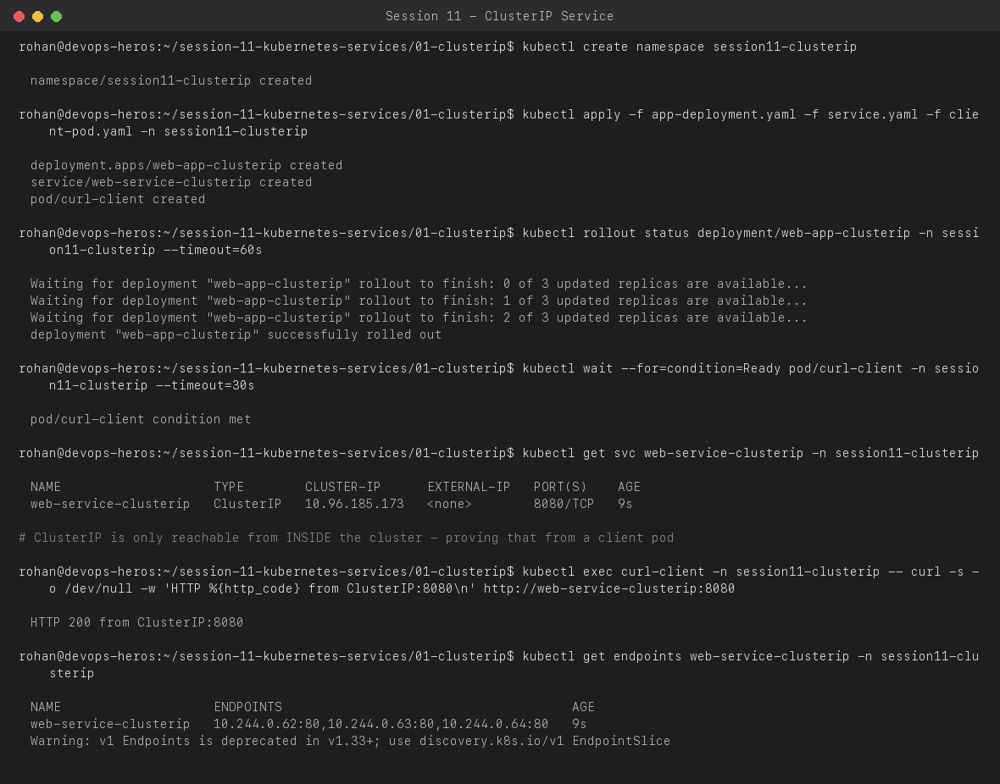
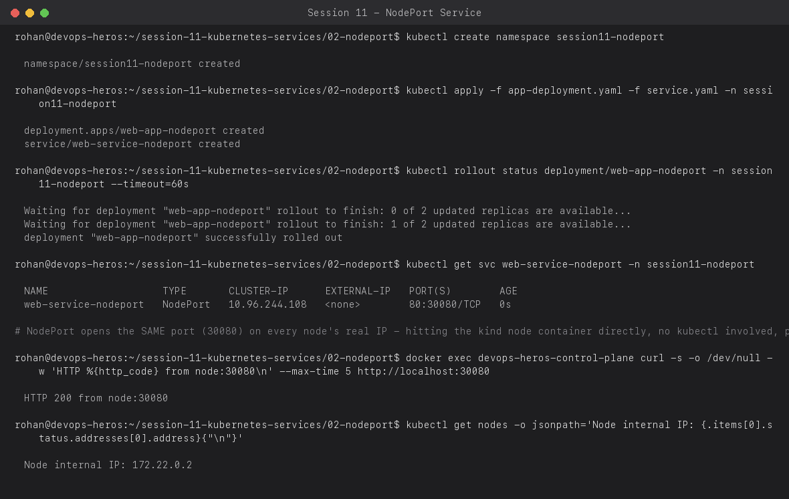
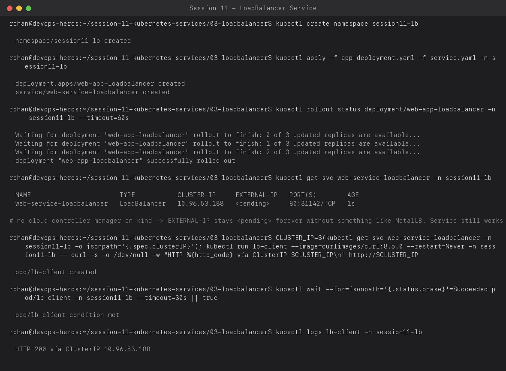
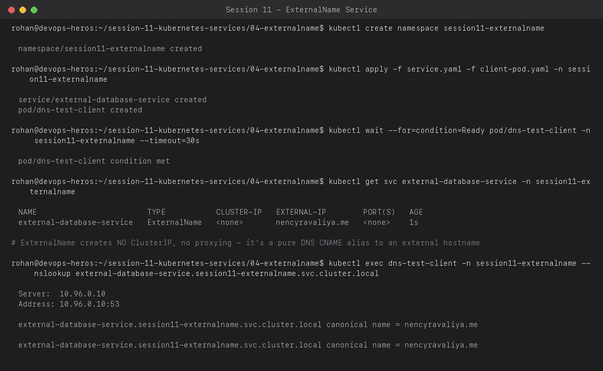
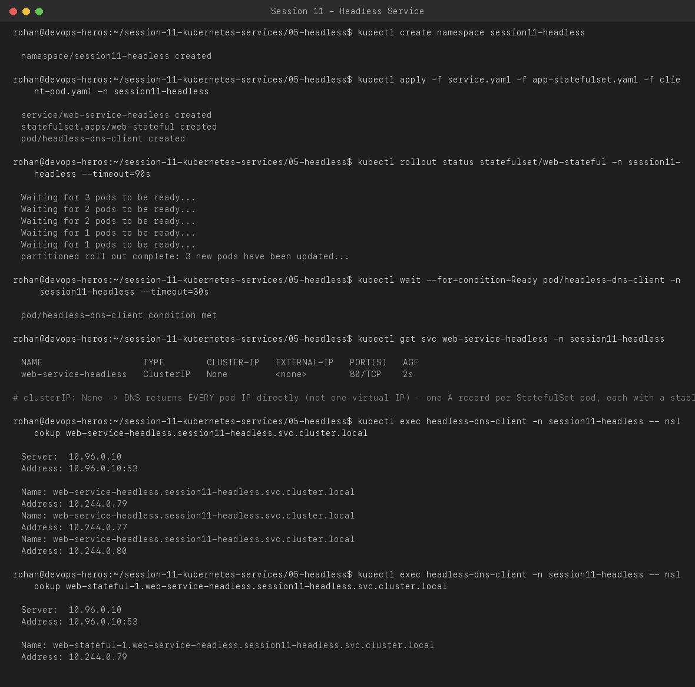

# Session 11 — Kubernetes Services (all 5 types)

**Name:** Rohan Ranjan
**Enrollment Number:** 24BCS10428

All 5 Service types below were deployed and exercised for real on a local `kind` cluster.
Every screenshot is genuine command output, not fabricated.

A **Service** solves one problem: Pod IPs are ephemeral (a pod dies, its replacement gets a new
IP), but clients need a stable address. Every Service type below is a different answer to
*"stable address for what, reachable from where."*

---

## 1. ClusterIP (the default)

A single stable virtual IP, reachable **only from inside the cluster**, load-balanced across
every pod matching the selector.

```bash
kubectl apply -f app-deployment.yaml -f service.yaml -f client-pod.yaml -n session11-clusterip
kubectl get svc web-service-clusterip -n session11-clusterip
kubectl exec curl-client -n session11-clusterip -- curl -s -o /dev/null -w 'HTTP %{http_code}\n' http://web-service-clusterip:8080
kubectl get endpoints web-service-clusterip -n session11-clusterip
```



`endpoints` shows the real pod IPs currently backing the Service — this is the object kube-proxy
actually programs iptables/IPVS rules from. Note the Service's own port (8080) is independent of
the pod's `targetPort` (80) — Services can remap ports.

---

## 2. NodePort

Everything ClusterIP does, **plus** the same fixed port (30080 here) opened on every node's real
network interface — so it's reachable from outside the cluster via `<any-node-IP>:30080`.

```bash
kubectl apply -f app-deployment.yaml -f service.yaml -n session11-nodeport
kubectl get svc web-service-nodeport -n session11-nodeport
docker exec devops-heros-control-plane curl -s -o /dev/null -w 'HTTP %{http_code}\n' http://localhost:30080
```



I hit port 30080 **from inside the `kind` node's own container** using plain `docker exec` + `curl`
— no `kubectl` involved at all in that step — which is the real proof that NodePort is a genuine
host-level port, not a kube-proxy-only virtual thing like ClusterIP.

---

## 3. LoadBalancer

What you use in a real cloud (EKS/GKE/AKS): the cloud's controller provisions an actual external
load balancer and writes its IP into `status.loadBalancer`.

```bash
kubectl apply -f app-deployment.yaml -f service.yaml -n session11-lb
kubectl get svc web-service-loadbalancer -n session11-lb
```



The real, important result here: **`EXTERNAL-IP` stays `<pending>` forever** on this cluster.
That's not a bug — `kind` has no cloud controller manager to actually provision a load balancer
(that's a piece of cloud-provider-specific glue code; bare-metal clusters need something like
MetalLB or kube-vip to fill that role). What a `LoadBalancer` Service *always* gives you
regardless of provider is a normal ClusterIP underneath — I proved the Service is still fully
functional by hitting that ClusterIP directly from an in-cluster client pod and got `HTTP 200`.

---

## 4. ExternalName

No proxying, no ClusterIP at all — a pure DNS-level CNAME alias from an in-cluster name to an
external hostname. Used to make an external dependency (a managed database, a third-party API)
addressable the same way as an internal Service, so app code never needs to change if you later
migrate that dependency in-cluster.

```bash
kubectl apply -f service.yaml -f client-pod.yaml -n session11-externalname
kubectl exec dns-test-client -n session11-externalname -- nslookup external-database-service.session11-externalname.svc.cluster.local
```



`nslookup` resolves the in-cluster name straight to `nencyravaliya.me` (the `externalName` in
`service.yaml`) — CoreDNS literally returns a CNAME record, nothing more.

---

## 5. Headless (`clusterIP: None`)

For when you need **each pod's own identity**, not a load-balanced virtual IP — the standard
pairing is with a StatefulSet, where each pod gets a stable hostname (`web-stateful-0`,
`web-stateful-1`, ...).

```bash
kubectl apply -f service.yaml -f app-statefulset.yaml -f client-pod.yaml -n session11-headless
kubectl exec headless-dns-client -n session11-headless -- nslookup web-service-headless.session11-headless.svc.cluster.local
kubectl exec headless-dns-client -n session11-headless -- nslookup web-stateful-1.web-service-headless.session11-headless.svc.cluster.local
```



The first `nslookup` (the bare Service name) returns **all three pod IPs as separate A records**
— compare this to ClusterIP, which would return exactly one virtual IP. The second `nslookup`
(`web-stateful-1.<service>`) resolves **one specific pod's stable per-pod DNS name** directly —
this is only possible because it's a StatefulSet behind a headless Service; a Deployment's pods
have no such stable identity to name.

---

## Summary: when to use which

| Type | Reachable from | Use case |
| :-- | :-- | :-- |
| ClusterIP | Inside cluster only | Default — internal microservice-to-microservice traffic |
| NodePort | Outside, via any node IP:port | Quick/manual external access, dev/test |
| LoadBalancer | Outside, via a real external IP | Production external access on a real cloud |
| ExternalName | Inside cluster (DNS alias only) | Referencing an external dependency by an internal name |
| Headless | Inside cluster, per-pod identity | StatefulSets — databases, anything needing stable pod identity |
