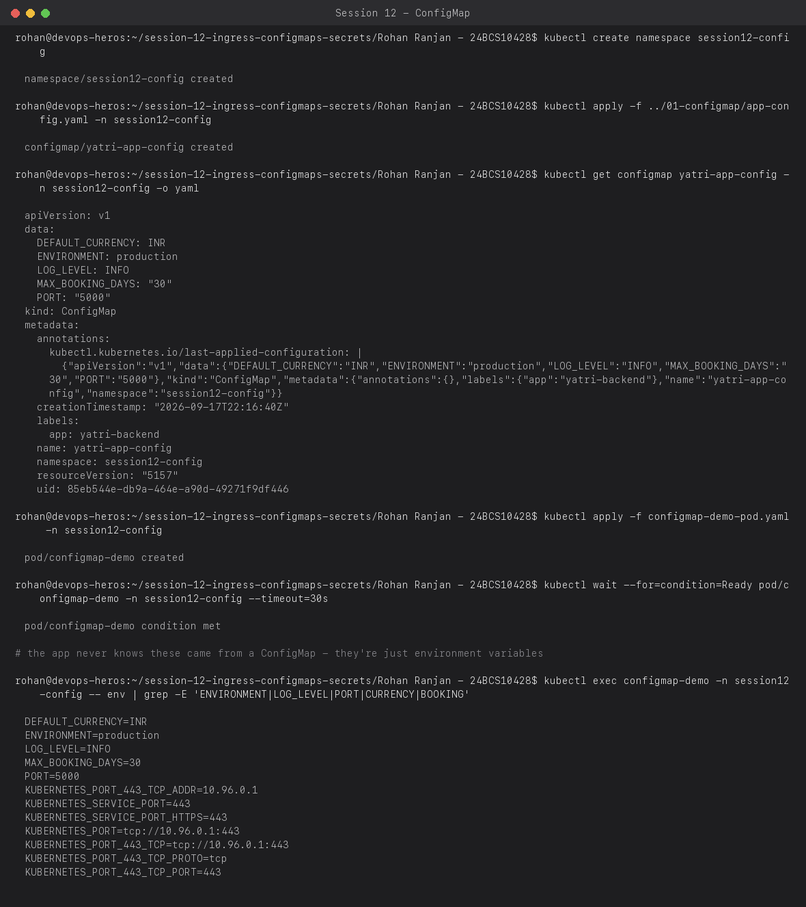
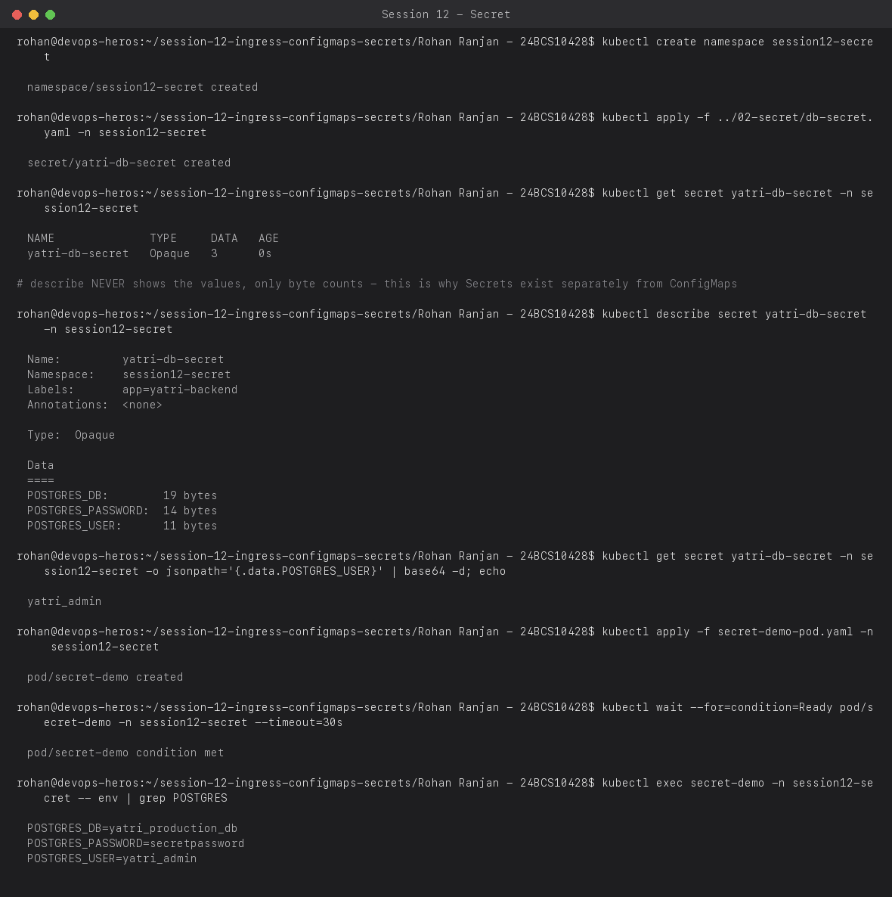
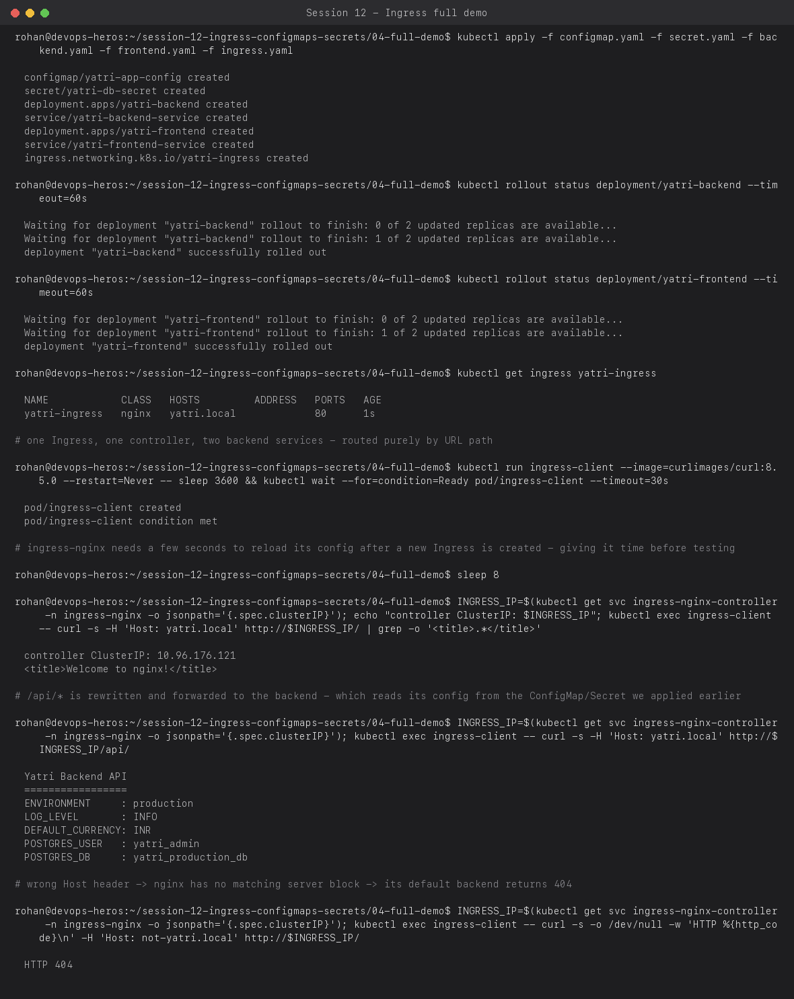

# Session 12 — Kubernetes Ingress, ConfigMaps & Secrets

**Name:** Rohan Ranjan
**Enrollment Number:** 24BCS10428

Everything below ran for real: `nginx-ingress` was actually installed on my local `kind` cluster
(`kubectl apply -f .../ingress-nginx/.../deploy/kind/deploy.yaml`), and the full `04-full-demo`
stack (a Python backend + an nginx frontend, wired together with a ConfigMap, a Secret, and one
Ingress) was deployed and routed through for real.

---

## Task 1: ConfigMap — plain-text configuration

A ConfigMap decouples configuration from the container image — the same image can run in
dev/staging/prod just by pointing it at a different ConfigMap.

```bash
kubectl apply -f 01-configmap/app-config.yaml
kubectl apply -f configmap-demo-pod.yaml   # a busybox pod with envFrom: configMapRef
kubectl exec configmap-demo -- env | grep -E 'ENVIRONMENT|LOG_LEVEL|PORT|CURRENCY|BOOKING'
```



`envFrom.configMapRef` dumps every key in the ConfigMap into the container's environment in one
shot — the application code just reads `os.environ`/`process.env` normally and has no idea
Kubernetes is involved.

---

## Task 2: Secret — sensitive configuration

Same mechanism as a ConfigMap (`envFrom`), but `kubectl describe` deliberately never prints the
actual values, and the data is base64-encoded at rest (not encrypted by default — base64 is
*encoding*, not *security* — real protection needs encryption-at-rest or an external secret
store, which is worth calling out explicitly since it's a common misconception).

```bash
kubectl apply -f 02-secret/db-secret.yaml
kubectl describe secret yatri-db-secret          # values never shown
kubectl get secret yatri-db-secret -o jsonpath='{.data.POSTGRES_USER}' | base64 -d
kubectl apply -f secret-demo-pod.yaml
kubectl exec secret-demo -- env | grep POSTGRES
```



`describe` only ever shows byte counts (`POSTGRES_PASSWORD: 14 bytes`), never the content —
you have to explicitly pull `.data.<key>` and decode it yourself, which is a deliberate friction
point so secret values don't end up in shell history or CI logs by accident from a routine
`describe`.

---

## Task 3: Ingress — full demo (ConfigMap + Secret + two Services behind one Ingress)

This is `04-full-demo/`: a Python backend that reads its config from the ConfigMap and Secret
from Tasks 1–2, an nginx frontend, and one Ingress routing by path — `/` to the frontend,
`/api/*` to the backend (stripped and rewritten via `nginx.ingress.kubernetes.io/rewrite-target`).

```bash
kubectl apply -f configmap.yaml -f secret.yaml -f backend.yaml -f frontend.yaml -f ingress.yaml
kubectl get ingress yatri-ingress
# from an in-cluster client, hit the ingress controller directly with the right Host header
kubectl exec ingress-client -- curl -s -H 'Host: yatri.local' http://<controller-ip>/
kubectl exec ingress-client -- curl -s -H 'Host: yatri.local' http://<controller-ip>/api/
kubectl exec ingress-client -- curl -s -H 'Host: not-yatri.local' http://<controller-ip>/
```



Three real results worth calling out:
- `GET /` with `Host: yatri.local` returns the nginx frontend's welcome page — routed by the
  Ingress's `path: /` rule.
- `GET /api/` with the same host returns the **live backend response**, showing
  `ENVIRONMENT: production`, `DEFAULT_CURRENCY: INR` (from the ConfigMap) and
  `POSTGRES_USER: yatri_admin` (decoded straight from the Secret) — proving the whole chain
  (Ingress → Service → Pod → ConfigMap/Secret env vars) actually works end to end, not just that
  the objects exist.
- `Host: not-yatri.local` (a host the Ingress has no rule for) gets a real **`HTTP 404`** from
  nginx's default backend — Ingress routing is host-based first, path-based second, and a host
  that doesn't match any rule never even reaches path matching.

One real hiccup I hit and kept rather than editing away: testing **immediately** after creating
the Ingress object returned `503 Service Temporarily Unavailable` — `ingress-nginx` doesn't apply
new Ingress rules instantly, it reconciles and reloads its internal nginx config on a short delay.
Adding an 8-second wait before testing fixed it. This is a real operational detail (a fresh
Ingress isn't traffic-ready the instant `kubectl apply` returns), not a mistake in the setup.

Since `kind` has no cloud load balancer (see Session 11's LoadBalancer notes), I reached the
ingress controller via its ClusterIP from an in-cluster pod instead of a real external URL —
in a cloud cluster this same Ingress would be reachable at a real external IP/DNS name given by
the LoadBalancer Service in front of the controller.

## Resources

- https://github.com/Nency-Ravaliya/Kubernetes
- https://kubernetes.github.io/ingress-nginx/deploy/#kind
