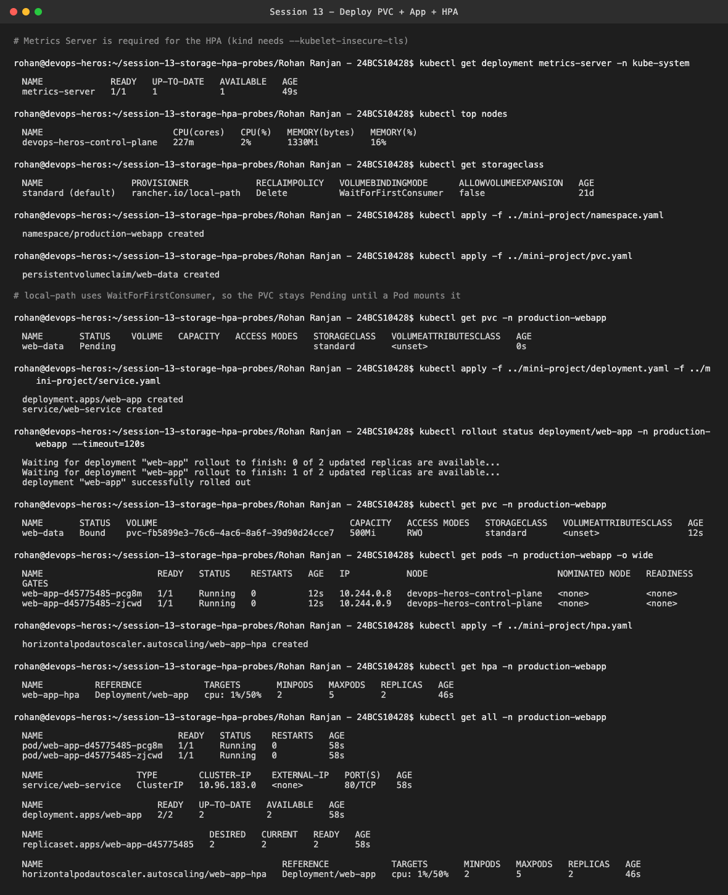
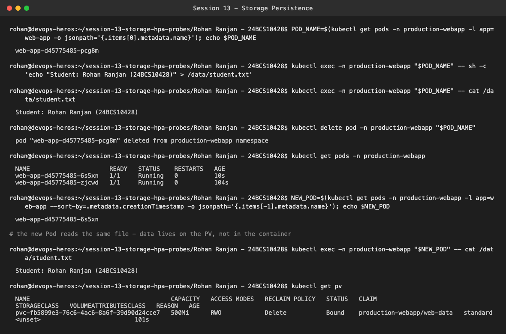
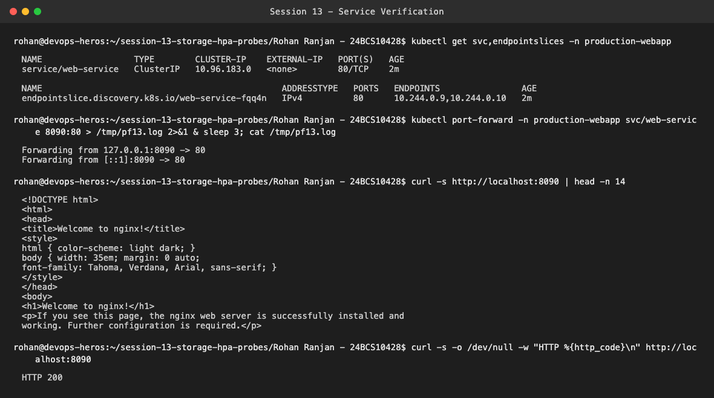
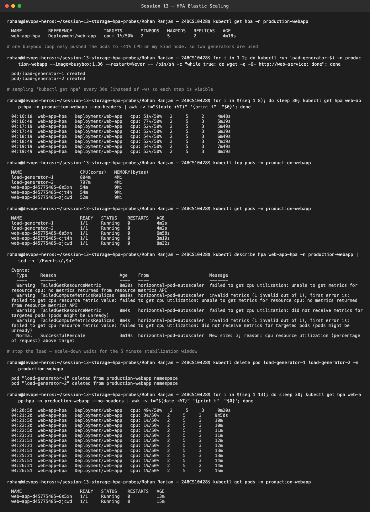
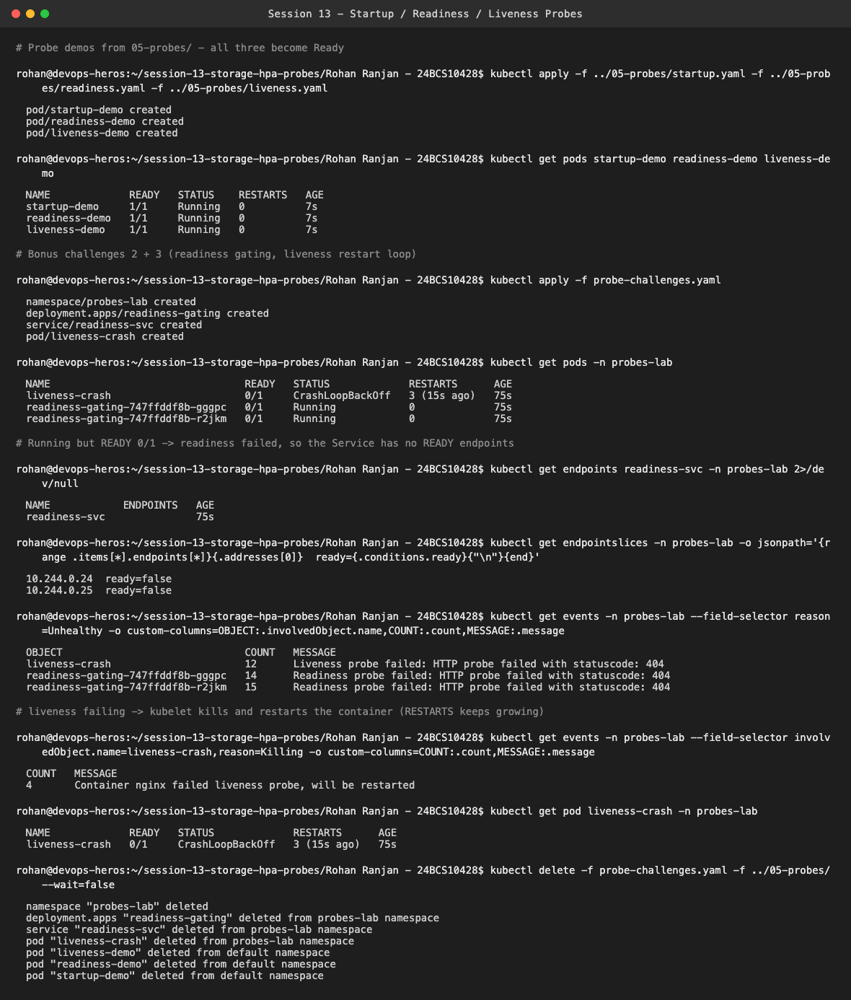
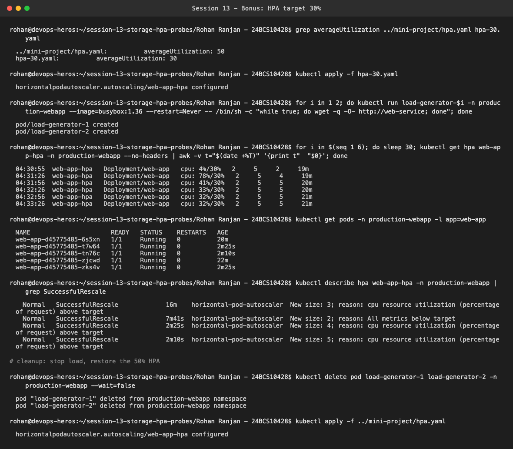

# Session 13 — Storage, HPA & Probes (Mini Project: Production-Ready Web App)

**Name:** Rohan Ranjan
**Enrollment Number:** 24BCS10428

Everything below ran for real on my local `kind` cluster (`devops-heros`, single node, Kubernetes
v1.37). The default StorageClass on kind is `standard` (`rancher.io/local-path`), not minikube's
hostpath provisioner, and Metrics Server isn't installed by default, so I installed it first (on kind it
needs `--kubelet-insecure-tls` because the kubelet certs are self-signed).

Manifests used: `../mini-project/` (namespace, PVC, deployment, service, HPA) plus two files of my
own in this folder: `probe-challenges.yaml` (bonus challenges 2 and 3) and `hpa-30.yaml` (bonus
challenge 1).

---

## Step 5: Deploy namespace, PVC, app, service and HPA

```bash
kubectl apply -f ../mini-project/namespace.yaml
kubectl apply -f ../mini-project/pvc.yaml
kubectl apply -f ../mini-project/deployment.yaml -f ../mini-project/service.yaml
kubectl apply -f ../mini-project/hpa.yaml
kubectl get all -n production-webapp
```



One difference from the expected output: the PVC was `Pending` right after creation. That's
expected on kind. The `standard` StorageClass uses `WaitForFirstConsumer`, so the volume is only
provisioned once a Pod that mounts it is scheduled (that way it lands on the right node). As soon
as the Deployment's Pods came up, it went to `Bound` with a 500Mi PV. The HPA shows a real
`cpu: 1%/50%` target, not `<unknown>`, which confirms Metrics Server is working and the
container has `resources.requests.cpu` set.

---

## Task 1: Storage persistence

```bash
POD_NAME=$(kubectl get pods -n production-webapp -l app=web-app -o jsonpath='{.items[0].metadata.name}')
kubectl exec -n production-webapp "$POD_NAME" -- sh -c 'echo "Student: Rohan Ranjan (24BCS10428)" > /data/student.txt'
kubectl delete pod -n production-webapp "$POD_NAME"
kubectl exec -n production-webapp "$NEW_POD" -- cat /data/student.txt
```



I wrote the file from Pod `...pcg8m`, deleted that Pod, and the ReplicaSet created `...6s5xn`.
Reading `/data/student.txt` from the new Pod still returned `Student: Rohan Ranjan (24BCS10428)`.
The data lives on the PersistentVolume, not in the container's writable layer, so it survives
Pod deletion.

---

## Task 2: Service verification

```bash
kubectl port-forward -n production-webapp svc/web-service 8090:80
curl http://localhost:8090
```



I used local port **8090** instead of 8080 because 8080 was already taken by another process on my
laptop. The Service has two endpoints (one per replica) and returns the nginx welcome page with
HTTP 200.

---

## Task 3: HPA elastic scaling

```bash
kubectl run load-generator-1 -n production-webapp --image=busybox:1.36 --restart=Never \
  -- /bin/sh -c "while true; do wget -q -O- http://web-service; done"
kubectl run load-generator-2 ...   # same command, second generator
kubectl get hpa -n production-webapp      # sampled every 30s
```



I first tried the single load generator from the README. It only pushed the pods to **41%** CPU,
which is under the 50% target, so nothing scaled. With two generators running:

| Time | CPU / target | Replicas | What happened |
| :--- | :--- | :--- | :--- |
| 04:16:18 | 51% / 50% | 2 | just crossed the target |
| 04:16:48 | 77% / 50% | **3** | HPA scaled out (`SuccessfulRescale: New size: 3`) |
| 04:17–04:19 | 52–54% / 50% | 3 | load spread over 3 pods, settles near the target |
| 04:20:50 | load stopped | 3 | CPU drops to 1–3% |
| 04:26:21 | 1% / 50% | **2** | scaled back down after the 5-minute stabilization window |

It only went to 3 and not 5 because the HPA computes
`desired = ceil(current × currentUtil / target) = ceil(2 × 77 / 50) = 4`. After the third Pod started,
utilization dropped to about 53%, which is inside the HPA's ±10% tolerance, so it stopped there.
The `FailedGetResourceMetric` warnings in `describe hpa` are from the first ~20 seconds after the
HPA was created, before Metrics Server had scraped the new pods. They stopped once metrics came in.
Scale-down waited the full 5 minutes. That's the default `scaleDown.stabilizationWindowSeconds: 300`,
which keeps the HPA from removing pods during a short dip in traffic.

---

## Probes + bonus challenges 2 & 3

```bash
kubectl apply -f ../05-probes/startup.yaml -f ../05-probes/readiness.yaml -f ../05-probes/liveness.yaml
kubectl apply -f probe-challenges.yaml      # readiness -> /does-not-exist, liveness -> /crash
kubectl get endpoints readiness-svc -n probes-lab
kubectl get events -n probes-lab --field-selector reason=Unhealthy
```



- **Probe demos**: `startup-demo`, `readiness-demo` and `liveness-demo` all became `1/1 Running`.
- **Readiness gating (bonus 2)**: both pods are `Running` but `READY 0/1`, and the Service has
  **no endpoints**. The EndpointSlice still lists the two IPs, but with `ready=false`, so kube-proxy
  sends them no traffic. The pods are never restarted. A failing readiness probe only takes them
  out of rotation.
- **Liveness restart loop (bonus 3)**: `/crash` returns 404, so after 3 failures the kubelet
  logged `Container nginx failed liveness probe, will be restarted`. RESTARTS reached 3 within 75s
  and the pod went into `CrashLoopBackOff`.

---

## Bonus challenge 1: HPA target 30%

```bash
kubectl apply -f hpa-30.yaml     # averageUtilization: 30
```



With the same two load generators, the 30% target scaled the deployment 2 → 4 → **5** (the max)
within 15 seconds. At 50% it only reached 3. A lower target means the HPA adds pods earlier and
keeps more headroom, at the cost of running more pods. Afterwards I re-applied the original 50% HPA.

---

## Probe reference

| Probe | Question it answers | On failure |
| :--- | :--- | :--- |
| Startup | Has the app finished starting? | Restarts container; liveness/readiness are paused until it passes |
| Readiness | Can this Pod take traffic right now? | Pod IP removed from Service endpoints (no restart) |
| Liveness | Is the process still healthy? | kubelet restarts the container |
