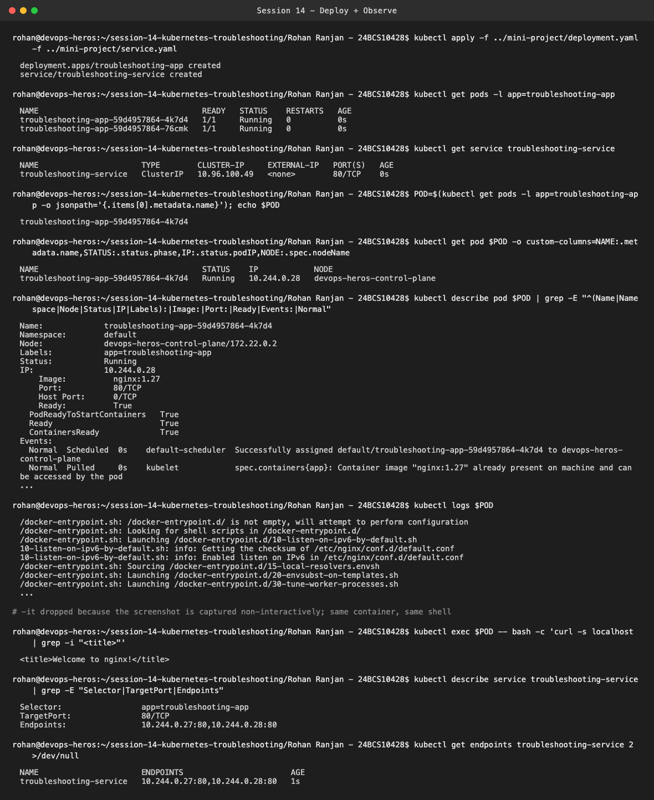
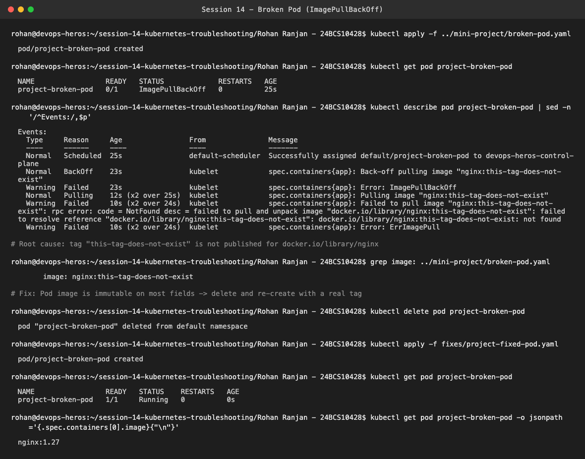
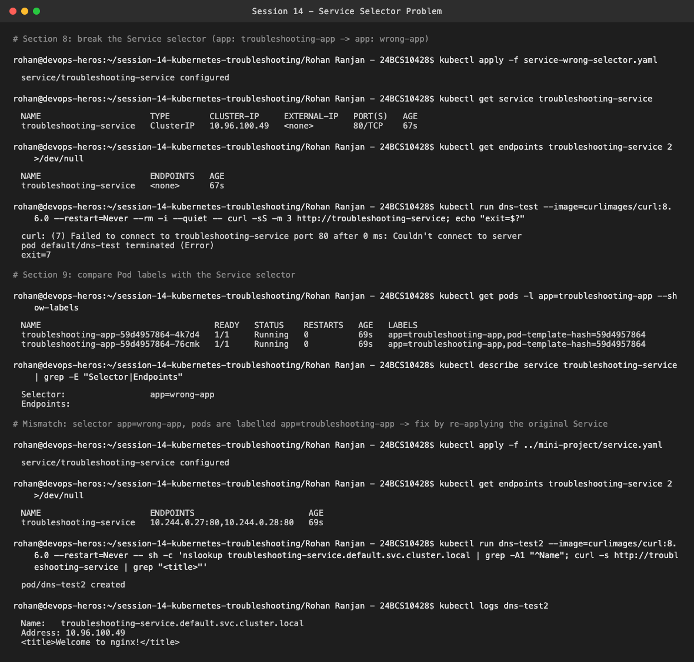
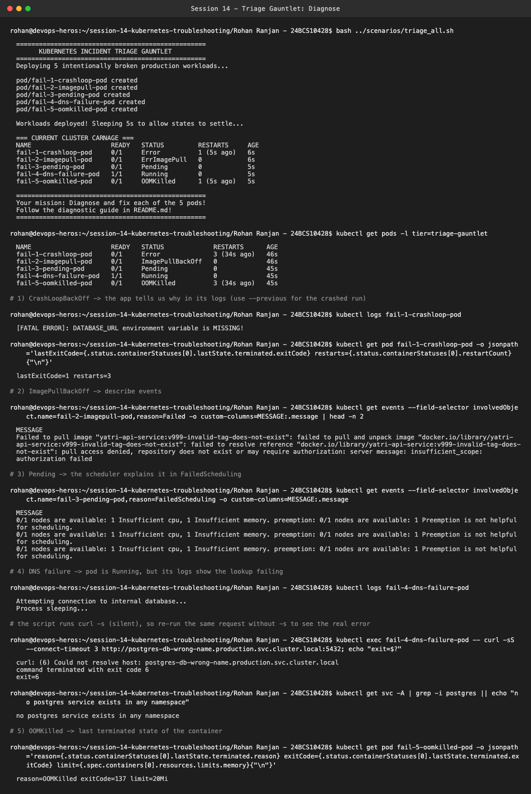
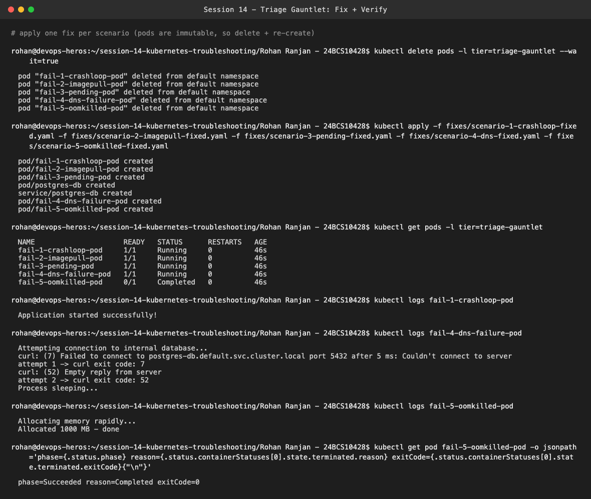

# Session 14 — Kubernetes Troubleshooting Challenge

**Name:** Rohan Ranjan
**Enrollment Number:** 24BCS10428

All of this ran for real on my local `kind` cluster (`devops-heros`). I applied the manifests from
`../mini-project/` as provided. The files in this folder are the ones I wrote while fixing things:

```text
Rohan Ranjan - 24BCS10428/
├── service-wrong-selector.yaml          # section 8 - the intentionally broken Service
├── fixes/
│   ├── project-fixed-pod.yaml           # fix for mini-project/broken-pod.yaml
│   ├── scenario-1-crashloop-fixed.yaml  # bonus: triage gauntlet fixes
│   ├── scenario-2-imagepull-fixed.yaml
│   ├── scenario-3-pending-fixed.yaml
│   ├── scenario-4-dns-fixed.yaml
│   └── scenario-5-oomkilled-fixed.yaml
└── Screenshots/
```

Workflow followed everywhere: **Deploy → Observe → Break → Investigate → Root cause → Fix → Verify.**

---

## 1–4. Deploy and observe a healthy app

```bash
kubectl apply -f ../mini-project/deployment.yaml -f ../mini-project/service.yaml
kubectl get pods / kubectl get service
kubectl describe pod <pod>
kubectl logs <pod>
kubectl exec <pod> -- bash -c 'curl -s localhost'
kubectl describe service troubleshooting-service
kubectl get endpoints troubleshooting-service
```



Both replicas are `Running`. `describe` shows they're `Ready` with image `nginx:1.27` on port 80, the
logs are the normal nginx entrypoint startup, and `curl localhost` from inside the container returns
`Welcome to nginx!`. The Service selector `app=troubleshooting-app` matches the pods, so it has two
endpoints (`10.244.0.27:80, 10.244.0.28:80`). I ran `exec` without `-it` only because the
screenshot was captured non-interactively. It's the same container and the same `bash`.

---

## 5–7. Broken Pod (ImagePullBackOff)

```bash
kubectl apply -f ../mini-project/broken-pod.yaml
kubectl get pod project-broken-pod
kubectl describe pod project-broken-pod     # -> Events
```



**Question 1: What is the Pod status?**
`ImagePullBackOff`, with `READY 0/1`. It alternates with `ErrImagePull` as the kubelet retries.

**Question 2: What is the actual error?**
`Failed to pull image "nginx:this-tag-does-not-exist": ... docker.io/library/nginx:this-tag-does-not-exist: not found`

**Question 3: Which command helped you find the reason?**
`kubectl describe pod project-broken-pod`, specifically the **Events** section. `kubectl get` only
shows the status, and `kubectl logs` has nothing to show because the container never started.

**Question 4: What is wrong with the image?**
The repository (`nginx`) exists, but the **tag** `this-tag-does-not-exist` was never published to
Docker Hub, so the registry returns `NotFound`.

**Question 5: How would you fix it?**
Use a tag that exists. A Pod's image field can't be changed into a working spec in place, so I deleted
the Pod and re-created it from `fixes/project-fixed-pod.yaml` (`image: nginx:1.27`). It went straight
to `1/1 Running`. In a real setup the Pod would belong to a Deployment, and I'd fix the image there.

---

## 8–9. Service selector problem

```bash
kubectl apply -f service-wrong-selector.yaml        # selector: app: wrong-app
kubectl get endpoints troubleshooting-service       # -> <none>
kubectl get pods --show-labels
kubectl describe service troubleshooting-service
kubectl apply -f ../mini-project/service.yaml       # fix
```



With `app: wrong-app`, the Service still exists and still has a ClusterIP, but `ENDPOINTS <none>`.
A curl from inside the cluster fails with `curl: (7) Couldn't connect to server`. The pods are labelled
`app=troubleshooting-app` and the selector says `app=wrong-app`, so no pod matches. After re-applying
the correct selector, both endpoints come back. A test pod resolves
`troubleshooting-service.default.svc.cluster.local → 10.96.100.49` and gets the nginx page.

---

## Bonus: triage gauntlet (5 broken scenarios)

```bash
bash ../scenarios/triage_all.sh
```





| Scenario | Status seen | Command that found it | Root cause | Fix |
| :--- | :--- | :--- | :--- | :--- |
| 1 crashloop | `Error` / `CrashLoopBackOff`, exit code 1 | `kubectl logs` | App exits because `DATABASE_URL` env var is missing | Add `DATABASE_URL` env (and keep the process alive) |
| 2 imagepull | `ErrImagePull` / `ImagePullBackOff` | `kubectl get events` / `describe` | `yatri-api-service:v999-...` doesn't exist on Docker Hub (`pull access denied, repository does not exist`) | Use a real image |
| 3 pending | `Pending` | `FailedScheduling` event | Requests 500 CPU + 1000Gi RAM. `0/1 nodes are available: Insufficient cpu, Insufficient memory` | Request `100m` / `64Mi` |
| 4 dns | `Running` (misleading) | `kubectl logs` + `exec curl` | Hostname `postgres-db-wrong-name.production...` doesn't exist. `curl: (6) Could not resolve host` | Create a real `postgres-db` Service and use its correct FQDN |
| 5 oomkilled | `OOMKilled`, exit code 137 | `jsonpath` on `lastState.terminated` | Allocates ~1000 MB with a `20Mi` limit | Raise the memory limit above the real working set (`1200Mi`) |

Scenario 4 is the tricky one. The Pod is `1/1 Running` because the script's `curl -s ... || true`
hides the failure. You only find it by reading logs or running the request yourself. After the fix,
the first attempt got `exit 7` (DNS resolved, but Postgres was still starting). The retry got `exit 52`
(empty reply), which means the name resolved and the TCP connection to port 5432 succeeded.

---

## 11. Troubleshooting table

| Problem | What I Saw | Command I Used | Root Cause | Fix |
| :--- | :--- | :--- | :--- | :--- |
| **Broken Pod** | `project-broken-pod 0/1 ImagePullBackOff` | `kubectl describe pod project-broken-pod` (Events) | Tag `nginx:this-tag-does-not-exist` not found on Docker Hub | Re-create the Pod with `nginx:1.27` |
| **Service Problem** | Service exists but `ENDPOINTS <none>`, curl to it fails | `kubectl get endpoints`, `kubectl get pods --show-labels`, `kubectl describe service` | Selector `app: wrong-app` ≠ Pod label `app: troubleshooting-app` | Set selector back to `app: troubleshooting-app` |
| **Image Problem** | `ErrImagePull` → `ImagePullBackOff`, container never starts, `logs` empty | `kubectl describe pod` / `kubectl get events` | Image reference (repo or tag) does not exist in the registry | Point to a valid `repo:tag` (and add `imagePullSecrets` if it's a private registry) |

---

## 12. README questions

1. **What does `kubectl get` tell us?**
   A quick summary of the current state of a resource: name, READY count, STATUS, RESTARTS, AGE
   (and IP/node with `-o wide`). It's the first thing to run, but it only shows the symptom.

2. **What is the difference between `get` and `describe`?**
   `get` is a one-line summary. `describe` gives the full detail for one object: spec, conditions,
   container state with last exit code and reason, mounted volumes, and most importantly the
   **Events** at the bottom, which usually say why something is happening.

3. **Why do we use `kubectl logs`?**
   To see what the application inside the container printed (stdout/stderr). That's where
   app-level errors show up, like the missing `DATABASE_URL` in scenario 1. Add `--previous` to read
   the logs of the container that crashed before the current restart.

4. **When would you use `kubectl exec`?**
   When the Pod is running but something is off and I need to look from inside: curl `localhost`,
   check env vars, check DNS with `nslookup`, look at files or mounted volumes. It only works on
   running containers.

5. **What does `CrashLoopBackOff` mean?**
   The container starts and then exits (crash or non-zero exit) again and again. The kubelet keeps
   restarting it with an exponential back-off delay (10s, 20s, 40s… up to 5 min). The cause is in the
   app's logs or its exit code.

6. **What does `ImagePullBackOff` mean?**
   The kubelet couldn't pull the container image (wrong name or tag, private repo without credentials,
   or the registry can't be reached) and is backing off between retries. The container never starts,
   so the reason is in `describe` Events, not in logs.

7. **Why can a Pod remain `Pending`?**
   The scheduler can't place it on any node. Common reasons: not enough CPU or memory for the
   requests, taints with no matching tolerations, a nodeSelector or affinity that matches no node,
   or a PVC that can't bind. The `FailedScheduling` event says which one.

8. **Why can a Service have no endpoints?**
   Its selector matches no Pods (label mismatch or typo), the matching Pods aren't Ready (failing
   readiness probe), or they're in a different namespace. No endpoints means traffic to the Service
   has nowhere to go.

9. **What is the relationship between a Service selector and Pod labels?**
   The Service picks its backends purely by labels. Every Ready Pod in the same namespace whose labels
   contain all the selector's key/value pairs becomes an endpoint. If they don't match exactly, the
   Service and Pods are effectively disconnected, even though both look healthy on their own.

10. **What is Kubernetes DNS?**
    CoreDNS, running in `kube-system`, gives every Service a stable name:
    `<service>.<namespace>.svc.cluster.local`. Inside the same namespace, the short `<service>` name
    works too. Pods use these names instead of IPs, which change. If the name is wrong (scenario 4),
    you get `Could not resolve host` even though everything is running.
