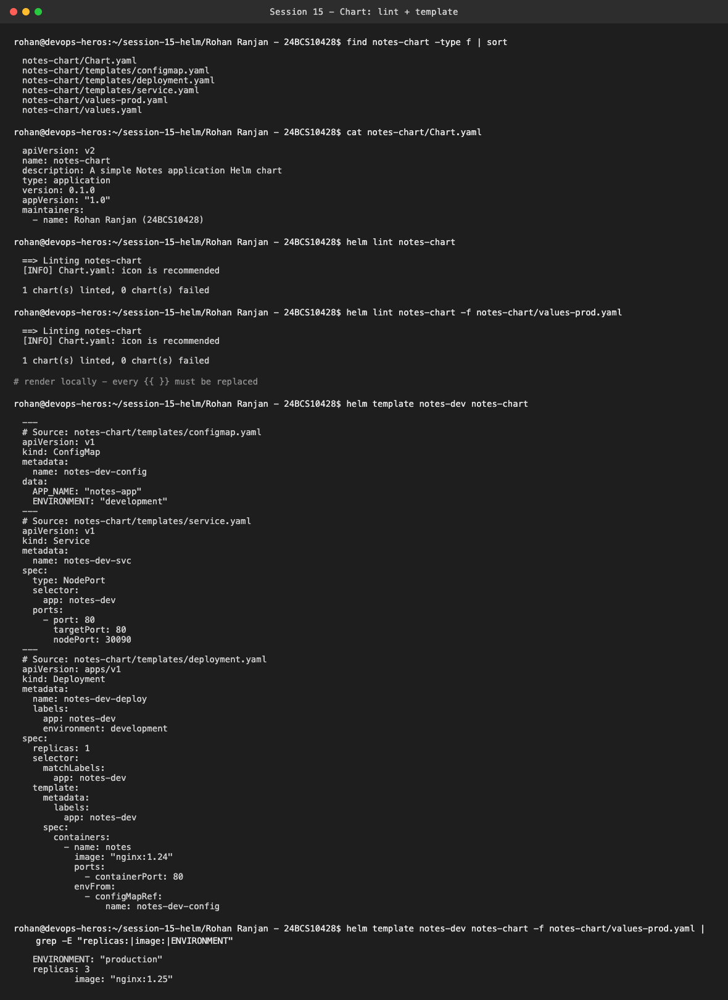
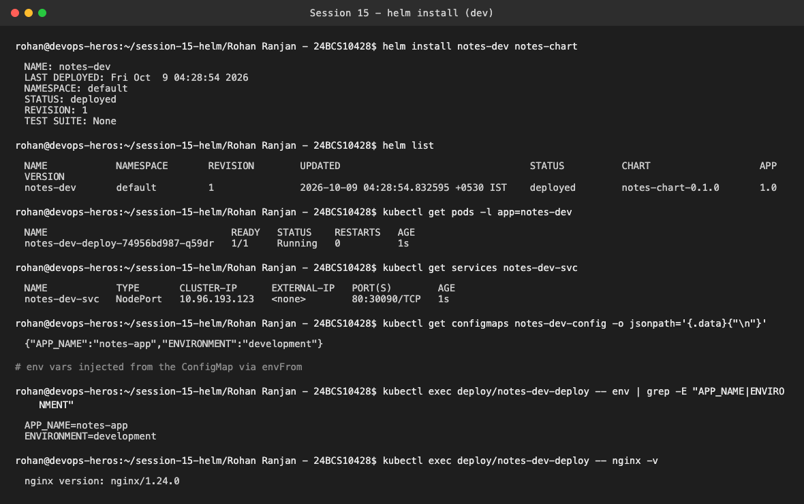
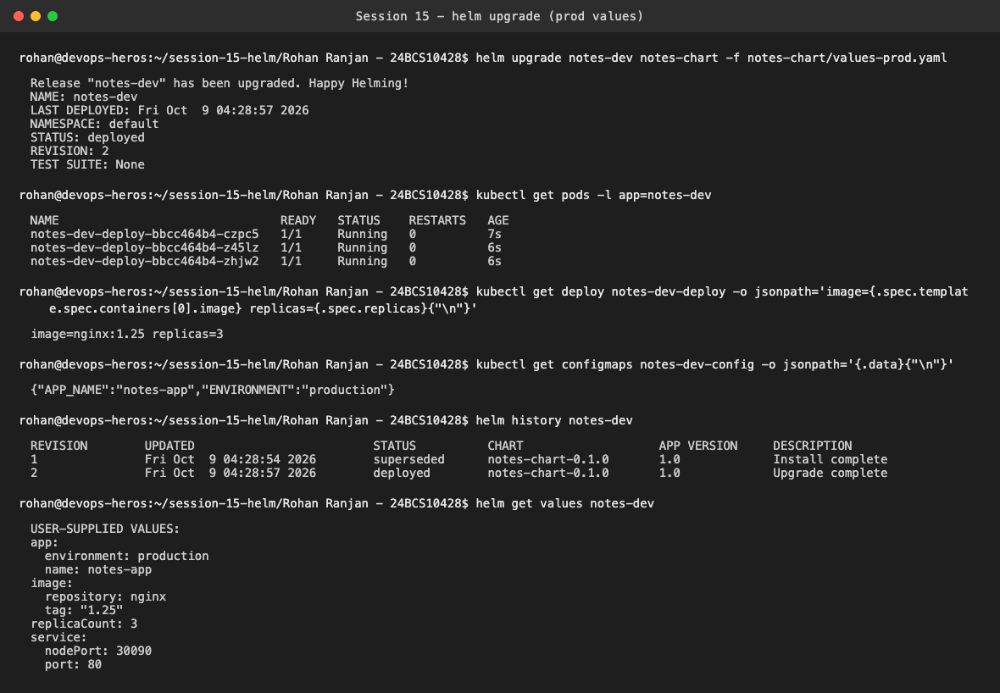
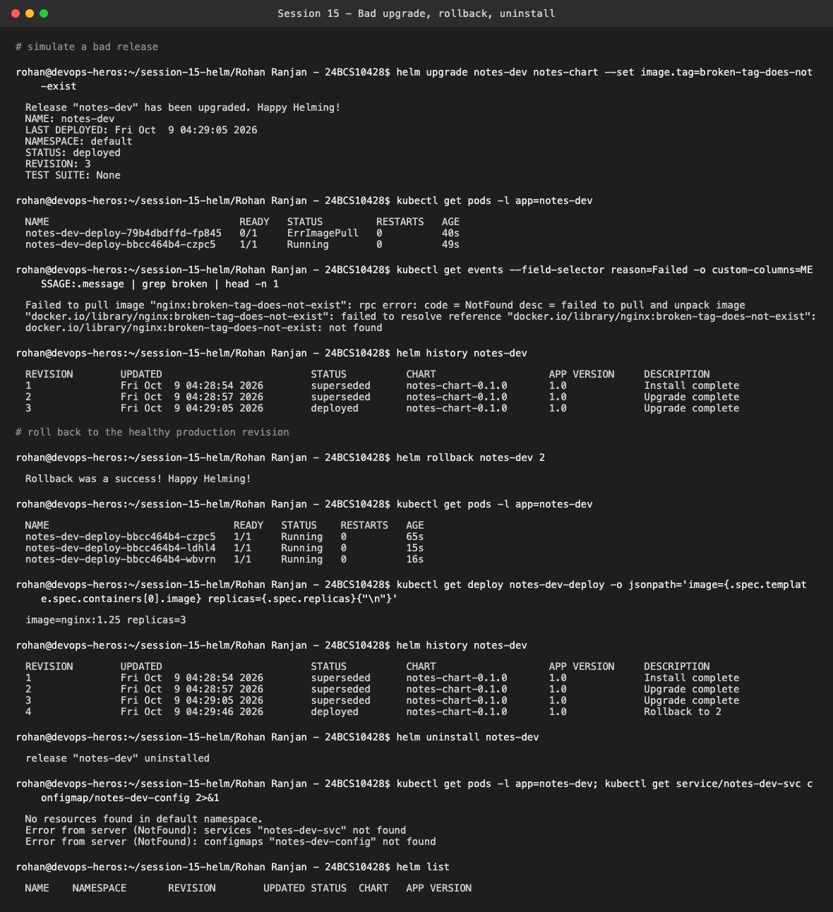

# Session 15 — Helm (Mini Project: Package and Deploy the Notes App)

**Name:** Rohan Ranjan
**Enrollment Number:** 24BCS10428

I built the chart from scratch in this folder (`notes-chart/`), following the mini-project steps,
and ran the whole install → upgrade → bad upgrade → rollback → uninstall lifecycle on my local `kind`
cluster with Helm v3.22.

```text
notes-chart/
├── Chart.yaml
├── values.yaml          # dev: 1 replica, nginx:1.24, environment=development
├── values-prod.yaml     # prod: 3 replicas, nginx:1.25, environment=production
└── templates/
    ├── configmap.yaml   # {{ .Release.Name }}-config  (APP_NAME, ENVIRONMENT)
    ├── deployment.yaml  # {{ .Release.Name }}-deploy  (envFrom the ConfigMap)
    └── service.yaml     # {{ .Release.Name }}-svc     (NodePort 30090)
```

---

## Steps 1–9: Create, lint and render the chart

```bash
helm lint notes-chart
helm lint notes-chart -f notes-chart/values-prod.yaml
helm template notes-dev notes-chart
```



`helm lint` passes with `1 chart(s) linted, 0 chart(s) failed` for both values files. The only note
is the informational `icon is recommended`. `helm template` renders every `{{ }}`. For example,
`{{ .Release.Name }}-deploy` becomes `notes-dev-deploy`, and the image becomes `"nginx:1.24"`.
Rendering with `values-prod.yaml` switches to `replicas: 3`, `nginx:1.25` and
`ENVIRONMENT: "production"` without touching a template.

---

## Step 10: Install (development)

```bash
helm install notes-dev notes-chart
kubectl get pods / services / configmaps
kubectl exec deploy/notes-dev-deploy -- env | grep -E "APP_NAME|ENVIRONMENT"
```



Revision 1 deployed. There's one Pod running `nginx/1.24.0`, a NodePort Service on `80:30090`, and
the ConfigMap's values (`APP_NAME=notes-app`, `ENVIRONMENT=development`) show up as environment
variables in the container through `envFrom`.

---

## Steps 11–12: Upgrade to production values + history

```bash
helm upgrade notes-dev notes-chart -f notes-chart/values-prod.yaml
helm history notes-dev
helm get values notes-dev
```



Revision 2 has 3 Pods on `nginx:1.25`, and the ConfigMap now says `production`. `helm history`
shows revision 1 as `superseded` and revision 2 as `deployed`. `helm get values` shows exactly
which user-supplied values are active for the release.

---

## Steps 13–15: Bad upgrade → rollback → uninstall

```bash
helm upgrade notes-dev notes-chart --set image.tag=broken-tag-does-not-exist
kubectl get pods
helm rollback notes-dev 2
helm uninstall notes-dev
```



What actually happened, and why it differs a bit from the expected output in the README:

- The broken upgrade (revision 3) used only `--set`, without `-f values-prod.yaml`. Helm went back
  to the defaults in `values.yaml` (`replicaCount: 1`) and only overrode the tag. So I got **one**
  old healthy Pod still `Running` plus **one** new Pod in `ErrImagePull`, not three broken ones. The
  RollingUpdate strategy keeps the old ReplicaSet serving until new Pods become Ready, and the
  broken Pods never do.
- Helm still marked revision 3 as `deployed`, because `helm upgrade` without `--wait` only checks
  that the API server accepted the manifests, not that the Pods came up. In CI I'd use
  `--wait --atomic` so a failed rollout rolls itself back.
- `helm rollback notes-dev 2` created **revision 4** ("Rollback to 2"). Helm doesn't rewrite
  history, it re-applies revision 2's manifests as a new revision. The result was 3 healthy Pods on
  `nginx:1.25` again.
- `helm uninstall` removed the Deployment, Service and ConfigMap (all `NotFound` afterwards), and
  `helm list` is empty.

---

## What I practiced

```text
[PASS] Created a Helm chart from scratch
[PASS] Used values.yaml and values-prod.yaml
[PASS] Deployed to Kubernetes with helm install
[PASS] Upgraded the release with different values
[PASS] Simulated a bad upgrade (broken image tag)
[PASS] Rolled back to a healthy revision
[PASS] Cleaned up with helm uninstall
```
