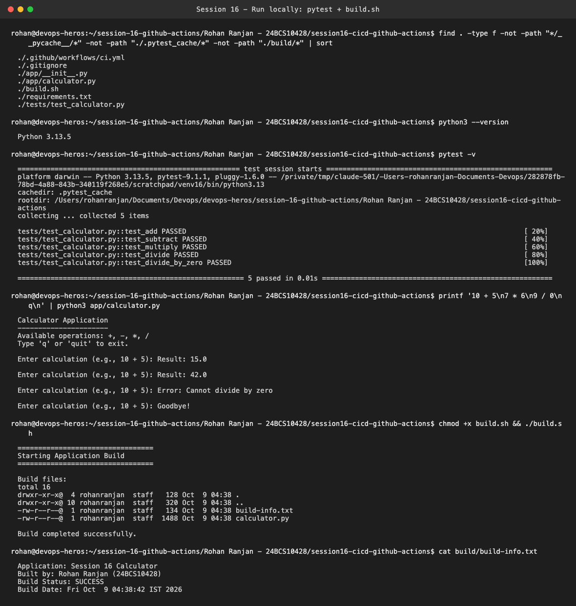
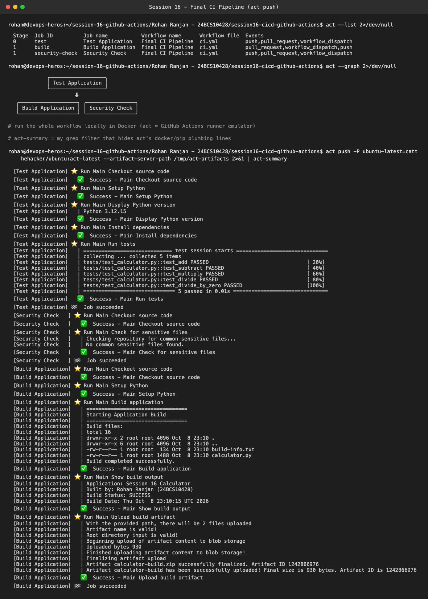
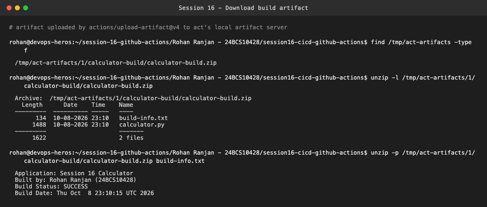
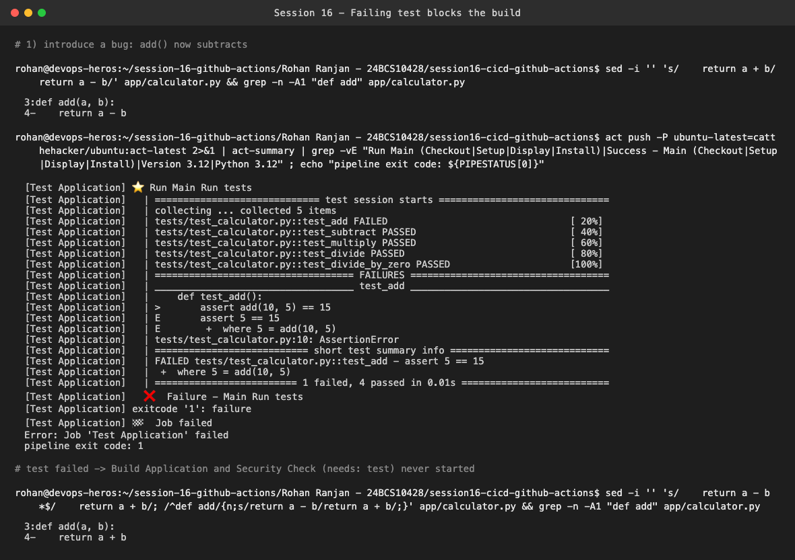
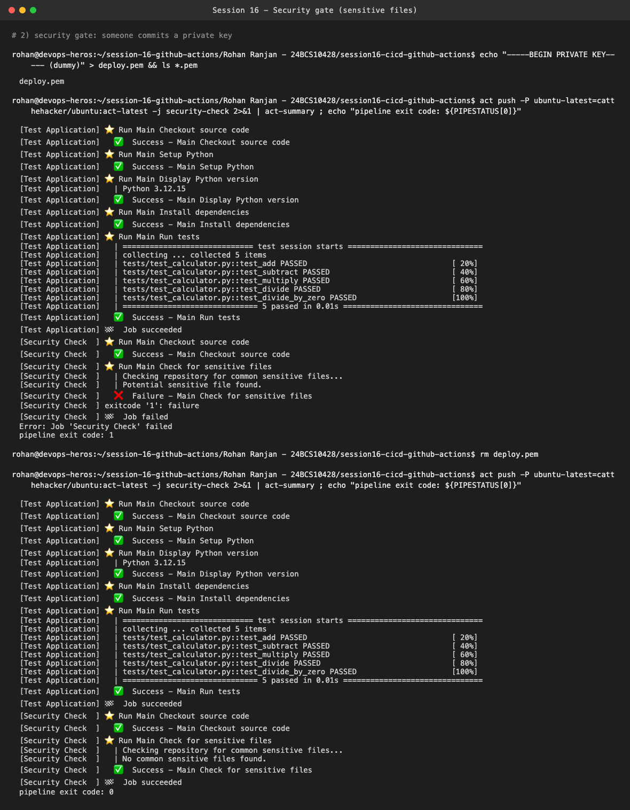

# Session 16 — CI/CD with GitHub Actions (Mini Project: Final CI Pipeline)

**Name:** Rohan Ranjan
**Enrollment Number:** 24BCS10428

The mini project is the Python calculator from `10-final-cicd-pipeline/` with a three-job workflow
(`test` → `build` + `security-check`). My copy is in
[`session16-cicd-github-actions/`](session16-cicd-github-actions/). The only change I made is that
`build.sh` also writes `Built by: Rohan Ranjan (24BCS10428)` into `build-info.txt`.

```text
session16-cicd-github-actions/
├── .github/workflows/ci.yml   # Final CI Pipeline: test -> build (artifact) + security-check
├── app/calculator.py
├── tests/test_calculator.py   # 5 pytest tests
├── build.sh                   # creates build/ with calculator.py + build-info.txt
└── requirements.txt           # pytest
```

**How the workflow was executed:** GitHub only runs workflows from `.github/workflows/` at the
**root** of a repository. This project sits in a sub-folder of the course repo, so pushing it would
not trigger anything. I ran the exact same `ci.yml` locally with
[`act`](https://github.com/nektos/act) v0.2.89. act reads the workflow, builds the job graph from
`needs:`, and runs each job in a Docker container (`catthehacker/ubuntu:act-latest`) using the real
`actions/checkout@v6`, `actions/setup-python@v7` and `actions/upload-artifact@v4`. In the
screenshots I pipe act's output through `act-summary`, a small `grep` filter I wrote to hide the
docker plumbing and pip download lines. Every step, its output and its result are left as-is.

---

## 1. Run locally (section 8 of the README)

```bash
pytest -v
printf '10 + 5\n7 * 6\n9 / 0\nq\n' | python3 app/calculator.py
./build.sh
```



All 5 tests pass. The calculator handles `10 + 5 = 15.0`, `7 * 6 = 42.0` and reports
`Cannot divide by zero`. `build.sh` produces `build/calculator.py` and `build/build-info.txt`.

---

## 2. Full pipeline run: all jobs green

```bash
act --list
act --graph
act push -P ubuntu-latest=catthehacker/ubuntu:act-latest --artifact-server-path /tmp/act-artifacts
```



`act --list` shows the stages. `test` is stage 0, and `build` and `security-check` are both stage 1
because each has `needs: test`. `--graph` draws the same dependency. In the run:

- **Test Application**: checkout → setup Python 3.12 (3.12.15 downloaded) → install deps →
  `pytest -v`: **5 passed**
- **Security Check** and **Build Application** start only after test succeeds, and run in parallel
- **Build**: `build.sh`, prints `build-info.txt`, then uploads the `calculator-build` artifact
  (2 files, 930 bytes)

---

## 3. Artifact



`upload-artifact@v4` sent the zip to act's local artifact server (on GitHub this would be the
**Artifacts** section of the run page). It contains `build-info.txt` and `calculator.py`, and the
build info was generated inside the runner container (UTC time, `Built by: Rohan Ranjan`).

---

## 4. A failing test stops the pipeline

I broke `add()` on purpose (`return a - b`) and pushed again:



`test_add` fails with `assert 5 == 15`, the **Run tests** step exits 1, and the job fails. Neither
**Build Application** nor **Security Check** even starts, because of `needs: test`. Broken code never
gets built into an artifact. The overall run exits with code 1, which is what turns a GitHub check
red and blocks a PR merge. I then restored `return a + b` (the file is identical to the original).

---

## 5. Security gate



I committed a dummy `deploy.pem` to simulate leaking a private key. The **Security Check** job's
`find` matched it, printed `Potential sensitive file found.` and failed with exit code 1. After
deleting the file, the same job passes with `No common sensitive files found.` This check only
looks at file names (`.env`, `*.pem`, `*.key`). A real pipeline would use a content-based secret
scanner like gitleaks (covered in Session 17).

---

## Key concepts, in my words

- **CI vs CD**: CI means every push is automatically built and tested. Continuous *Delivery* means
  the result is always ready to deploy, and someone presses the button. Continuous *Deployment*
  means it goes to production automatically when the pipeline is green.
- **Workflow → jobs → steps**: a workflow (`ci.yml`) has jobs. Each job runs on its own fresh
  runner, which is why `build` has to check out the code and set up Python again. Each job has steps.
- **`uses` vs `run`**: `uses:` calls a packaged action (checkout, setup-python, upload-artifact).
  `run:` executes shell commands on the runner.
- **`needs`**: turns parallel jobs into a dependency chain. A failed dependency means dependent
  jobs are skipped.
- **Artifacts**: files a job hands out of its runner (build output, reports). Without uploading
  them, everything is lost when the runner is destroyed.
- **Secrets**: stored in repo Settings → Secrets, read as `${{ secrets.NAME }}`, masked in logs,
  and never committed. The security-check job is a basic guard against committing them by accident.
