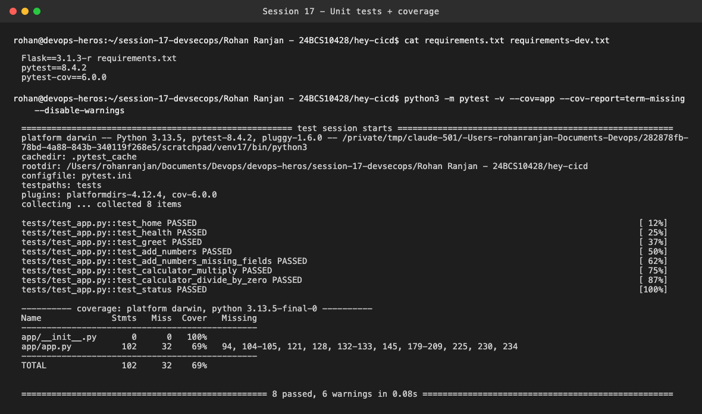
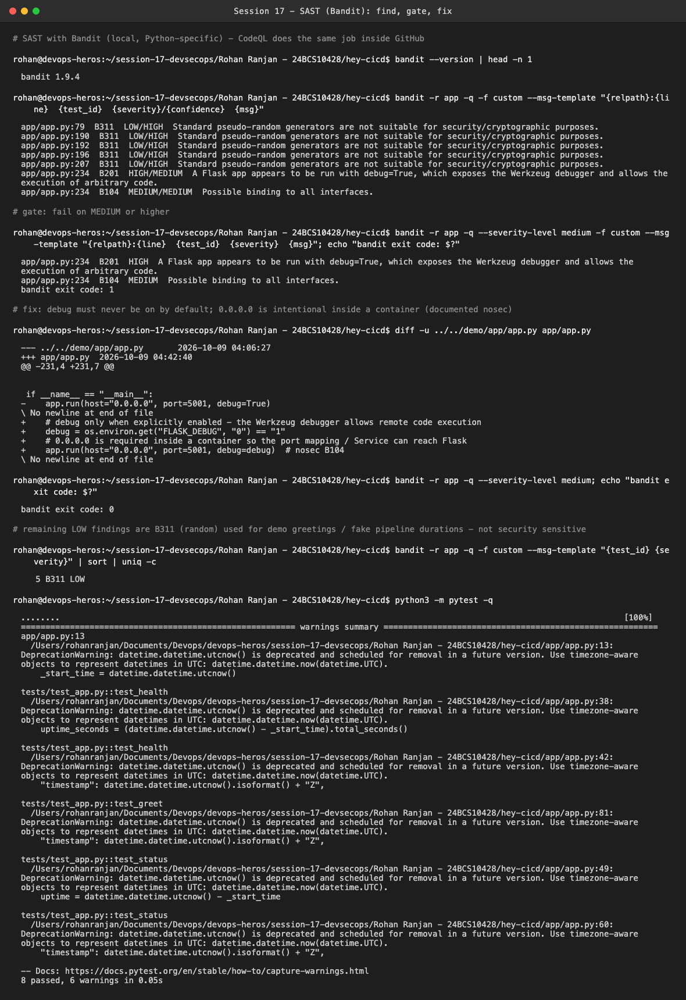
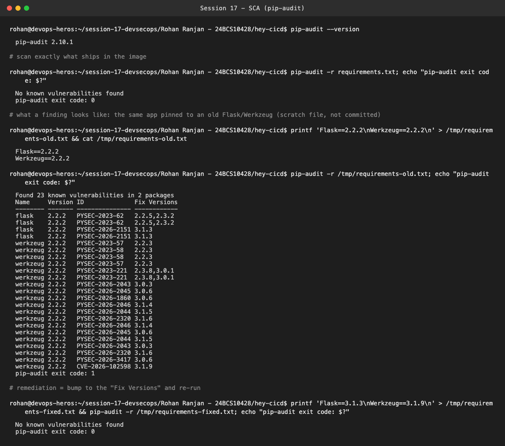
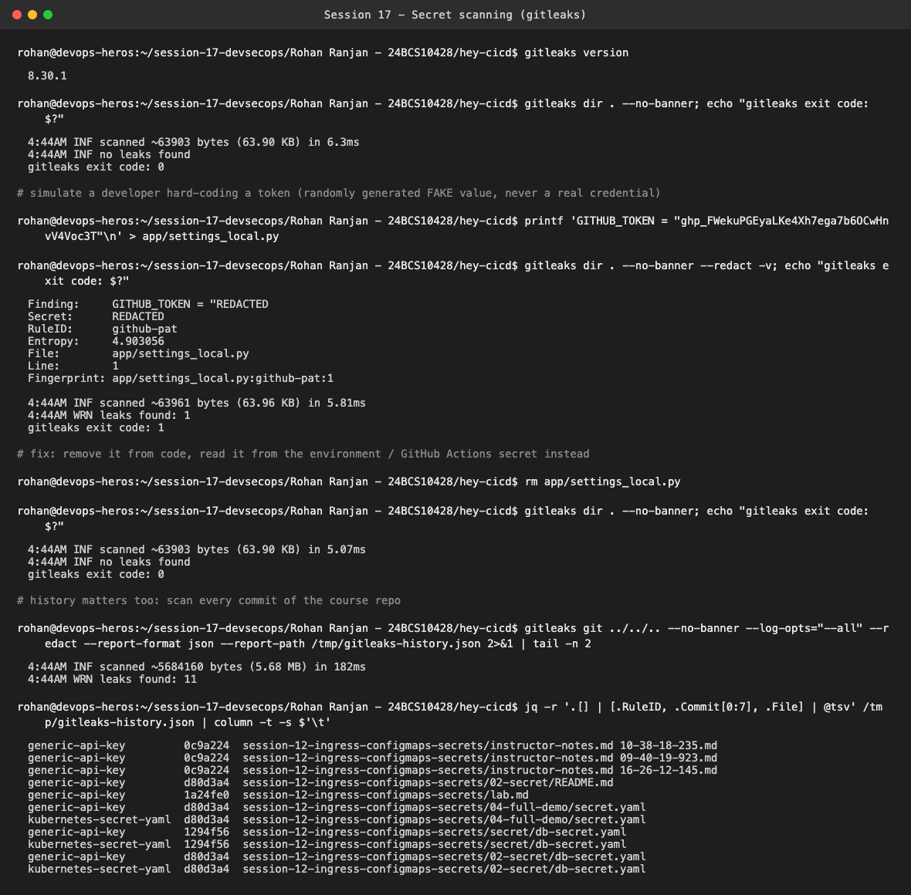
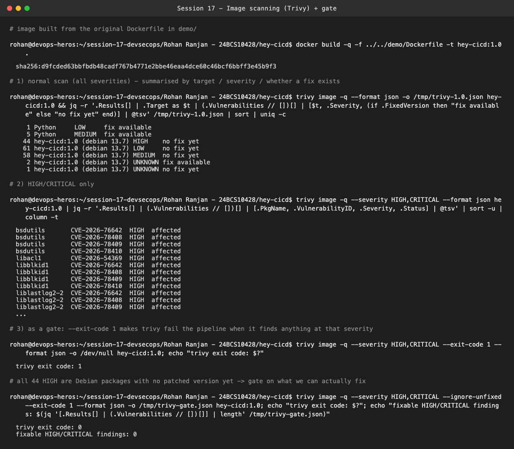
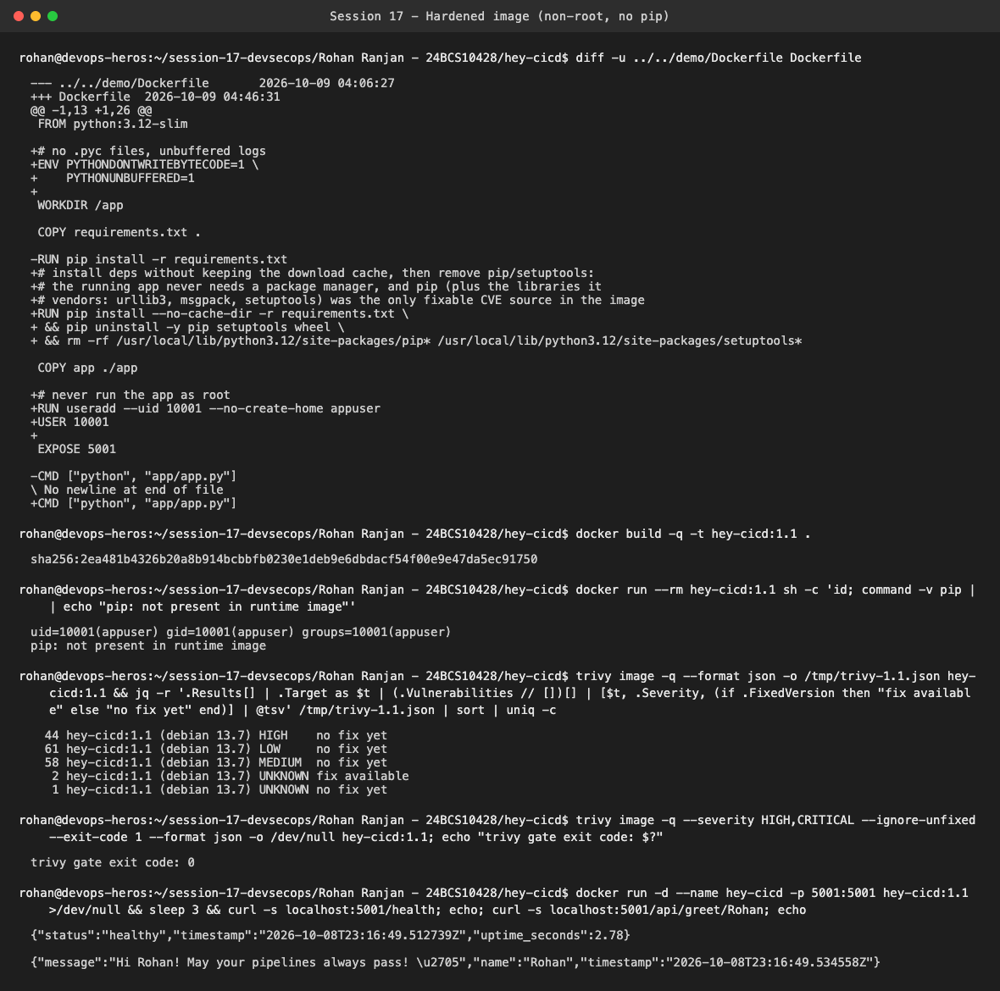
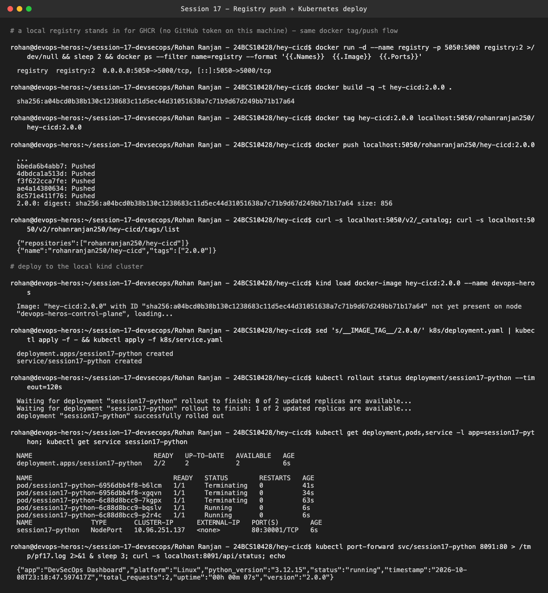
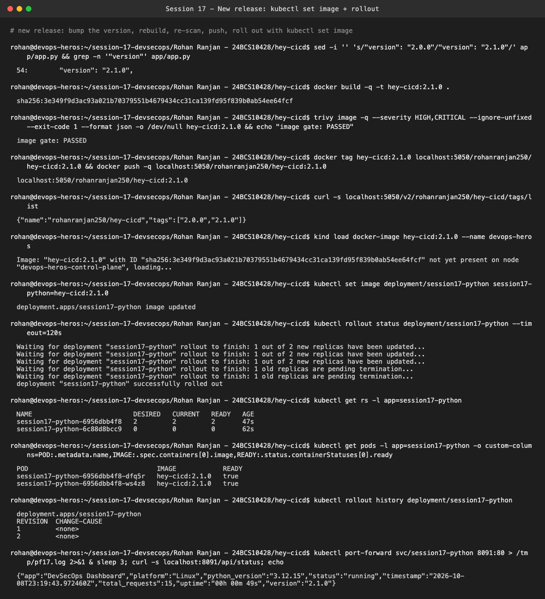
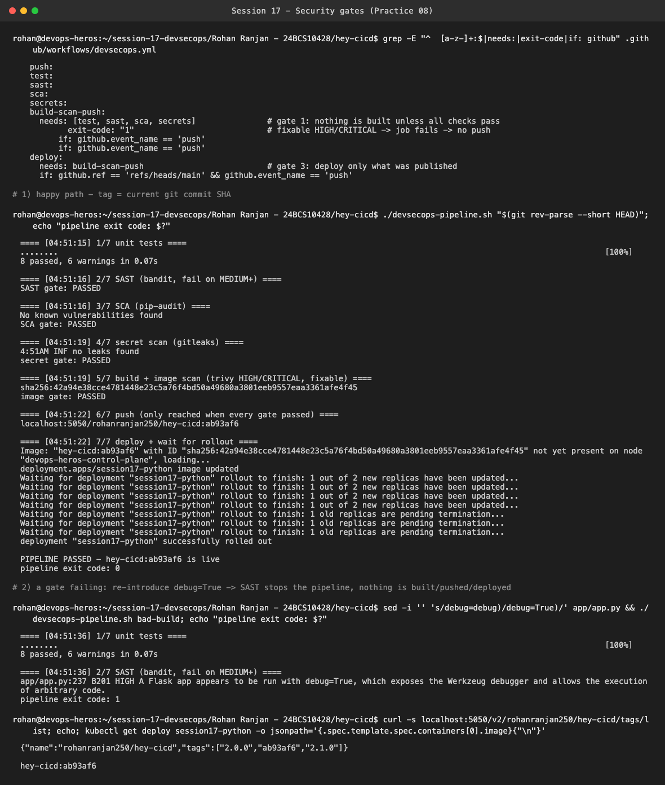

# Session 17 — DevSecOps (hey-cicd)

**Name:** Rohan Ranjan
**Enrollment Number:** 24BCS10428

I took the `demo/` Flask app (the "hey-cicd" DevSecOps dashboard) into
[`hey-cicd/`](hey-cicd/) and ran each security stage on it for real. Where a scanner found
something, I fixed the code or Dockerfile and re-scanned.

| Stage | Tool I ran locally | In GitHub Actions |
| :--- | :--- | :--- |
| Unit tests | pytest + pytest-cov | same |
| SAST | **Bandit 1.9.4** | CodeQL. It needs GitHub's code-scanning backend, so I used Bandit (a Python SAST tool) locally |
| SCA | pip-audit 2.10.1 | same |
| Secret scanning | gitleaks 8.30.1 | `gitleaks-action` + GitHub secret scanning |
| Image scanning | Trivy 0.75.0 | `aquasecurity/trivy-action` |
| Registry | local `registry:2` on `localhost:5050` | GHCR. There's no GitHub token on this machine, so I used a local registry with the same `docker tag`/`push` flow |
| Deploy | `kind` cluster `devops-heros` | kind in the runner (`helm/kind-action`) |

What I changed compared to `demo/`:
- `app/app.py`: `debug=True` removed (SAST fix), version bumped to `2.1.0` for the rollout demo
- `Dockerfile`: hardened. It removes pip/setuptools after installing deps and runs as a non-root user
- `k8s/deployment.yaml`: probes, resources, `runAsNonRoot`, and an image-tag placeholder for the pipeline
- `.github/workflows/devsecops.yml`: my gated pipeline (Practice 08)
- `devsecops-pipeline.sh`: the same gates as a local script, which I actually ran

---

## 1. Unit tests + coverage

```bash
python3 -m pytest -v --cov=app --cov-report=term-missing
```



All 8 tests pass with 69% line coverage on `app/app.py`. The uncovered lines are mostly the
simulated pipeline endpoint (`/api/pipeline/run`) and some calculator error branches.

---

## 2. SAST: find, gate, fix (04-sast)

```bash
bandit -r app
bandit -r app --severity-level medium     # used as a gate
```



Bandit reported 7 issues:
- **B201, HIGH**: `app.run(..., debug=True)` (`app/app.py:234`). The Werkzeug debugger allows
  arbitrary code execution from the browser if it's ever reachable. That's a real vulnerability.
- **B104, MEDIUM**: binding to `0.0.0.0`. Inside a container this is required, otherwise the port
  mapping and the Kubernetes Service can't reach Flask.
- **5 × B311, LOW**: `random` used for greetings and fake pipeline durations. That's not a security
  context, so I accepted them.

The gate (`--severity-level medium`) failed with exit code 1. The fix: debug is now off unless
`FLASK_DEBUG=1` is set explicitly, and the intentional `0.0.0.0` has a documented `# nosec B104`.
After that the gate passes (exit 0) and all 8 tests still pass. This is the same loop as the CodeQL
practice: read the file and line, understand it, fix it, push again.

---

## 3. SCA (05-sca)

```bash
pip-audit -r requirements.txt
```



1. **Run locally**: `requirements.txt` (`Flask==3.1.3`) reports **No known vulnerabilities found**.
2. **Read the output**: to show what a finding looks like, I audited the same app pinned to
   `Flask==2.2.2` / `Werkzeug==2.2.2` (a scratch file, not committed). That gave
   **23 known vulnerabilities in 2 packages** and exit code 1.
3. **Package/version info**: each row is `name`, `installed version`, `advisory ID`
   (PYSEC-/CVE-/GHSA-), and **Fix Versions**. For example, `werkzeug 2.2.2 PYSEC-2023-221 → 2.3.8, 3.0.1`.
4. **Remediation**: upgrade to at least the highest fix version needed, then re-run the tests and
   the audit. `Flask==3.1.3 + Werkzeug==3.1.5` still had 3 Werkzeug advisories (fixed in 3.1.6 / 3.1.9),
   and `Werkzeug==3.1.9` came back clean. One more thing I noticed: our `requirements.txt` pins only
   Flask, so Werkzeug floats to the latest version on every build. That's why it's clean today, but
   a lockfile (`pip-compile`/`pip freeze`) makes builds reproducible and audits meaningful.

---

## 4. Secret scanning (06-secret-scanning)

```bash
gitleaks dir .
gitleaks git <repo> --log-opts="--all"
```



- The clean app scan reported **no leaks found**.
- I wrote a **randomly generated fake** GitHub token (`ghp_` + 36 random characters, never a real
  credential) into `app/settings_local.py`. gitleaks caught it (`RuleID: github-pat`) and exited 1.
  After removing the file, the scan is clean again.
- I also scanned **all 58 commits** of the course repo. It found 11 matches, all in Session 12
  teaching files (`db-secret.yaml`, `lab.md`, instructor notes) that contain the demo password
  `secretpassword` and a `kind: Secret` manifest with base64 data. They're intentional demo values,
  but they show why a history scan matters: deleting a file in a later commit doesn't remove it
  from history.

**Practice questions**

1. *Why should secrets not be stored in source code?* Anyone with read access to the repo, its
   forks, clones, CI logs or a leaked laptop gets the secret. It also lives forever in Git history,
   and it can't be rotated or scoped per environment without a code change.
2. *GitHub Actions secret vs source-code secret?* An Actions secret is stored encrypted by GitHub,
   only injected into a job at runtime (`${{ secrets.X }}`), masked in logs, and not available to
   fork PRs. A source-code secret is plain text in the repo, readable by everyone who can read the
   code, permanently in history.
3. *A real cloud key was pushed. What now?* First **revoke or rotate the key immediately**. Assume
   it's compromised, because bots scan GitHub within minutes. Then check the provider's audit logs
   (CloudTrail etc.) for misuse, remove it from history (`git filter-repo` / BFG, then force-push and
   have collaborators re-clone), move it to a secret store or Actions secret, and add secret scanning
   to CI and as a pre-commit hook so it doesn't happen again.

---

## 5. Image scanning + gate (07-container-image-scanning)

```bash
docker build -t hey-cicd:1.0 .
trivy image hey-cicd:1.0
trivy image --severity HIGH,CRITICAL hey-cicd:1.0
trivy image --severity HIGH,CRITICAL --exit-code 1 hey-cicd:1.0
```



1. **Build**: the original `demo/Dockerfile` on `python:3.12-slim` (Debian 13.7).
2. **Normal scan**: 44 HIGH, 58 MEDIUM, 61 LOW in Debian packages, **all with no fix available
   yet** (status `affected` / `fix_deferred`), plus 6 fixable findings in the bundled `pip 25.0.1`.
3. **HIGH/CRITICAL scan**: 44 HIGH, mostly `util-linux` (`bsdutils`, `libblkid1`, `mount`, …),
   `ncurses` and `perl-base`. There are no CRITICAL findings.
4. **`--exit-code 1`**: Trivy's exit code is normally 0 even when it finds vulnerabilities.
   `--exit-code 1` makes it return 1 when anything at the selected severity is found, and a non-zero
   exit fails the CI step, which stops the job. With 44 unfixable HIGHs the strict gate fails
   forever, and nobody can do anything about it. So the practical gate adds `--ignore-unfixed`. It
   blocks on HIGH/CRITICAL **that have a fix**, which means "you could have patched this and didn't".
   That gate passes with 0 findings.

## 6. Hardening the image



My first attempt was `pip install --upgrade pip`. That made the scan **worse**: pip 26.2.1 vendors
`urllib3 2.7.0`, `msgpack 1.1.2` and `setuptools 70.3.0`, which added **4 fixable HIGH** findings. The
real fix was to **remove pip/setuptools from the runtime image** after installing the dependencies,
since the app never needs a package manager at runtime. Final image (`hey-cicd:1.1`):
- runs as `uid=10001(appuser)`, not root
- no pip in the image
- **0 Python-package findings** (was 6), and the fixable-HIGH/CRITICAL gate passes
- still works: `/health` → `healthy`, `/api/greet/Rohan` → greeting

The remaining Debian CVEs come from the base image and need a patched `python:3.12-slim` (rebuild
when Debian ships fixes), or a smaller base like distroless to shrink the attack surface.

---

## 7. Registry + Kubernetes deployment (02-container-registry, 03-kubernetes-deployment)





1. Built and tagged `localhost:5050/rohanranjan250/hey-cicd:2.0.0`, pushed it, and verified it through
   the registry API (`/v2/_catalog`, `/tags/list`). On GitHub the same image would be
   `ghcr.io/rohanranjan250/hey-cicd:<sha>`, visible under **Packages**.
2. Deployed to kind. `kind load docker-image` side-loads the image into the node, because kind's
   containerd can't see my laptop's `localhost:5050`. 2/2 pods Ready, and `/api/status` returns
   `"version":"2.0.0"`.
3. Changed the image tag: bumped the version to `2.1.0`, rebuilt, passed the Trivy gate, pushed.
4. `kubectl set image deployment/session17-python session17-python=hey-cicd:2.1.0`
5. `kubectl rollout status` waited until both new pods were Ready. The new ReplicaSet `6956dbb4f8`
   has 2 pods and the old one `6c88d8bcc9` has 0, and `rollout history` shows revision 2.
6. Verified the new pods run `hey-cicd:2.1.0`, and the API now returns `"version":"2.1.0"`.

---

## 8. Security gates pipeline (08-security-gates)

[`hey-cicd/.github/workflows/devsecops.yml`](hey-cicd/.github/workflows/devsecops.yml) implements
the Practice 08 requirements:

```text
test ─┐
sast ─┤ (CodeQL)
sca  ─┼──> build-scan-push ──> deploy (main only)
secrets┘      │  Trivy gate: HIGH/CRITICAL fixable -> exit 1
              │  push to GHCR as :<git sha> only if the scan passed
              └─ deploy uses that exact SHA, then waits for `rollout status`
```

Since this folder isn't a repo root, GitHub won't run it. I ran the same stages and gates with
[`devsecops-pipeline.sh`](hey-cicd/devsecops-pipeline.sh):



- **Happy path** (tag = git SHA `ab93af6`): tests → SAST → SCA → secrets → build → image gate →
  push → deploy → rollout status. Result: `PIPELINE PASSED`.
- **Failing gate**: I re-introduced `debug=True`. Bandit failed at stage 2 with B201 HIGH and the
  script exited 1. Nothing was built, pushed or deployed. The registry has no `bad-build` tag and the
  cluster is still running `hey-cicd:ab93af6`.

One bug I hit while writing the script: I first wrote the gates as `bandit ... && echo "PASSED"`.
Under `set -e` a failing command on the left of `&&` **doesn't stop the script**, so my first
"failing" run went straight past SAST. Each gate is now a standalone command, so `set -e` catches it.
