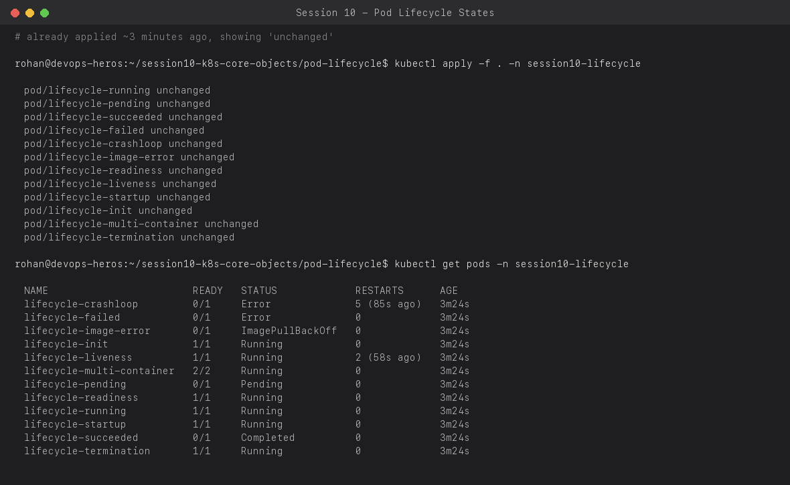
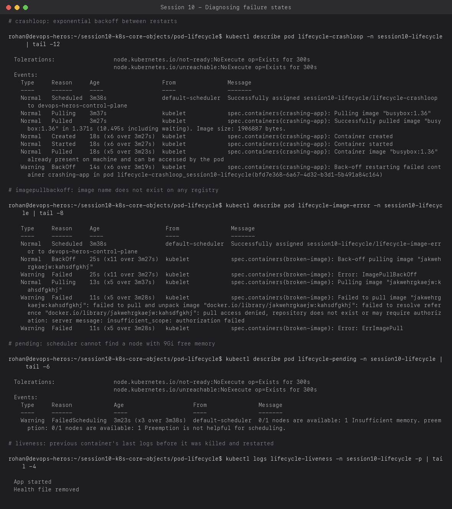
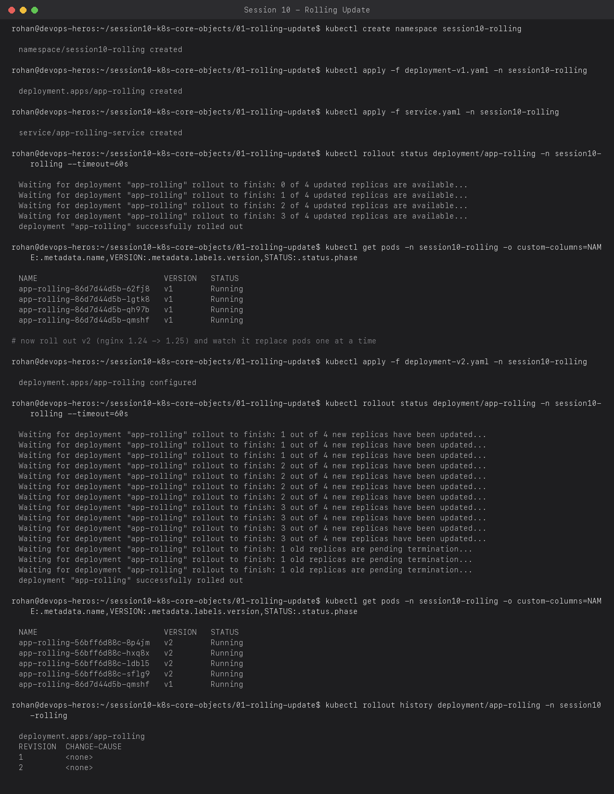
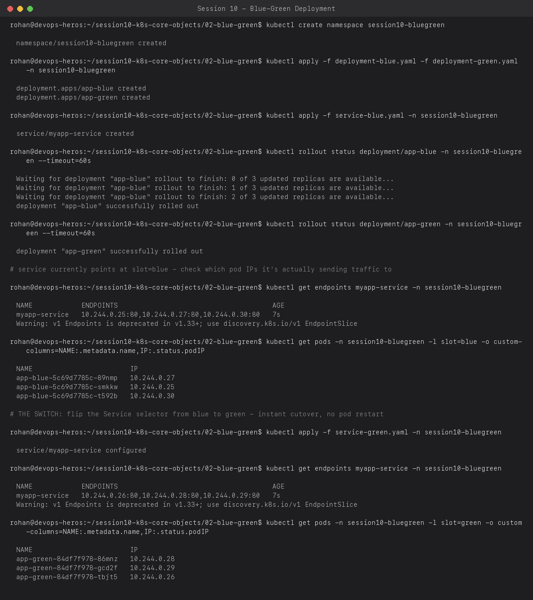
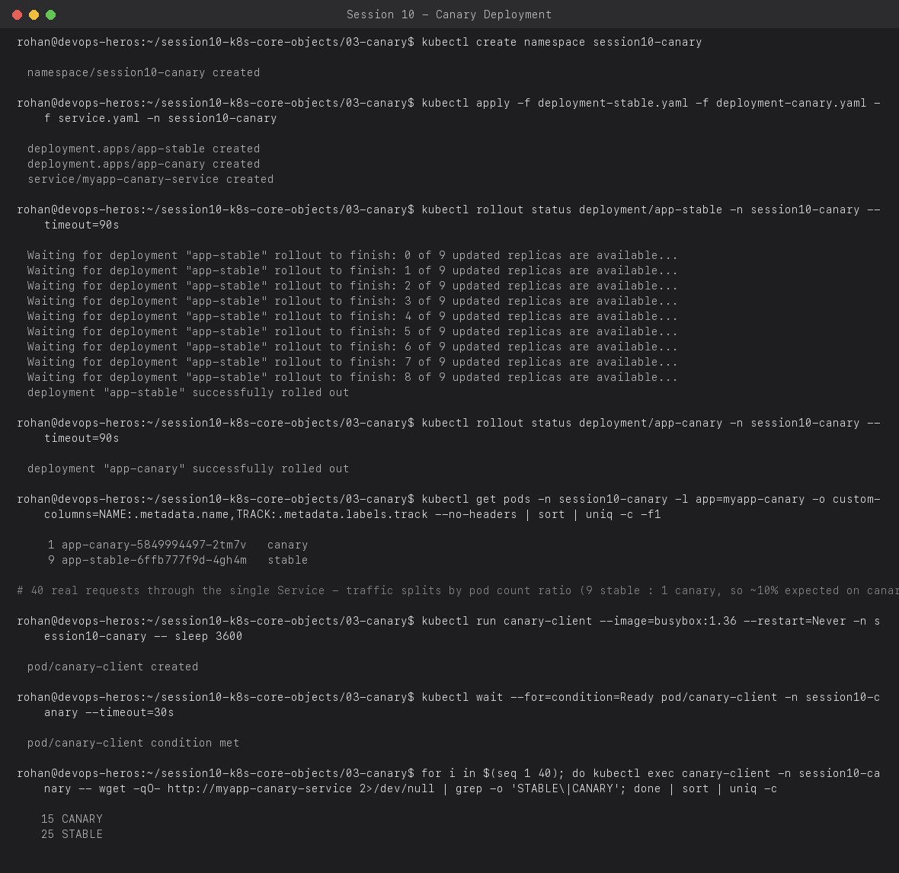
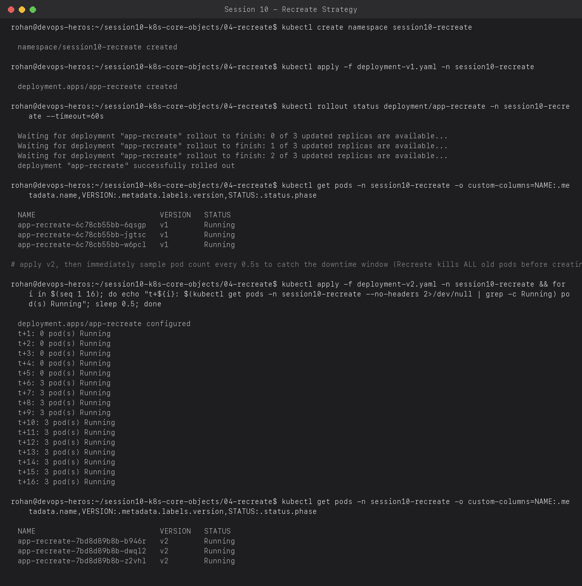

# Session 10 — Kubernetes Core Objects: Pod Lifecycle & Deployment Strategies

**Name:** Rohan Ranjan
**Enrollment Number:** 24BCS10428

Every command below was run for real against a local `kind` (Kubernetes-in-Docker) cluster.
Screenshots are the actual terminal output, not mocked data.

---

## Task 1: Pod Lifecycle States

A Pod moves through a set of well-defined phases (`Pending`, `Running`, `Succeeded`, `Failed`),
and containers inside it can additionally sit in `Waiting` states like `CrashLoopBackOff` or
`ImagePullBackOff`. I applied all 12 manifests in `pod-lifecycle/` at once into a scratch
namespace so every state could be observed side by side:

```bash
kubectl apply -f pod-lifecycle/ -n session10-lifecycle
kubectl get pods -n session10-lifecycle
```



| Pod | What it shows |
| :-- | :-- |
| `lifecycle-running` | Healthy steady state |
| `lifecycle-pending` | Requests 9Gi memory — scheduler can't place it on any node, stays `Pending` forever |
| `lifecycle-succeeded` | `restartPolicy: Never`, exits 0 → `Completed` |
| `lifecycle-failed` | `restartPolicy: Never`, exits 1 → `Error`, not retried |
| `lifecycle-crashloop` | Exits 1 every ~3s, default `restartPolicy: Always` → Kubernetes retries with exponential backoff |
| `lifecycle-image-error` | Image name doesn't exist on any registry → `ImagePullBackOff` |
| `lifecycle-readiness` / `-liveness` / `-startup` | Probes gate traffic / trigger restarts / delay the other two probes |
| `lifecycle-init` | An initContainer must finish before the main container starts |
| `lifecycle-multi-container` | Two containers sharing one pod (`2/2` ready) |
| `lifecycle-termination` | Traps `SIGTERM` and takes 10s to clean up before exiting |

Digging into the interesting failures with `describe` and `logs -p`:

```bash
kubectl describe pod lifecycle-crashloop -n session10-lifecycle
kubectl describe pod lifecycle-image-error -n session10-lifecycle
kubectl describe pod lifecycle-pending -n session10-lifecycle
kubectl logs lifecycle-liveness -n session10-lifecycle -p
```



Real things worth noting from the actual output:
- The crashloop pod's `BackOff` events show the exponential delay Kubernetes imposes between
  restarts — it doesn't just restart-loop as fast as possible.
- The `ImagePullBackOff` events show the *exact* two-stage process: `Pulling` → `Failed` (with
  the real registry error, "pull access denied, repository does not exist") → `BackOff`.
- `kubectl logs -p` fetches the **previous** container instance's logs — essential once liveness
  has already killed and replaced the container you're debugging.

---

## Task 2: Rolling Update (default strategy)

Replaces pods gradually, one (or `maxSurge`) at a time, only proceeding once the new pod passes
its readiness probe — the app is never at less than full capacity.

```bash
kubectl apply -f 01-rolling-update/deployment-v1.yaml -n session10-rolling
kubectl apply -f 01-rolling-update/service.yaml -n session10-rolling
kubectl rollout status deployment/app-rolling -n session10-rolling
# ... then ship v2 ...
kubectl apply -f 01-rolling-update/deployment-v2.yaml -n session10-rolling
kubectl rollout status deployment/app-rolling -n session10-rolling
kubectl rollout history deployment/app-rolling -n session10-rolling
```



`maxSurge: 1, maxUnavailable: 0` means Kubernetes is allowed one extra pod above the desired
count during the rollout, but never fewer than the desired count — zero downtime is guaranteed
by the numbers, not by luck. `rollout history` keeps the last `revisionHistoryLimit` revisions,
which is what makes `kubectl rollout undo` possible.

---

## Task 3: Blue-Green Deployment

Both versions run **simultaneously**, full size, and the switch is just the Service's label
selector flipping from one to the other — instant, all-or-nothing cutover.

```bash
kubectl apply -f deployment-blue.yaml -f deployment-green.yaml -n session10-bluegreen
kubectl apply -f service-blue.yaml -n session10-bluegreen     # traffic -> blue
kubectl get endpoints myapp-service -n session10-bluegreen
kubectl apply -f service-green.yaml -n session10-bluegreen    # THE SWITCH -> green
kubectl get endpoints myapp-service -n session10-bluegreen
```



Watch the `endpoints` object: before the switch its IPs match the `slot=blue` pods exactly;
after applying `service-green.yaml` (only the `selector` field changed) the endpoint IPs match
`slot=green` pods instead — nothing was restarted, redeployed, or scaled, only the Service's
routing target changed. This is what makes blue-green instantly reversible: rolling back is
just re-applying `service-blue.yaml`.

---

## Task 4: Canary Deployment

One Service selects **both** tracks via a shared label; the traffic split is simply the ratio
of pod counts behind it (9 stable : 1 canary here = ~10% canary traffic expected).

```bash
kubectl apply -f deployment-stable.yaml -f deployment-canary.yaml -f service.yaml -n session10-canary
kubectl get pods -n session10-canary -l app=myapp-canary -o custom-columns=NAME:.metadata.name,TRACK:.metadata.labels.track
# fire 40 real requests at the shared Service from an in-cluster client pod
for i in $(seq 1 40); do kubectl exec canary-client -n session10-canary -- wget -qO- http://myapp-canary-service | grep -o 'STABLE\|CANARY'; done | sort | uniq -c
```



The real run above came back **15 CANARY / 25 STABLE** (37.5%), noticeably higher than the
naive 10% expectation. This is a genuine, worth-knowing caveat, not a mistake: `kube-proxy`'s
iptables mode load-balances per new *connection* using per-rule random probabilities, and at
only 40 samples from a single client pod the observed ratio can drift a fair distance from the
theoretical 9:1 — the guarantee is statistical over many independent clients/requests, not exact
per-request. In a real canary rollout you'd watch error rates / latency on the canary track over
a much larger, more diverse sample before promoting it, precisely because small-sample skew like
this is expected.

---

## Task 5: Recreate Strategy

The opposite extreme from rolling update: **all** old pods are terminated before **any** new
pod is created. Simple, but guarantees a downtime window.

```bash
kubectl apply -f deployment-v1.yaml -n session10-recreate
kubectl rollout status deployment/app-recreate -n session10-recreate
# ship v2 and sample the running pod count every 0.5s to catch the gap
kubectl apply -f deployment-v2.yaml -n session10-recreate
for i in $(seq 1 16); do echo "t+${i}: $(kubectl get pods -n session10-recreate --no-headers | grep -c Running) pod(s) Running"; sleep 0.5; done
```



The real timeline: **0 pods Running from t+0.5s through t+2.5s** (5 samples, ~2.5 real seconds
of zero capacity) before the 3 new v2 pods come up together at t+3s. Compare this directly to
the rolling-update screenshot above, where the pod count never dropped below the desired count
at any point — that's the concrete cost/benefit tradeoff between the two strategies in one
side-by-side comparison.

## Resources

- https://github.com/Nency-Ravaliya/Kubernetes
- k8s core objects: https://github.com/Nency-Ravaliya/Kubernetes/blob/main/core-objects.md
