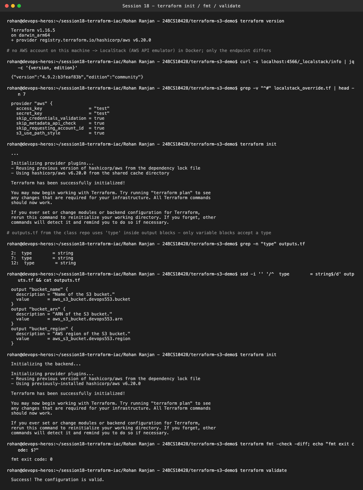
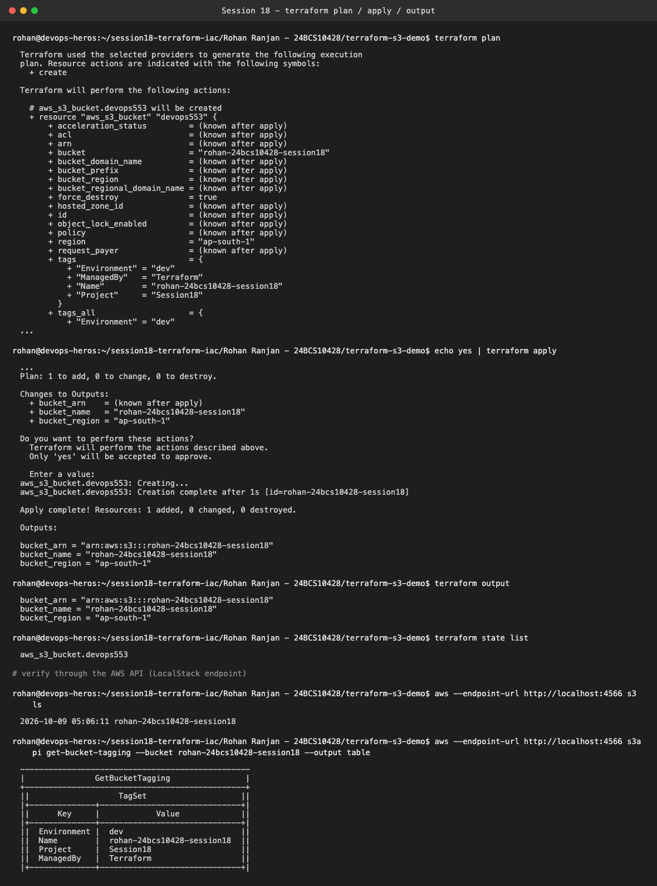
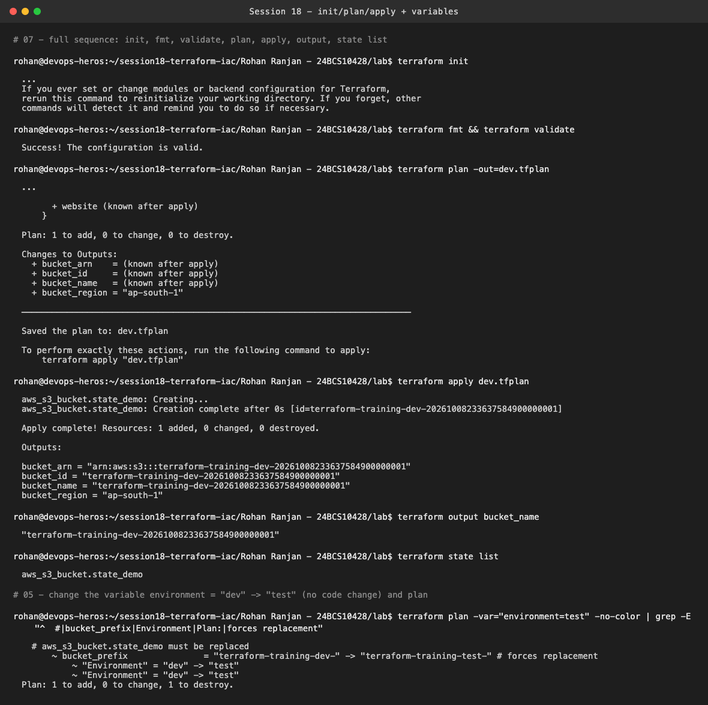
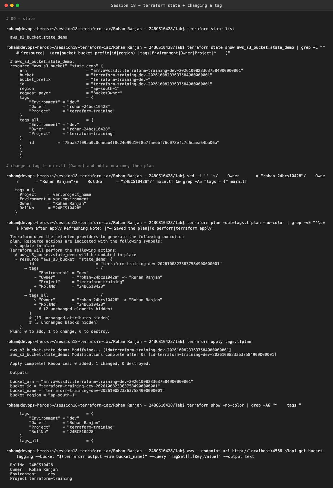
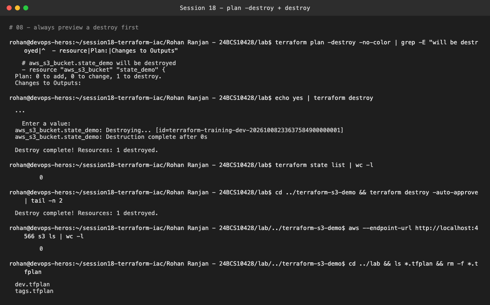

# Session 18 — Terraform & Infrastructure as Code

**Name:** Rohan Ranjan
**Enrollment Number:** 24BCS10428

## Setup, and why LocalStack

I don't have an AWS account or credentials on this laptop, so I ran every lab against
**LocalStack 4.9.2** (community edition), a Docker container that emulates the AWS APIs on
`localhost:4566`. Terraform, the AWS provider and the AWS CLI all talk to it exactly as they would
to AWS. The `.tf` code is unchanged real-AWS code. The only addition is a `localstack_override.tf`
in each project:

```hcl
# Terraform merges *_override.tf into the matching block; deleting this file
# points the exact same code at a real AWS account.
provider "aws" {
  access_key = "test"   # LocalStack's dummy credentials
  secret_key = "test"
  skip_credentials_validation = true
  ...
  endpoints { s3 = "http://localhost:4566", sts = ..., ec2 = ... }
}
```

Tools: Terraform **v1.16.5**, hashicorp/aws provider **v6.20.0** (pinned in the committed
`.terraform.lock.hcl`, which still satisfies the course's `version = "~> 6.0"`), aws-cli 1.46.

Two problems I hit while setting this up:

1. **Provider version vs emulator.** With the newest provider (6.68) the bucket was created but
   **its tags were never stored**. I tested 6.0, 6.10, 6.20, 6.25, 6.30, 6.50 and 6.60 against
   LocalStack and checked with `aws s3api get-bucket-tagging`. Up to 6.20 the tags are really written.
   From 6.25 on, LocalStack never receives a `PutBucketTagging` call. Newer provider versions
   changed how S3 bucket tags are sent, and LocalStack 4.9 doesn't handle the new way. So I locked
   6.20.0. (The newest LocalStack image fixes this, but it now
   requires a paid license and refuses to start without one.)
2. **A bug in the class repo's `terraform-s3-demo/outputs.tf`.** See step 1 below.

```text
Rohan Ranjan - 24BCS10428/
├── terraform-s3-demo/       # copy of the class S3 demo (bucket name changed, outputs.tf fixed)
└── lab/                     # one project for exercises 04, 05, 06, 07, 08, 09
```

---

## 1. `terraform-s3-demo`: init, fmt, validate

```bash
terraform init
terraform fmt -check
terraform validate
```



`terraform init` failed straight away:
`Error: Unsupported argument ... An argument named "type" is not expected here` on all three
outputs. The class `outputs.tf` puts `type = string` inside `output` blocks, but only `variable`
blocks accept a type. An output's type comes from its value. After removing those three lines,
`init` installs the AWS provider, `fmt -check` exits 0 (already formatted) and `validate` prints
`Success! The configuration is valid.`

## 2. plan → apply → output



`plan` shows `Plan: 1 to add, 0 to change, 0 to destroy`. `apply` asks for confirmation (`yes`
piped in) and creates `rohan-24bcs10428-session18`. The outputs give the bucket name, the ARN
(`arn:aws:s3:::rohan-24bcs10428-session18`) and the region. I checked it through the AWS API
itself: `aws s3 ls` lists the bucket, and `get-bucket-tagging` returns the four tags from `main.tf`
(Name, Environment, ManagedBy, Project).

---

## 3. Lab: full sequence (07), outputs (06), variables (05), tags (04)

`lab/main.tf` is based on `05-variables`. It has the exercise-04 tags (`Project`, `Environment`,
`Owner`) and all the outputs from `06-outputs`, including the exercise's `bucket_name`.



- **07**: `init → fmt → validate → plan -out → apply → output → state list` all succeed. The
  bucket gets a generated name from `bucket_prefix`:
  `terraform-training-dev-20261008233637584900000001`.
- **06**: `terraform output bucket_name` prints just that one value. That's how a CI job or
  another module would read it.
- **05**: planning with `-var="environment=test"` and **no code change** gives
  `bucket_prefix "terraform-training-dev-" -> "terraform-training-test-" # forces replacement`
  and `Plan: 1 to add, 0 to change, 1 to destroy`. S3 bucket names can't be renamed, so Terraform
  has to destroy and re-create the bucket. I didn't apply it. The plan is exactly what tells you
  that before it happens.

**Practice Q (05): Why does changing a variable change the desired infrastructure?**
The `.tf` files describe the desired state as expressions, for example
`bucket_prefix = "${var.project_name}-${var.environment}-"`. Variables are inputs to those
expressions. A different input produces a different desired state, and `plan` compares that new
desired state with the real infrastructure recorded in state. The same code with
`dev.tfvars` / `test.tfvars` gives you separate environments.

---

## 4. State (09) + changing a tag



1. `terraform state list` → `aws_s3_bucket.state_demo`
2. `terraform state show` shows everything Terraform knows about the real bucket: id, ARN, region,
   prefix, and tags
3. I changed `Owner = "rohan-24bcs10428"` → `"Rohan Ranjan"` and added `RollNo = "24BCS10428"`
4. `plan` shows `~ update in-place`, `~ "Owner" = "rohan-24bcs10428" -> "Rohan Ranjan"`,
   `+ "RollNo"`, and `Plan: 0 to add, 1 to change, 0 to destroy`. Tags can be changed in place,
   unlike the prefix above.
5. `apply` → `Modifications complete`, then `terraform show` and the AWS API both report the new
   tags

---

## 5. plan -destroy + destroy (08)



`terraform plan -destroy` previews `Plan: 0 to add, 0 to change, 1 to destroy` without touching
anything. `terraform destroy` (confirmed with `yes`) removes the bucket, `state list` becomes empty,
and after destroying the S3-demo project too, `aws s3 ls` returns nothing. No leftover resources.

---

## Practice questions

**01-iac-basics**

1. *What happens if 10 engineers manually create the same infrastructure?*
   You get 10 slightly different setups: different names, sizes, tags, forgotten security-group
   rules. Nobody knows which one is correct, nothing is reviewable, and rebuilding after a failure
   depends on someone's memory. That's configuration drift.
2. *How can Git help with infrastructure?*
   Infrastructure becomes code. Every change is a commit with an author and a message, it goes
   through PR review (with the `terraform plan` output attached), it can be reverted, and CI can run
   `fmt`/`validate`/`plan` automatically. Git becomes the history of the infrastructure.
3. *Same infrastructure in another environment?*
   Run the same code with different variables (a different `tfvars` file, workspace, or a module
   called with other inputs) and a separate state. My `-var="environment=test"` plan shows exactly
   that.

**08-destroy**

1. *`plan` vs `apply`?* `plan` is read-only. It refreshes the real state, compares it with the code
   and prints what would change. `apply` executes those changes (after confirmation, or exactly the
   saved plan file I pass it) and updates the state file.
2. *What does `destroy` do?* It deletes every resource tracked in this configuration's state, in
   reverse dependency order, and empties the state. It's equivalent to `apply -destroy`.
3. *Why `plan -destroy` before deleting production?* It shows exactly which resources would go.
   You can catch a wrong workspace or state, a shared resource you didn't realise was managed here,
   or data that has to be backed up first. A destroy can't be undone, especially for databases and
   buckets with data in them.
