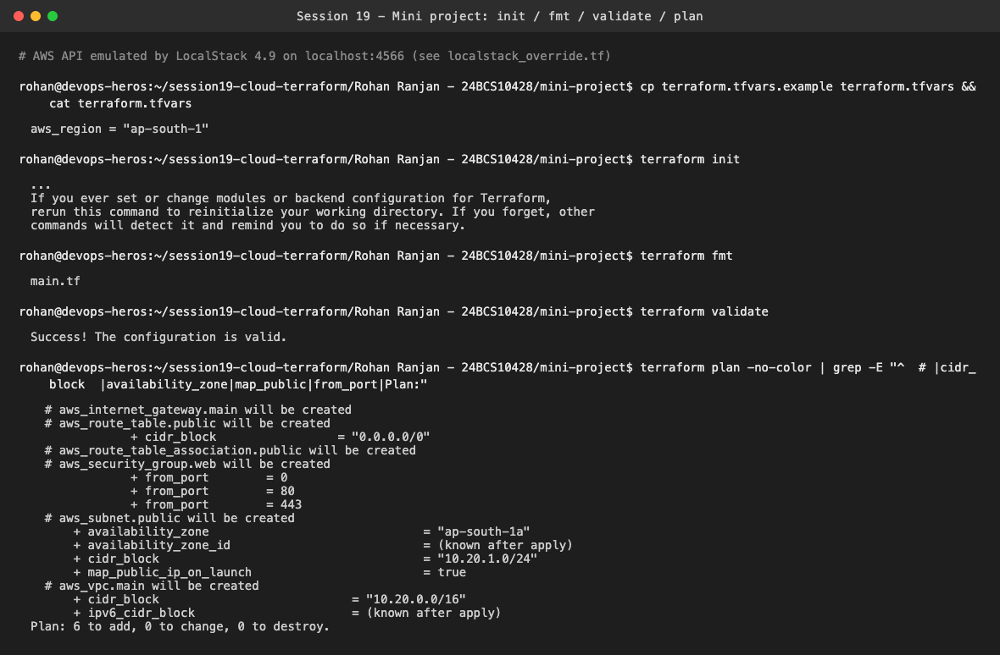
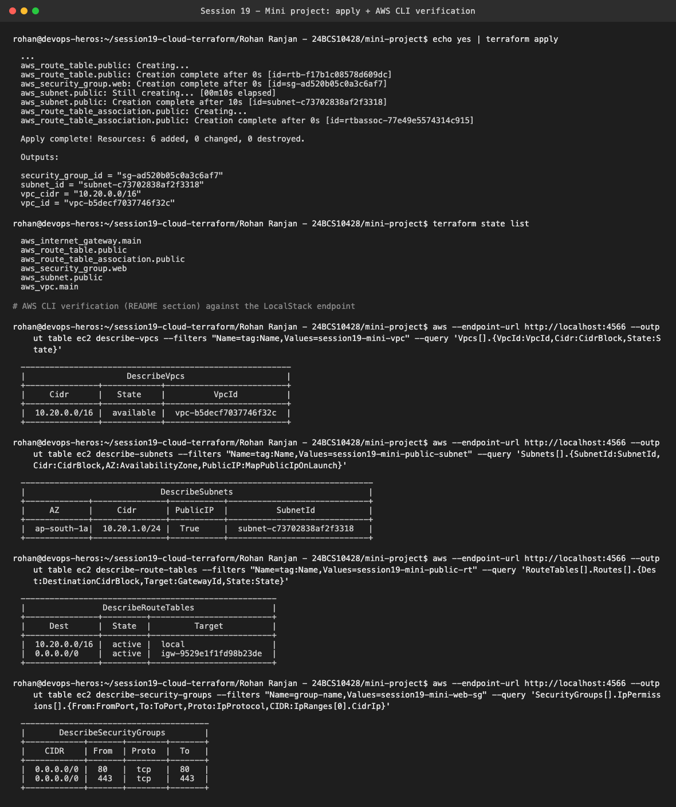
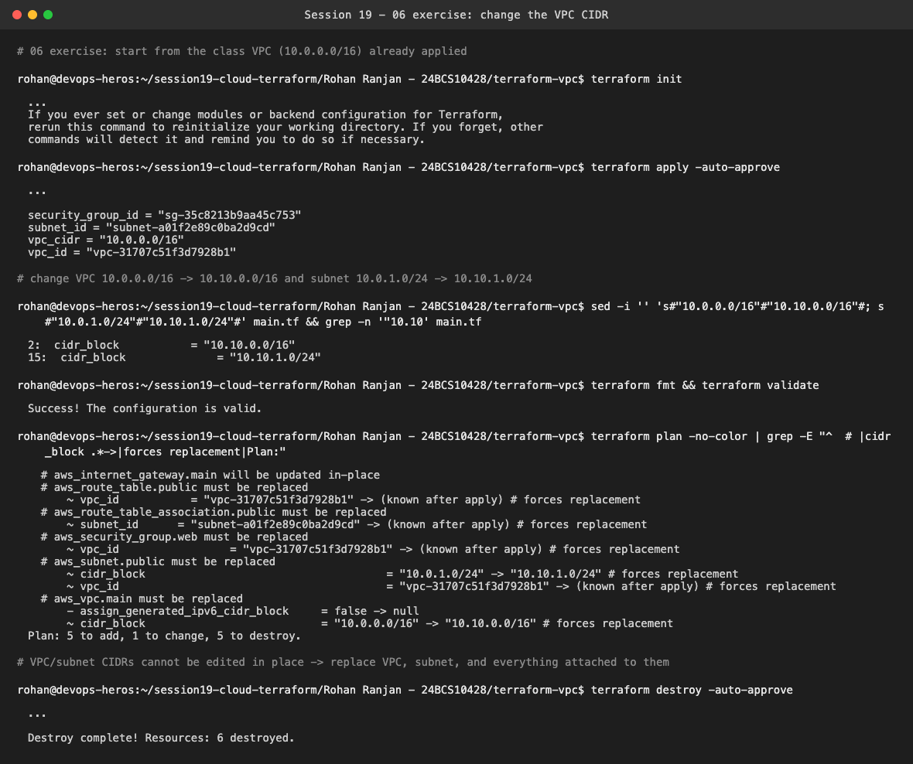
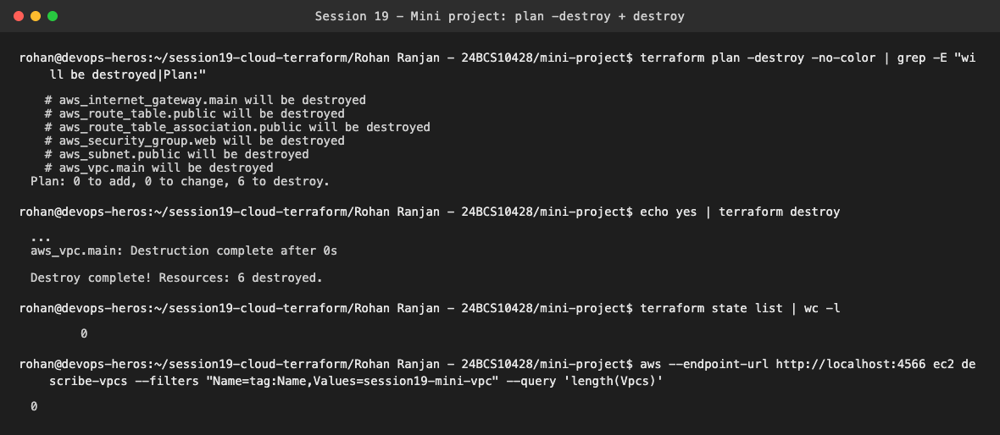

# Session 19 — Cloud Fundamentals + Terraform VPC (Mini Project)

**Name:** Rohan Ranjan
**Enrollment Number:** 24BCS10428

Same setup as Session 18. I have no AWS account on this machine, so Terraform ran against
**LocalStack 4.9.2** (an AWS API emulator in Docker on `localhost:4566`). The `.tf` files are the
class files unchanged. Each project only adds a `localstack_override.tf` that points the AWS
provider's endpoints at LocalStack and uses dummy credentials. Delete that file and the same code
targets real AWS. The provider is locked to **hashicorp/aws 6.20.0** in `.terraform.lock.hcl`
(force-added, because the session's `.gitignore` excludes lock files), for the LocalStack tagging
reason described in my Session 18 README.

```text
Rohan Ranjan - 24BCS10428/
├── mini-project/     # copy of 08-mini-project  (VPC 10.20.0.0/16 + public subnet + IGW + RT + SG)
└── terraform-vpc/    # copy of 06-terraform-vpc (used for the CIDR-change exercise)
```

---

## 1. Mini project: init → fmt → validate → plan

```bash
cp terraform.tfvars.example terraform.tfvars
terraform init
terraform fmt
terraform validate
terraform plan
```



- `terraform fmt` printed `main.tf`, which means it reformatted the file. The class file had
  `gateway_id  =` with two spaces inside the route block, and fmt aligned it.
- `validate` → `Success! The configuration is valid.`
- `plan` → **6 to add**: VPC `10.20.0.0/16`, public subnet `10.20.1.0/24` in `ap-south-1a` with
  `map_public_ip_on_launch = true`, the internet gateway, a route table with `0.0.0.0/0`, its
  association, and the web security group (ingress 80/443, all egress).

## 2. Apply + verify with the AWS CLI



`Apply complete! Resources: 6 added`. The outputs have the shape the README expects:

```text
security_group_id = "sg-ad520b05c0a3c6af7"
subnet_id         = "subnet-c73702838af2f3318"
vpc_cidr          = "10.20.0.0/16"
vpc_id            = "vpc-b5decf7037746f32c"
```

`terraform state list` shows all 6 resources. I ran the README's AWS CLI checks against the
LocalStack endpoint:
- **VPC** `10.20.0.0/16` is `available`
- **Subnet** `10.20.1.0/24` is in `ap-south-1a` with public IPs on launch
- **Route table**: `10.20.0.0/16 → local` (added automatically for traffic inside the VPC) and
  `0.0.0.0/0 → igw-…` (everything else goes to the internet gateway). This is what makes the subnet
  "public".
- **Security group**: inbound `tcp/80` and `tcp/443` from `0.0.0.0/0`

## 3. Exercise 06: change the VPC CIDR



I applied the class VPC (`10.0.0.0/16`), then changed it to `10.10.0.0/16` and the subnet to
`10.10.1.0/24`. `fmt` and `validate` pass. Following "do not apply until you understand the plan",
here's what it says:

```text
Plan: 5 to add, 1 to change, 5 to destroy.
aws_vpc.main             must be replaced   cidr_block "10.0.0.0/16" -> "10.10.0.0/16" # forces replacement
aws_subnet.public        must be replaced   cidr_block + new vpc_id                    # forces replacement
aws_route_table.public   must be replaced   vpc_id -> (known after apply)
aws_security_group.web   must be replaced   vpc_id -> (known after apply)
aws_route_table_association.public  must be replaced
aws_internet_gateway.main  updated in-place  (detached from the old VPC, attached to the new one)
```

A VPC's primary CIDR can't be edited, so changing one line re-creates the VPC. Everything that
references `aws_vpc.main.id` then gets a new `vpc_id` and has to be replaced too. On a real
network with EC2 instances in it, that means downtime. I didn't apply it, and destroyed the lab VPC.

## 4. Cleanup



`terraform plan -destroy` → `0 to add, 0 to change, 6 to destroy`, then `terraform destroy` →
`Destroy complete! Resources: 6 destroyed.`, empty state, and `describe-vpcs` finds 0 matching VPCs.

---

## Practice questions

**01 – Classify:** EC2 → **IaaS** · Gmail → **SaaS** · Elastic Beanstalk → **PaaS** · Google Docs →
**SaaS** · Virtual Machine → **IaaS**. In IaaS I manage the OS and everything above it. In PaaS I
only bring the code and the platform runs it. In SaaS I just use the finished application.

**02 – Regions & AZs**
1. *Is an AZ bigger than a Region?* No. A Region (e.g. `ap-south-1`, Mumbai) contains several AZs.
2. *Can one Region contain multiple AZs?* Yes. `ap-south-1` has `ap-south-1a/b/c`, which are
   physically separate data centers with independent power and networking.
3. *Why use multiple AZs?* So that one data-center failure doesn't take the application down. You
   run copies in two or more AZs behind a load balancer.
4. *Subnet → Region or AZ?* A specific **AZ**. That's why the code sets
   `availability_zone = "${var.aws_region}a"`. A VPC spans the whole Region.

**03 – VPC & subnets**
1. *VPC*: your own logically isolated private network inside an AWS Region, with an IP range you choose.
2. *Subnet*: a smaller IP range carved out of the VPC, living in one AZ, where resources actually go.
3. *Can a subnet be larger than its VPC?* No. It must be inside the VPC's CIDR (`10.20.1.0/24` is
   inside `10.20.0.0/16`).
4. *`10.0.0.0/16`*: the first 16 bits are fixed (`10.0`), leaving 16 bits for hosts, so 65,536
   addresses from `10.0.0.0` to `10.0.255.255`. A `/24` is 256 addresses (AWS reserves 5 per subnet).
5. *Public vs private subnet*: a public subnet's route table has `0.0.0.0/0 → Internet Gateway`.
   A private subnet has no such route (outbound only through a NAT gateway, if at all).

**04 – The path Laptop → Internet → IGW → Route table → Public subnet → EC2**
My request crosses the internet to the instance's public IP. The **Internet Gateway** is the VPC's
door to the internet and translates the public IP to the instance's private IP. The **route table**
associated with the subnet decides where packets go. The `0.0.0.0/0 → igw` route is what lets the
reply go back out. The packet reaches the EC2 instance in the **public subnet**. A route table only
decides *where traffic can go*. It doesn't decide *whether traffic is allowed*. Without a **security
group** rule allowing, say, tcp/80, the packet is dropped at the instance even though routing works.

**05 – Security groups**
1. *What does it do?* It's a stateful virtual firewall attached to an instance or ENI. Everything
   is denied unless a rule allows it.
2. *Inbound rule*: which traffic may come **in** (protocol, port, source), e.g. tcp/443 from
   `0.0.0.0/0`.
3. *Outbound rule*: which traffic the resource may send **out**. Replies to allowed inbound traffic
   are allowed automatically because SGs are stateful.
4. *Why is `0.0.0.0/0` risky for SSH?* Port 22 open to the whole internet gets constant brute-force
   and exploit attempts within minutes. Restrict it to your own IP or a bastion, or use SSM Session
   Manager with no open port at all.
5. *SG vs route table*: the route table is about the **path** (subnet level, where packets go). The
   SG is about **permission** (instance level, which packets are accepted).

**07 – Terraform workflow:** 1. `terraform init` downloads providers · 2. `terraform fmt` formats
code · 3. `terraform validate` checks syntax and consistency · 4. `terraform plan` shows changes
without applying · 5. `terraform apply` creates or changes resources · 6. `terraform destroy`
removes them.

**Optional EC2 extension (questions)**
1. The **public subnet** (`aws_subnet.public`), since it has the IGW route.
2. The **web SG** (`aws_security_group.web`), for 80/443.
3. Without `0.0.0.0/0 → IGW`, traffic from the instance to the internet (including replies) has
   no way out of the VPC.
4. A **public IP** (here `map_public_ip_on_launch = true`, or an Elastic IP), a security group rule
   for the port, and an application actually listening on it. If NACLs were customised, they need
   to allow it too.
5. See 05.4. Use your own IP/32, a bastion, or SSM instead.

**Interview list (08)** — short answers:
IaaS/PaaS/SaaS (above) · Region = geographic area, AZ = isolated data center inside it ·
VPC = private network for the Region, subnet = slice of it in one AZ · public subnet has an IGW
route, private doesn't · route table = rules for where packets go · IGW = the VPC's connection to the
internet · security group = stateful instance firewall · Terraform = declarative IaC tool that
reconciles real infrastructure with code · `plan` previews, `apply` executes · state = Terraform's
record mapping code resources to real IDs (`vpc-b5de…`), so it knows what to update or delete ·
`destroy` deletes everything in that state.
