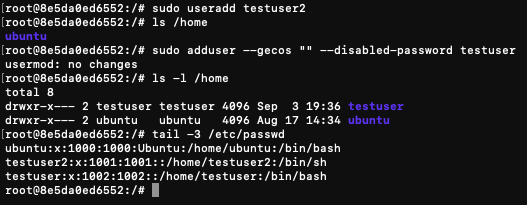
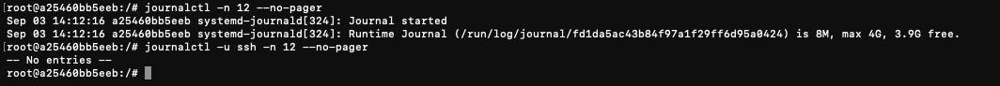
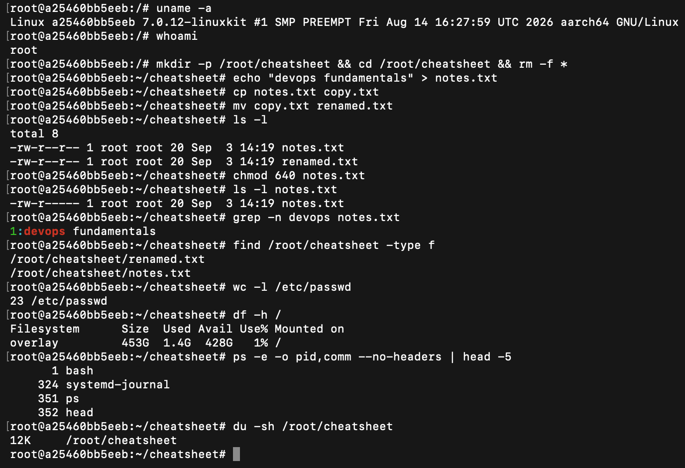

# Session 2 — Linux Fundamentals

**Name:** Rohan Ranjan
**Enrollment Number:** 24BCS10428

Task 1 was run in a normal shell on macOS (`ROHANs-MacBook-Air-2`). Tasks 2–4 were run inside an
Ubuntu container with a full `systemd` init, so `journalctl` and `systemctl` behave exactly as
they would on a normal Linux server. Each code block is the real output from that session, and
every screenshot is attached below the task it belongs to.

---

## Task 1: Soft Link & Hard Link

- Learn the difference between soft links and hard links.
- Learn the commands to create both.
- Practise creating and deleting soft and hard links.
- Prepare this as an interview answer.

### What is a link?

A link is a second name for a file. Linux offers two kinds, and they differ in *what* they
point at — a path, or the data itself.

### Commands

**Syntax**

```bash
ln -s <source_file> <link_name>    # soft (symbolic) link
ln    <source_file> <link_name>    # hard link
```

**Example**

```bash
echo "Hello Linux" > original.txt
ln -s original.txt softlink.txt
ln original.txt hardlink.txt
ls -li
```

### Output

```text
$ ls -li
...
34393990 -rw-r--r--   2 rohanranjan  staff   12  3 Sep 18:57 hardlink.txt
34393990 -rw-r--r--   2 rohanranjan  staff   12  3 Sep 18:57 original.txt
34394045 lrwxr-xr-x   1 rohanranjan  staff   12  3 Sep 18:57 softlink.txt -> original.txt
...

$ cat softlink.txt
Hello Linux

$ cat hardlink.txt
Hello Linux
```

The first column is the inode number, and it is the whole story:

- `hardlink.txt` and `original.txt` both show inode **34393990**. They are not two files — they
  are two names for one file. The `2` after the permissions is the link count, i.e. how many
  names currently point at that inode.
- `softlink.txt` has its own inode **34394045**, a size of 12 bytes (the length of the string
  `original.txt`), and `ls` displays it as `softlink.txt -> original.txt`. It stores a *path*,
  not the data.

### Commands

Now delete the original and see which link survives:

```bash
rm original.txt
cat softlink.txt
cat hardlink.txt
ls -li
```

### Output

```text
$ rm original.txt

$ cat softlink.txt
cat: softlink.txt: No such file or directory

$ cat hardlink.txt
Hello Linux

$ ls -li
...
34393990 -rw-r--r--   1 rohanranjan  staff   12  3 Sep 18:57 hardlink.txt
34394045 lrwxr-xr-x   1 rohanranjan  staff   12  3 Sep 18:57 softlink.txt -> original.txt
```

### Explanation

Deleting `original.txt` removed one *name*, not the file. The hard link still points at inode
34393990, so the data is untouched and `cat hardlink.txt` still works — note the link count has
dropped from `2` to `1`. The data is only freed once the last name is removed. Deleting the
links themselves (`rm softlink.txt hardlink.txt`) then releases the inode entirely.

The soft link broke immediately, because it only ever held the text `original.txt` and that path
no longer resolves. `ls` still lists it happily — a dangling symlink is a perfectly valid file.

**As an interview answer:** a hard link is another directory entry pointing at the same inode,
so it cannot cross filesystems and cannot point at a directory, and the file survives until every
hard link is gone. A soft link is a small file containing a path, so it can cross filesystems and
point at directories, but it breaks if the target moves or is deleted.


---

## Task 2: adduser vs useradd

- Learn the difference between `adduser` and `useradd`.
- Understand which is preferred on Ubuntu/Linux and why.
- Create a test user with the recommended command.

### Commands

```bash
sudo useradd testuser2
ls /home

sudo adduser --gecos "" --disabled-password testuser

ls -l /home
tail -3 /etc/passwd
```

### Output

```text
$ sudo useradd testuser2
$ ls /home
ubuntu
```

`useradd` created the account silently — and note `/home` does not contain `testuser2` at all.

```text
$ sudo adduser --gecos "" --disabled-password testuser
usermod: no changes

$ ls -l /home
total 8
drwxr-x--- 2 testuser testuser 4096 Sep  3 19:36 testuser
drwxr-x--- 2 ubuntu   ubuntu   4096 Aug 17 14:34 ubuntu

$ tail -3 /etc/passwd
ubuntu:x:1000:1000:Ubuntu:/home/ubuntu:/bin/bash
testuser2:x:1001:1001::/home/testuser2:/bin/sh
testuser:x:1002:1002::/home/testuser:/bin/bash
```

### Which command is preferred on Ubuntu/Linux?

**`adduser`** is the one to use on Ubuntu/Debian.

- `useradd` is the low-level binary. It does exactly what it is told and nothing more — no home
  directory unless you pass `-m`, no password prompt, and a default shell of `/bin/sh`.
- `adduser` is a higher-level script that wraps `useradd`. It creates the home directory, copies
  the skeleton files from `/etc/skel`, creates a matching user group, adds the user to the
  sensible supplemental groups, handles the password, and sets `/bin/bash` as the shell.
- The `/etc/passwd` entries show the difference directly: `testuser2` was given `/bin/sh` and a
  home directory that does not exist on disk, while `testuser` got `/bin/bash` and a real
  `/home/testuser`.
- `useradd` is the better choice inside scripts and Dockerfiles, precisely because it is
  non-interactive and predictable — which is why `adduser` here is run with `--gecos ""` and
  `--disabled-password` to keep it from prompting.



---

## Task 3: journalctl

- Learn what `journalctl` is used for.
- Learn how to view system and service logs.
- Practise checking the logs for a specific service.

### What is journalctl?

`systemd` collects the logs of every service it manages into one binary journal, and
`journalctl` is how that journal is read. Rather than hunting through separate files in
`/var/log`, every unit's output is queryable from a single place with consistent filters.

### Commands

```bash
journalctl -n 12 --no-pager
journalctl -u ssh -n 12 --no-pager
```

### Output

```text
$ journalctl -n 12 --no-pager
Sep 03 14:12:16 a25460bb5eeb systemd-journald[324]: Journal started
Sep 03 14:12:16 a25460bb5eeb systemd-journald[324]: Runtime Journal (/run/log/journal/fd1da5ac43b84f97a1f29ff6d95a0424) is 8M, max 4G, 3.9G free.

$ journalctl -u ssh -n 12 --no-pager
-- No entries --
```

### Explanation

`-n 12` limits the output to the most recent 12 lines. `--no-pager` prints straight to stdout
instead of opening `less`, which is what you want in a script or when capturing output.

`-u <unit>` filters to a single service, which is the flag used most often in practice — when a
service will not start, `journalctl -u <name> -n 50` usually shows the reason straight away. Here
`journalctl -u ssh` returns `-- No entries --` because this container image does not run an SSH
server, so that unit has never logged anything; on a real server it would list the sshd startup
and every login attempt.

Other flags worth knowing: `-f` to follow live, `-b` for the current boot only, `-p err` to show
only errors, and `--since "10 min ago"` for a time window.



---

## Task 4: Linux Command Cheat Sheet

- Review the Linux command cheat sheet.
- Practise the important commands.
- Understand the purpose and basic usage of each.

### Commands

```bash
uname -a
whoami
mkdir -p /root/cheatsheet && cd /root/cheatsheet && rm -f *
echo "devops fundamentals" > notes.txt
cp notes.txt copy.txt
mv copy.txt renamed.txt
ls -l
chmod 640 notes.txt
ls -l notes.txt
grep -n devops notes.txt
find /root/cheatsheet -type f
wc -l /etc/passwd
df -h /
ps -e -o pid,comm --no-headers | head -5
du -sh /root/cheatsheet
```

### Output

```text
$ uname -a
Linux a25460bb5eeb 7.0.12-linuxkit #1 SMP PREEMPT Fri Aug 14 16:27:59 UTC 2026 aarch64 GNU/Linux

$ whoami
root

$ ls -l
total 8
-rw-r--r-- 1 root root 20 Sep  3 14:19 notes.txt
-rw-r--r-- 1 root root 20 Sep  3 14:19 renamed.txt

$ chmod 640 notes.txt
$ ls -l notes.txt
-rw-r----- 1 root root 20 Sep  3 14:19 notes.txt

$ grep -n devops notes.txt
1:devops fundamentals

$ find /root/cheatsheet -type f
/root/cheatsheet/renamed.txt
/root/cheatsheet/notes.txt

$ wc -l /etc/passwd
23 /etc/passwd

$ df -h /
Filesystem      Size  Used Avail Use% Mounted on
overlay         453G  1.4G  428G   1% /

$ ps -e -o pid,comm --no-headers | head -5
      1 bash
    324 systemd-journal
    351 ps
    352 head

$ du -sh /root/cheatsheet
12K     /root/cheatsheet
```

### Explanation

| Command | Purpose |
|---|---|
| `uname -a` | Kernel, architecture and hostname in one line |
| `whoami` | The effective user running the shell |
| `cp` / `mv` | Copy a file, or move/rename one |
| `chmod 640` | Set permissions — owner read/write, group read, others none |
| `grep -n` | Search inside files, `-n` prefixes the line number |
| `find <dir> -type f` | Walk a directory tree, `-type f` restricts to regular files |
| `wc -l` | Count lines |
| `df -h` | Free space per mounted filesystem, `-h` in human units |
| `ps -e -o pid,comm` | List processes, choosing which columns to print |
| `du -sh` | Total size of a directory, summarised and human readable |

The pattern worth remembering is that `-h` means "human readable" across `df`, `du` and `free`,
and that most of these commands are designed to be piped into one another — `ps` into `head`
above being the simplest example.


