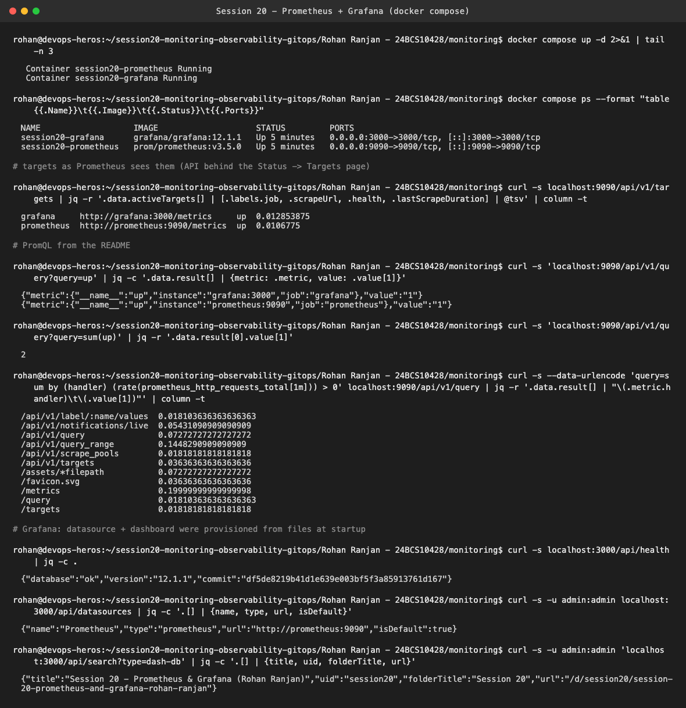
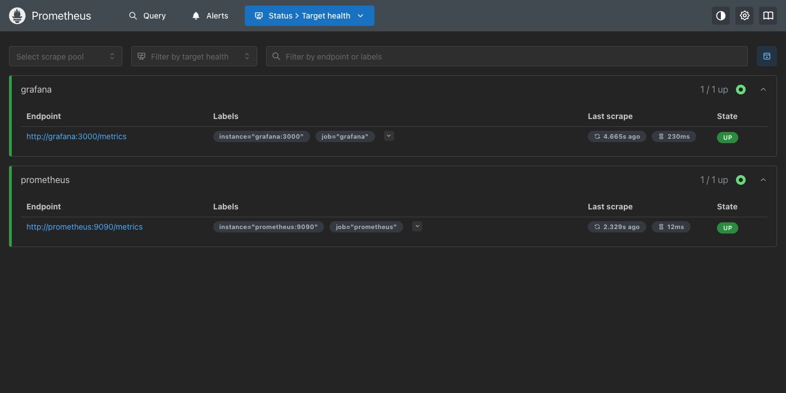
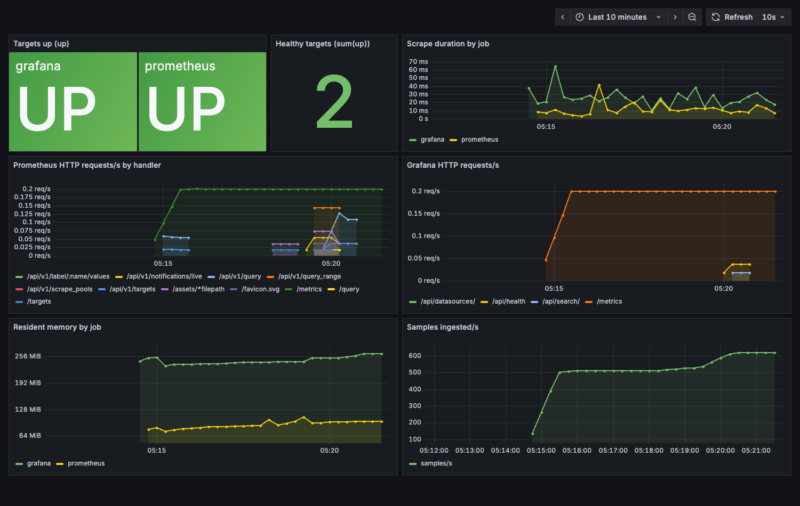
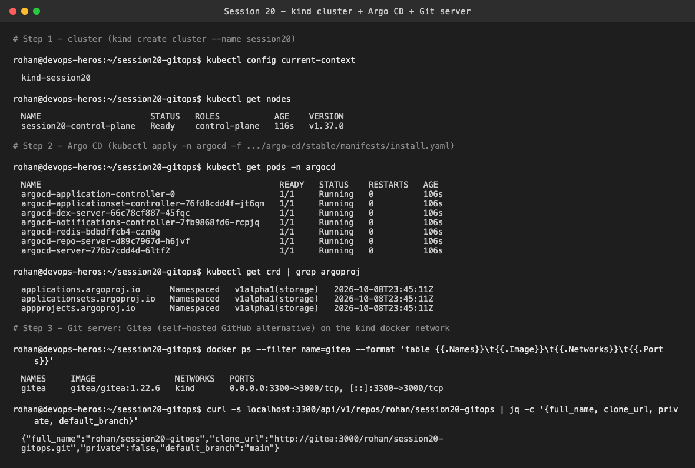
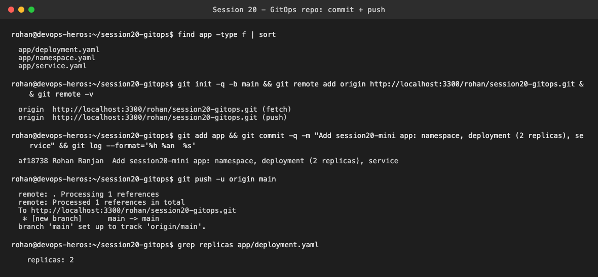
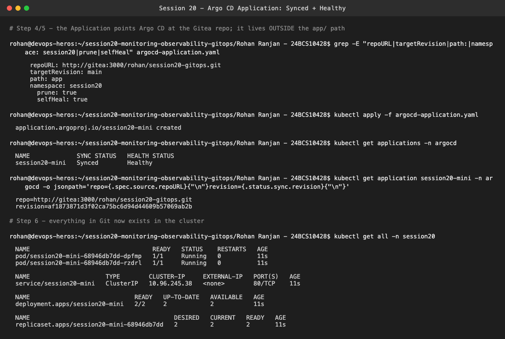
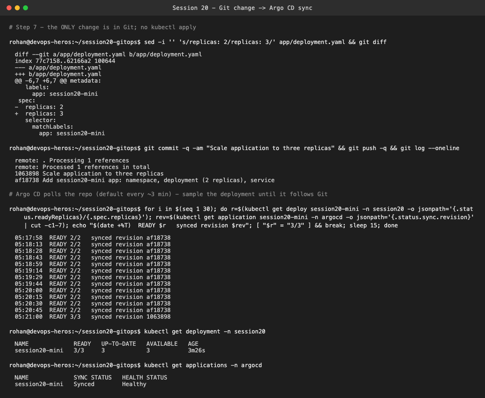
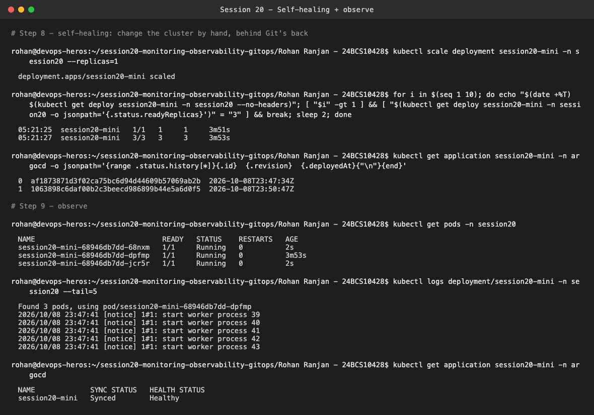
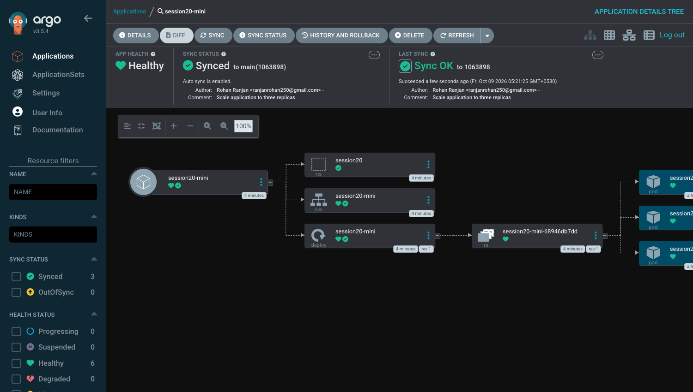

# Session 20 — Monitoring, Observability & GitOps

**Name:** Rohan Ranjan
**Enrollment Number:** 24BCS10428

Two parts, both run for real on my laptop:

1. **Monitoring**: Prometheus + Grafana with Docker Compose (03-prometheus, 04-grafana)
2. **GitOps mini project**: a `kind` cluster `session20`, Argo CD, and a Git repo that Argo CD
   keeps the cluster in sync with (08-mini-project)

```text
Rohan Ranjan - 24BCS10428/
├── monitoring/
│   ├── docker-compose.yml        # 04-grafana compose + Grafana provisioning + anonymous viewer
│   ├── prometheus.yml            # scrapes prometheus AND grafana
│   └── grafana/provisioning/     # datasource + dashboard as code (session20.json)
├── gitops-repo/app/              # exactly what is in the Git repo Argo CD watches
│   ├── namespace.yaml
│   ├── deployment.yaml           # replicas: 3 (after the Step 7 change)
│   └── service.yaml
└── argocd-application.yaml       # kept OUTSIDE app/, as the README says
```

---

## Part 1 — Prometheus + Grafana

```bash
cd monitoring
docker compose up -d
```



Changes I made compared to the class compose files:
- Prometheus also scrapes **Grafana's own `/metrics`**, so there are two targets instead of one.
- Grafana is **provisioned from files**: the `Prometheus` datasource and a dashboard are created
  automatically at startup, with no clicking in the UI. That's the GitOps idea applied to
  dashboards too.
- An anonymous read-only Viewer role, so the dashboard can be opened without logging in.

Results: both targets are `up` (`up{job="grafana"} 1`, `up{job="prometheus"} 1`, `sum(up) = 2`),
and the PromQL `rate()` query shows live request rates per handler on Prometheus' own HTTP API.
Grafana's `/api/health` is ok, the datasource is the default, and the dashboard is in the
"Session 20" folder.





The dashboard panels (all PromQL): `up` per job, `sum(up)`, scrape duration per job, Prometheus and
Grafana HTTP request rates per handler, resident memory per job, and samples ingested per second.

**03 practice answers**
1. *What does Prometheus collect?* Numeric time-series **metrics**: name + labels + value +
   timestamp.
2. *What is a scrape?* Prometheus **pulling** a target's `/metrics` endpoint over HTTP on a schedule
   (`scrape_interval: 5s` here) and storing every sample.
3. *What does `up` mean?* A metric Prometheus generates for every target: `1` if the last scrape
   succeeded, `0` if it failed. It's the simplest health check.
4. *What is PromQL?* Prometheus' query language, e.g. `up`, `sum(up)`,
   `rate(prometheus_http_requests_total[1m])`.
5. *Metrics or logs?* Primarily a **metrics** system. Logs belong in Loki/ELK, and traces in
   Jaeger/Tempo.

---

## Part 2 — GitOps mini project with Argo CD

**Git host.** The mini project says to use GitHub/GitLab/Bitbucket. Instead of pushing a throwaway
repo to my public GitHub account, I ran **Gitea** (a self-hosted GitHub-like server) in Docker on
the same `kind` network. Argo CD inside the cluster clones from `http://gitea:3000/rohan/session20-gitops.git`,
and I push to it from my laptop on `localhost:3300`. The flow is identical. Only the `repoURL`
differs from a GitHub URL.

### Steps 1–3: cluster, Argo CD, Git repo



`kind create cluster --name session20` → node `session20-control-plane`. Argo CD was installed from
the stable manifests, all 7 pods are Running and the three `argoproj.io` CRDs exist.



The repo contains only `app/namespace.yaml`, `app/deployment.yaml` (replicas: 2) and
`app/service.yaml`, pushed to `main`.

### Steps 4–6: Application → Synced / Healthy



`argocd-application.yaml` has `repoURL` set to my repo, `path: app`, `automated: prune + selfHeal`
and `CreateNamespace=true`. After `kubectl apply`, Argo CD reports
`session20-mini   Synced   Healthy` at revision `af18738…`, and `kubectl get all -n session20`
shows the deployment (2/2), 2 pods and the service. I never ran `kubectl apply` on the app
manifests myself.

### Step 7: change Git, not the cluster



I committed `replicas: 2 → 3` ("Scale application to three replicas", `1063898`) and pushed. No
kubectl. Sampling every 15 seconds, the cluster stayed at 2/2 while Argo CD was still on
`af18738`. At **05:21:00**, after Argo CD's next repo poll (default about every 3 minutes), it moved
to `1063898` and the deployment went to **3/3**.

### Step 8: self-healing



`kubectl scale ... --replicas=1` changed the cluster by hand. Two seconds later the deployment was
back to **3/3**. `selfHeal: true` makes Argo CD treat the manual change as drift and re-apply what
Git says. The sync history shows exactly two deploys, one per Git commit. The manual change left no
trace.

### Step 9: observe + Argo CD UI



The UI shows **Healthy / Synced to main (1063898)**, auto sync enabled, the commit author and
message, and the resource tree: namespace → service → deployment → ReplicaSet → 3 pods. Pod logs
are normal nginx worker startup.

---

## Practice / viva answers

**05 – `Git = desired state, Cluster = actual state, Argo CD = keeps them synchronized`**
Git holds the YAML describing what *should* run. The cluster is what *is* running. Argo CD
continuously compares the two. If Git changes (Step 7), it applies the change. If the cluster
drifts (Step 8), it reverts the drift. Nobody needs `kubectl apply` access to production.

**06 – Why Git as the source of truth?** Version history (every change is a commit), review (PRs
before anything reaches the cluster), diffs (exactly what changed), auditability (who and when, like
the author shown in the Argo CD UI), collaboration, and rollback (`git revert` and Argo CD
syncs the old state back).

**08 – Final viva**
1. *Monitoring vs observability*: monitoring watches known signals and alerts on known failure
   modes ("is it up, is CPU high"). Observability is being able to explain *unknown* problems from
   the outside, using the system's metrics, logs and traces.
2. *Metrics vs logs vs traces*: metrics are numbers over time (cheap, good for trends and alerts).
   Logs are timestamped event text (detail on what happened). Traces follow one request across
   services (where the time went).
3. *Prometheus*: a pull-based time-series database that scrapes `/metrics`, stores samples, and is
   queried with PromQL.
4. *Grafana*: a visualisation tool that queries data sources like Prometheus and shows dashboards
   and alerts. It doesn't store metrics itself.
5. *GitOps*: operating infrastructure and apps by declaring desired state in Git and letting an
   automated agent reconcile the cluster to it.
6. *Why Git is the source of truth*: whatever is in Git wins. The cluster is just the current
   result of applying it, as the self-heal demo showed.
7. *What Argo CD does*: it watches Git repos, renders the manifests, diffs them against the live
   cluster, syncs automatically or on demand, prunes deleted resources, self-heals drift, and shows
   health and history.
8. *Desired state*: the declared target configuration (e.g. "3 replicas of nginx:1.27-alpine").
   Controllers keep working until the actual state matches it.
