# Session 21 — TaskBoard: Full DevOps Walkthrough (class part)

**Name:** Rohan Ranjan
**Enrollment Number:** 24BCS10428

This is the **class walkthrough** of Session 21 (README Parts B–N) on the instructor's TaskBoard
app, not the graded capstone (that one needs my own application domain). Everything ran for real on
my laptop: Docker Compose, pytest, Trivy, the CI test job (with `act`), Terraform (`plan` against
LocalStack, since I have no AWS account), and Kubernetes on my `kind` cluster `devops-heros` with
Helm, ingress-nginx, the HPA and kube-prometheus-stack.

I worked from my own copy in [`taskboard/`](taskboard/). Running the class code as-is hit
**eight real problems**. Each one is fixed in my copy and shown in the screenshots:

| # | Where | Problem | Fix |
|---|---|---|---|
| 1 | `backend/tests` | `TestClient(app)` is created without `with`, so FastAPI's startup hook never runs → `no such table: tasks`, 1 of 3 tests fails | `tests/conftest.py` creates the schema for the test session |
| 2 | `docker-compose.yml` | `depends_on: postgres` only waits for the container to *start*. Alembic ran before Postgres accepted connections → backend exited (`Connection refused`), frontend `/api` returned 502 | Postgres `healthcheck` + `condition: service_healthy` + `restart: on-failure` |
| 3 | `backend/requirements.txt` | Trivy gate failed: starlette 0.41.3 (via FastAPI 0.115.6) has 3 fixable HIGH CVEs | FastAPI 0.143.0, starlette 1.7.0, prometheus-fastapi-instrumentator 8.1.0. Tests and `/metrics` still pass |
| 4 | `frontend/Dockerfile` | Trivy gate failed: `nginx:1.27-alpine` (Alpine 3.21.3) has 45 fixable HIGH/CRITICAL, including a CRITICAL in OpenSSL | `nginx:1.30-alpine` + `apk upgrade --no-cache` |
| 5 | `terraform/*.tf` | Several arguments packed into one-line blocks → `Invalid single-argument block definition`, so `init` and `validate` fail | Rewrote as normal multi-line HCL with the same values. Added `terraform.tfvars.example` |
| 6 | Helm chart | Backend Service was named `<release>-taskboard-backend`, but the Ingress pointed at `taskboard-backend:8080` and `nginx.conf` proxies to `backend:8000`, so nothing could reach the API | One Service `backend` on port 8000 (`backend.serviceName`), used by both. Added `values-kind.yaml` and `imagePullPolicy` |
| 7 | `scripts/load-test.sh` | Default URL `/api/health` doesn't exist (the route is `/health`) → 404 | Used in-cluster load generators against `/api/tasks` for the HPA demo |
| 8 | `troubleshooting/broken-image.yaml` | After fixing the image, the pod still crashes: no `DATABASE_URL`, so the app tries `127.0.0.1:5432` | `kubectl set env` with the in-cluster Postgres URL (the second layer of the exercise) |

I also replaced the instructor's name hard-coded in the UI ("Good morning, Nensi" and the profile
card) with mine, the same as I did with the template folders in earlier sessions.

---

## Part C — Pytest

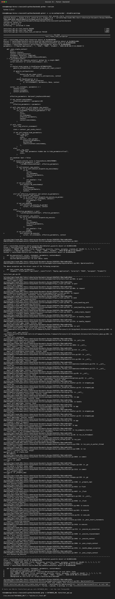

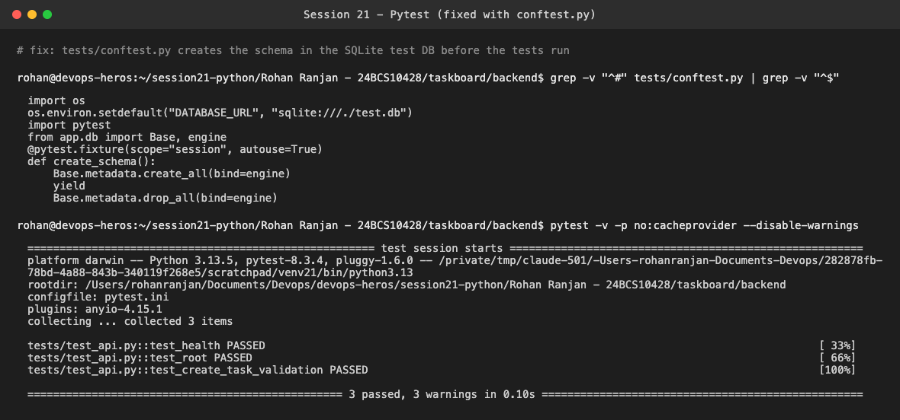

The class code gives `2 passed, 1 failed` (`sqlite3.OperationalError: no such table: tasks`). The
test module sets `DATABASE_URL=sqlite:///./test.db` (good, it doesn't touch the real database), but
the tables are only created in FastAPI's `startup` event, which runs only when `TestClient` is used
as a context manager. With `conftest.py` creating the schema per test session, all 3 tests pass.

## Part B — Docker Compose (frontend + backend + PostgreSQL)

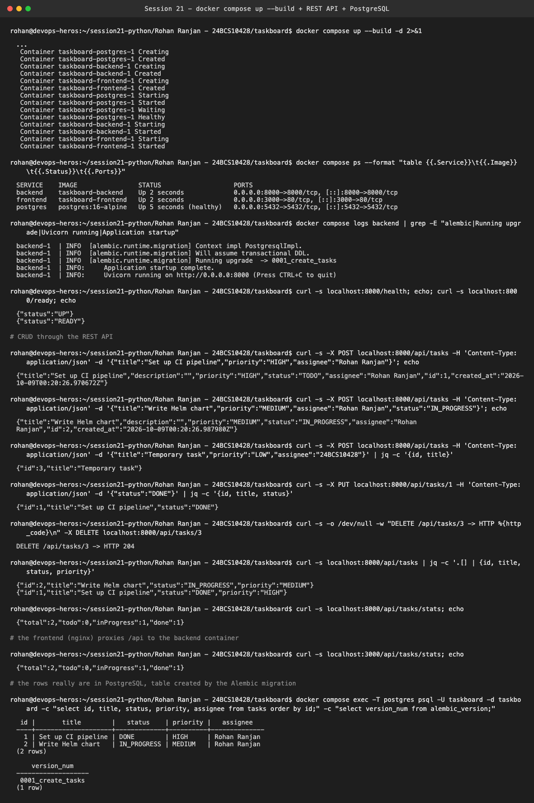

`docker compose up --build -d` builds both images and starts all 3 services. Postgres shows
`(healthy)`, and the backend logs `Running upgrade -> 0001_create_tasks` (Alembic) and then
`Uvicorn running`. Then:
- `/health` → `{"status":"UP"}`, `/ready` → `{"status":"READY"}` (ready actually queries the DB)
- **CRUD**: POST creates tasks 1–3, PUT moves task 1 to `DONE`, DELETE task 3 → `204`, GET lists
  the rest, `/api/tasks/stats` → `{"total":2,"todo":0,"inProgress":1,"done":1}`
- the same stats through the **frontend on :3000**, so nginx proxies `/api` to the backend container
- `psql` shows the rows in the `tasks` table and `alembic_version = 0001_create_tasks`

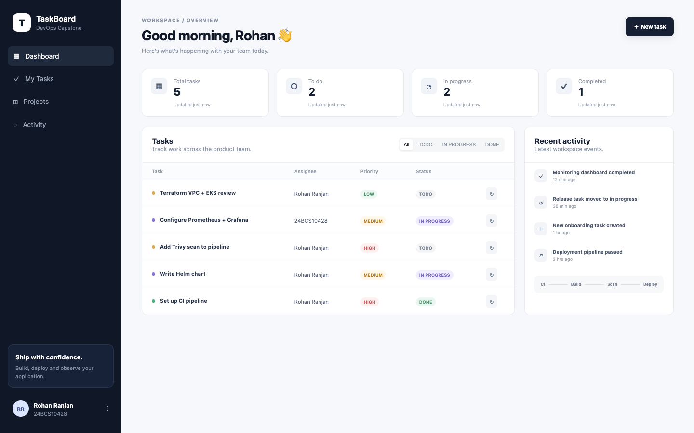

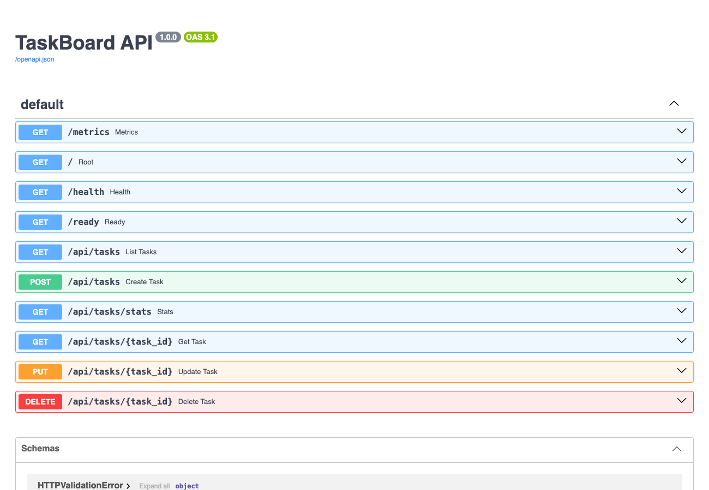

## Part E/G — Docker images + Trivy

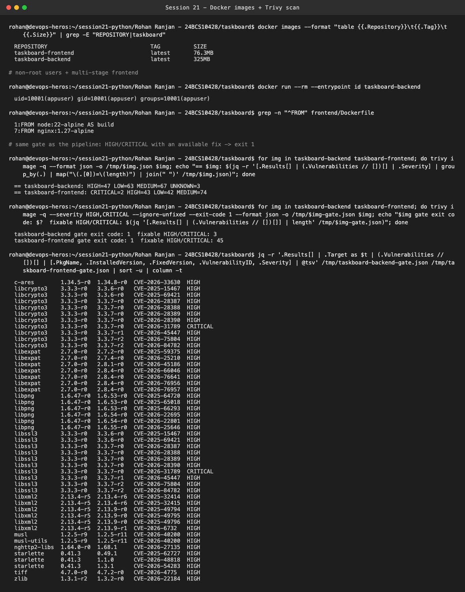

Both images are non-root (`uid=10001(appuser)`) and the frontend is a multi-stage build
(`node:22-alpine` → `nginx`). But with the pipeline's own gate (`HIGH,CRITICAL`, `ignore-unfixed`,
`exit-code 1`), **both images failed**: 3 fixable findings in the backend and 45 in the frontend.
In GitHub Actions the `build-scan-push` job would stop there and never push to GHCR.

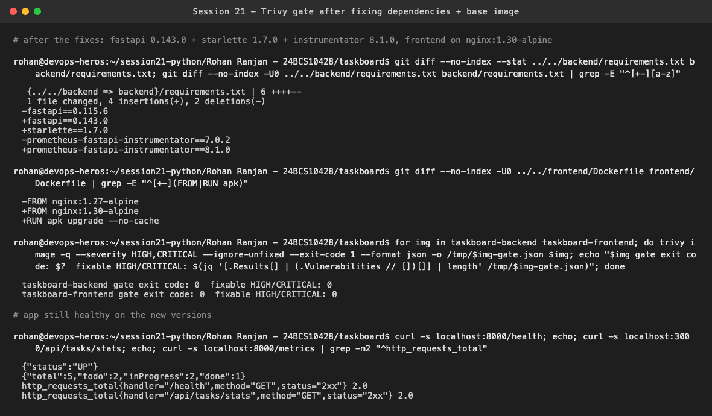

After problems 3 and 4: **both gates exit 0 with 0 fixable HIGH/CRITICAL**, and the app still
answers `/health`, `/api/tasks/stats` and `/metrics`. The remaining CVEs are base-OS packages with
no fix released yet. Trivy is one layer of security, not a guarantee, which is the point of Part G.

## Part F — CI pipeline (test job)

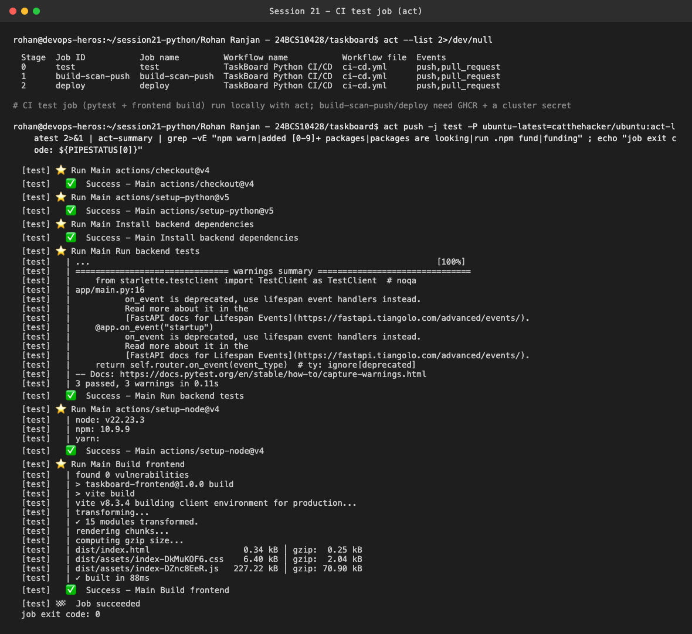

`act --list` shows the 3 stages (`test` → `build-scan-push` → `deploy`). I ran the **test job**
locally with `act` in a GitHub-runner image: pip install → **pytest 3 passed** → setup Node 22 →
`npm install && npm run build` (Vite builds `dist/`). The other two jobs need a GHCR login and a
`KUBE_CONFIG_DATA` secret, so they can only run on GitHub. Their image build and scan steps are
what I ran by hand above, and the deploy step is the `helm upgrade --install` below. The image tag
there is `${{ github.sha }}`, which ties every running image back to the commit it came from.

## Part H — Terraform (AWS VPC + EKS)

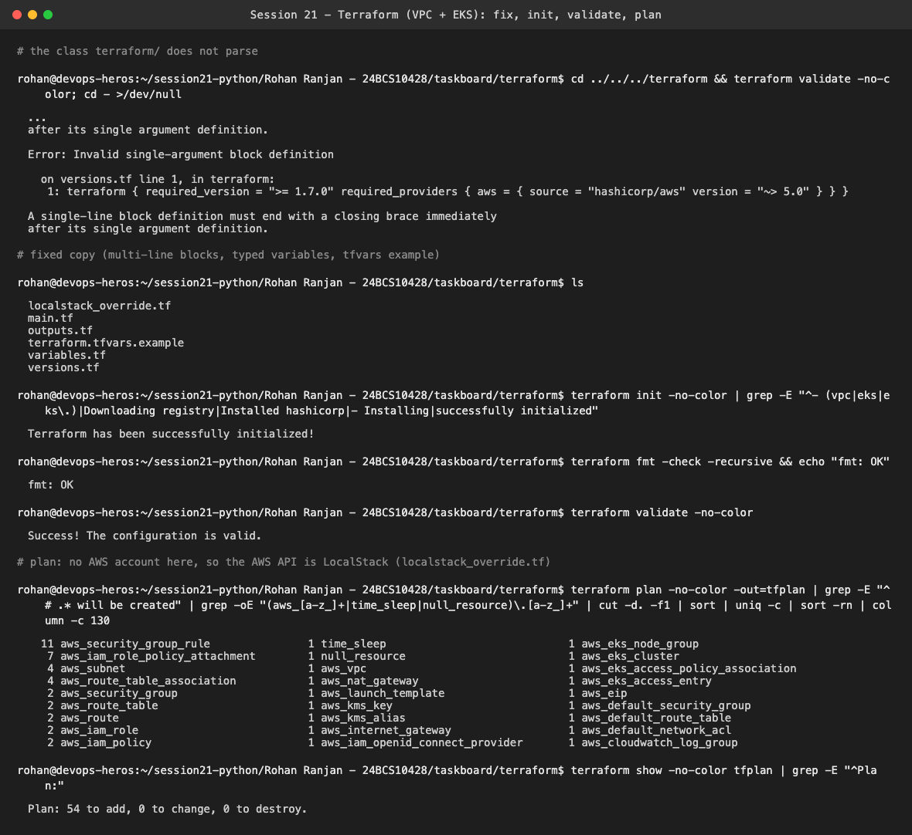

The class `terraform/` doesn't parse (problem 5). My fixed copy: `init` downloads the
`terraform-aws-modules/vpc` 5.8.1 and `eks` 20.37.1 modules and the AWS provider 5.100.0, `fmt`
passes, and `validate` says `Success!`. I have no AWS account, so `terraform plan` ran against
**LocalStack** through `localstack_override.tf` (delete that file to target real AWS): **54 to add**.
That's the VPC, 4 subnets (2 public, 2 private), IGW, NAT gateway + EIP, route tables, the
`aws_eks_cluster`, a managed `aws_eks_node_group`, IAM roles/policies, OIDC provider, KMS key,
security groups, CloudWatch log group and the access entry. I didn't apply: EKS isn't available in
free LocalStack, and on real AWS a NAT gateway plus 2× t3.medium costs money.

## Parts I/J — Kubernetes + Helm

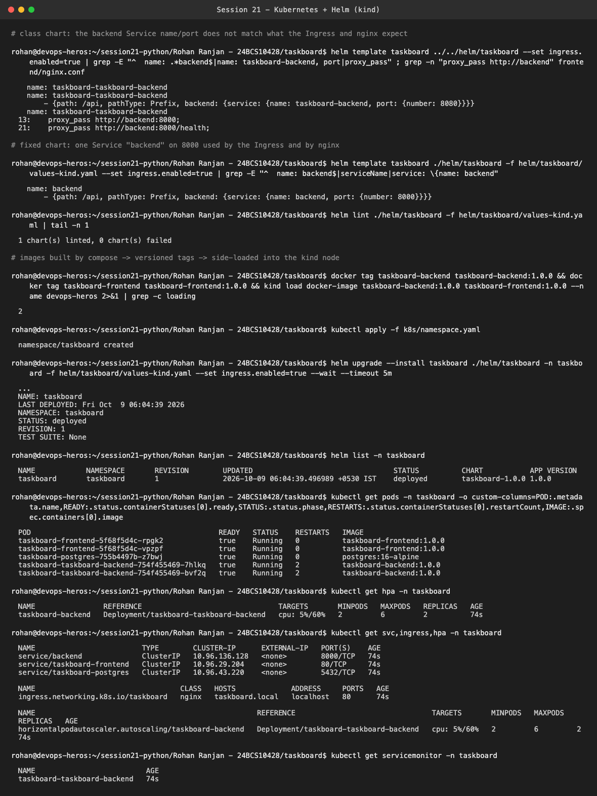

The top of the screenshot shows the chart mismatch (problem 6): the class chart renders the
Service as `taskboard-taskboard-backend`, the Ingress wants `taskboard-backend:8080`, and nginx
wants `backend:8000`. My chart renders one Service, `backend:8000`. Then:
- images tagged `1.0.0` and side-loaded with `kind load docker-image`
- `kubectl apply -f k8s/namespace.yaml`, then
  `helm upgrade --install taskboard ./helm/taskboard -n taskboard -f values-kind.yaml --set ingress.enabled=true`
- `helm list` shows revision 1 `deployed`. Running: 2 frontend, 2 backend, 1 Postgres (with a 5Gi
  PVC). Services `backend`, `taskboard-frontend`, `taskboard-postgres`. The Ingress for
  `taskboard.local`, the HPA (`cpu 5%/60%`, 2–6 replicas) and the ServiceMonitor are all created.

The backend pods show `RESTARTS 2`. That's the same startup race as in Compose: Postgres wasn't
ready yet, so the backend exited and Kubernetes restarted it until it connected. That's
self-healing at work. An init container that waits for Postgres would avoid the restarts.

## Part K — Ingress

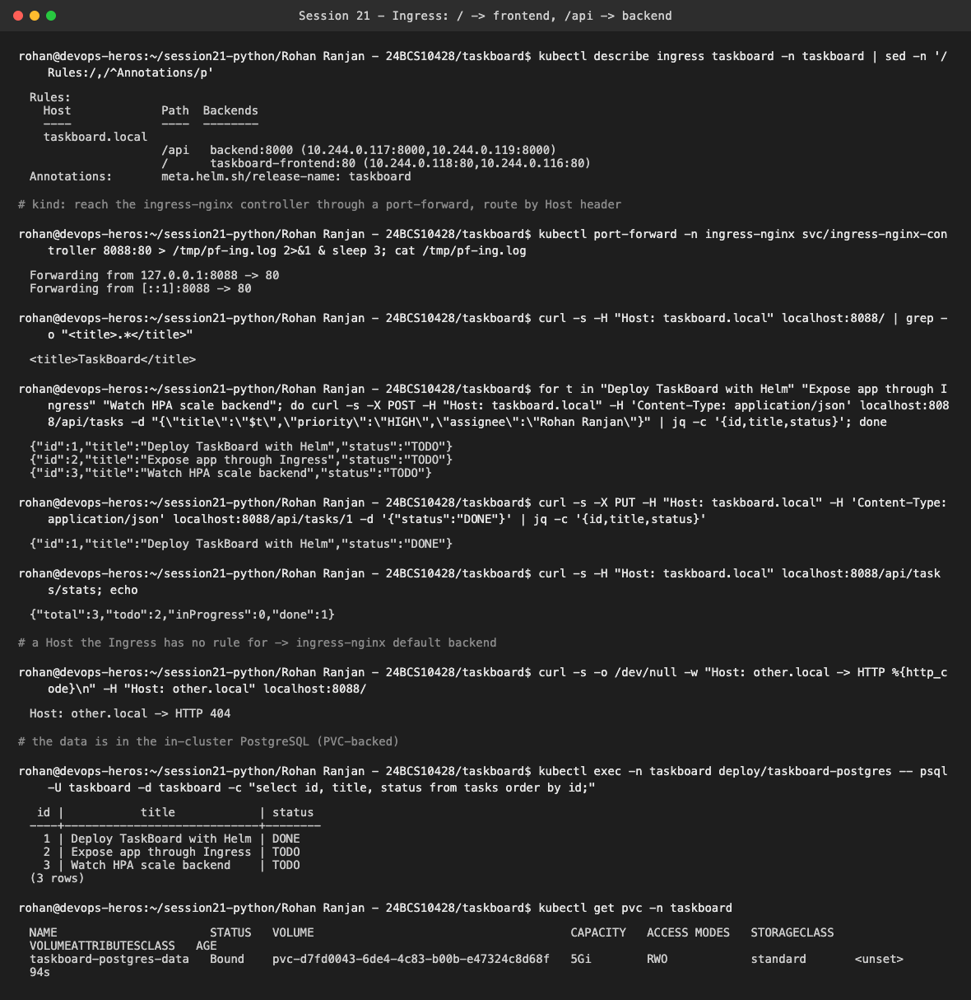

`describe ingress`: `taskboard.local` routes `/api` → `backend:8000` (2 pod IPs) and `/` →
`taskboard-frontend:80`. kind has no LoadBalancer, so I port-forwarded the ingress-nginx controller
to `localhost:8088` and routed by `Host` header. `/` returns the React app, `/api` creates, updates
and reads tasks, and a host with no rule (`other.local`) gets the controller's `404`. The rows are
in the in-cluster Postgres on its PVC.

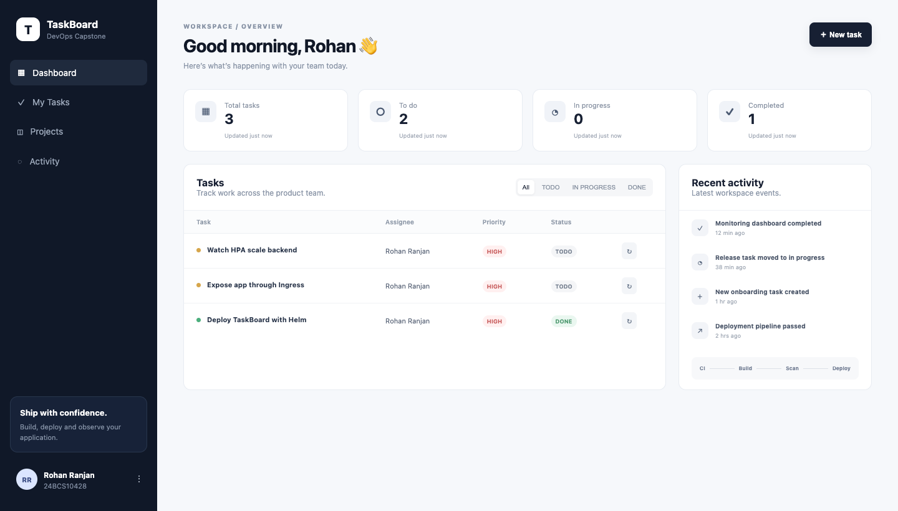

The same app in Chrome at `http://taskboard.local`, with the hostname mapped to the port-forward.

## Part L — HPA

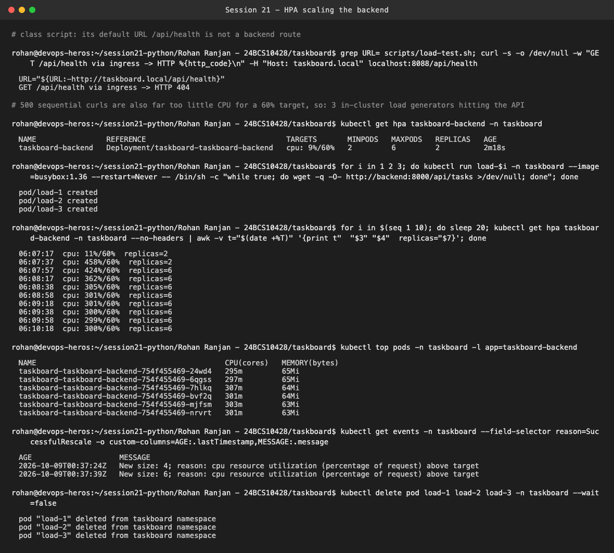

The class load script hits `/api/health` → 404 (problem 7), and 500 sequential requests wouldn't
move CPU anyway. With 3 busybox loops hitting `/api/tasks` inside the cluster, CPU went to
`458%/60%` of the request (100m), and the HPA scaled **2 → 4 → 6** (the max) within 15 seconds
(`SuccessfulRescale` events). At 6 replicas each pod sat at about 300m. The HPA can't go further,
because `maxReplicas: 6` is a deliberate cost ceiling.

## Part M — Prometheus + Grafana

kube-prometheus-stack installed with the class `monitoring/prometheus-values.yaml`
(`serviceMonitorSelectorNilUsesHelmValues: false`, so Prometheus picks up the chart's ServiceMonitor).

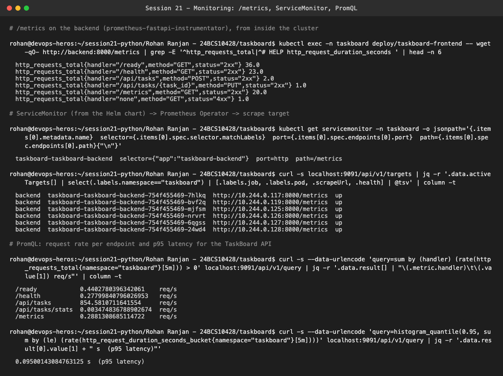

- `/metrics` returns Prometheus text (`http_requests_total{handler="/api/tasks",...}`, latency histograms)
- ServiceMonitor `taskboard-taskboard-backend` → selector `app=taskboard-backend`, port `http`,
  path `/metrics`
- **all 6 backend pods are scrape targets and `up`** (the HPA's new pods were discovered automatically)
- PromQL: `/api/tasks` at ~838 req/s during the load test, p95 latency 0.095 s

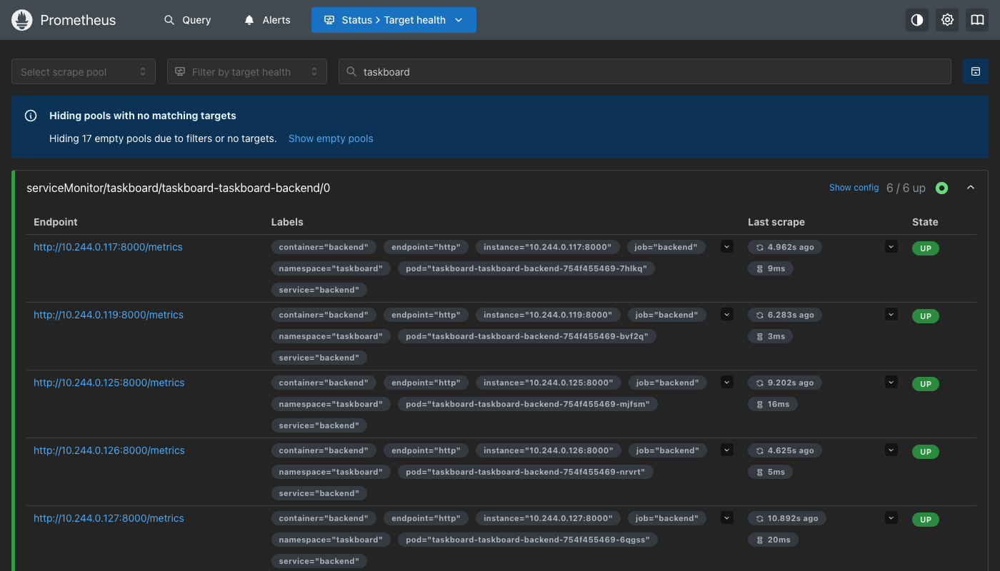

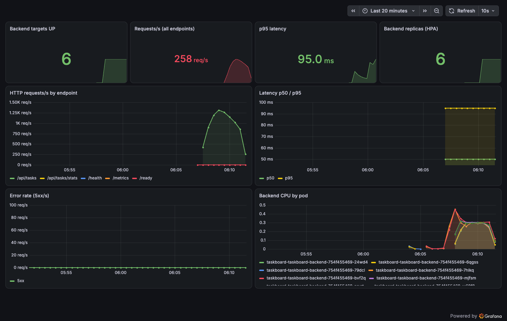

The Grafana dashboard is in [`taskboard/monitoring/dashboards/taskboard-api.json`](taskboard/monitoring/dashboards/taskboard-api.json)
and was imported through the Grafana API. It answers the README's questions: targets up (6),
request rate per endpoint (the load-test spike), p50/p95 latency, 5xx error rate (0), backend CPU
per pod, and current HPA replicas (6).

## Part N — Troubleshooting lab

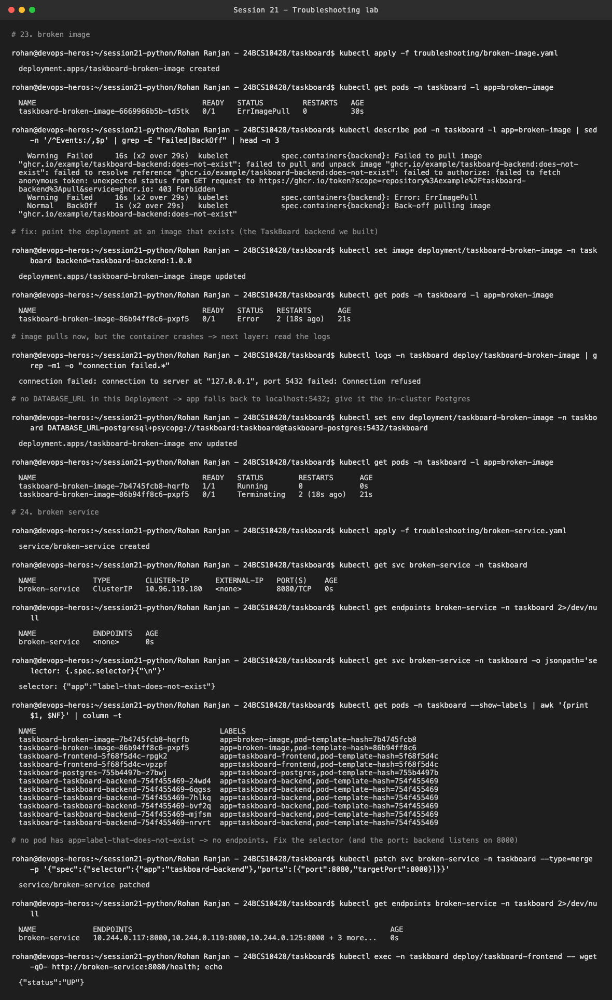

**Broken image:** `ErrImagePull`. `describe` Events show `ghcr.io/example/taskboard-backend:does-not-exist`
→ `403 Forbidden` from ghcr.io (that repository doesn't exist or isn't public).
`kubectl set image ... backend=taskboard-backend:1.0.0` fixed the pull. The pod then went to
`Error` with restarts, and the logs showed `connection to server at "127.0.0.1", port 5432 failed`.
The Deployment has no `DATABASE_URL`. After `kubectl set env DATABASE_URL=...taskboard-postgres...`
it's `1/1 Running`. Fixing one layer often reveals the next.

**Broken service:** the Service exists, but `ENDPOINTS <none>`. Its selector is
`app=label-that-does-not-exist`, and `--show-labels` shows no pod with that label. On top of that,
its `targetPort: 8080` is wrong, because the backend listens on 8000. After patching the selector
to `app=taskboard-backend` and the targetPort to 8000, it has 6 endpoints, and
`wget http://broken-service:8080/health` returns `{"status":"UP"}`.
**No matching labels = no endpoints = no traffic.**
