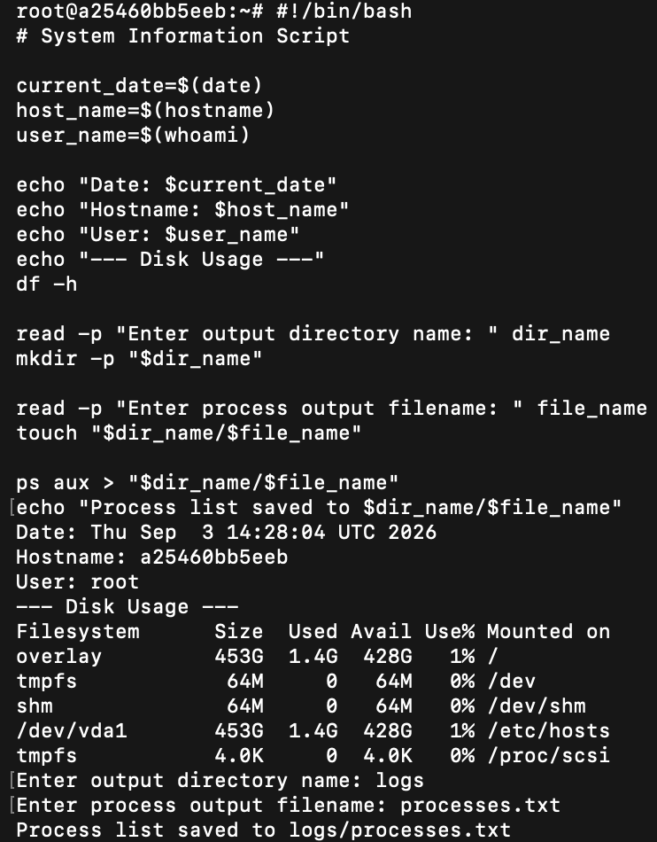
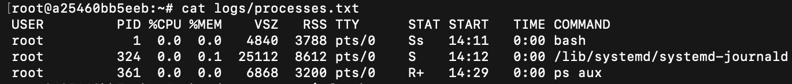

# Session 3 — Shell Scripting

**Name:** Rohan Ranjan
**Enrollment Number:** 24BCS10428

---

## Task: System Information Script

Create a shell script that:

- Prints the current date.
- Prints the hostname.
- Prints the username.
- Prints the disk usage.
- Prints the running processes.
- Uses variables to store and use data.
- Takes user input using `read -p`.
- Creates a directory using `mkdir`.
- Creates a file using `touch`.
- Stores the running processes information in the file using `>` output redirection.

### Where each requirement is met

| Requirement | In the script |
|---|---|
| Current date | `current_date=$(date)` |
| Hostname | `host_name=$(hostname)` |
| Username | `user_name=$(whoami)` |
| Disk usage | `df -h` |
| Running processes | `ps aux > "$dir_name/$file_name"` |
| Variables | `current_date`, `host_name`, `user_name`, `dir_name`, `file_name` |
| `read -p` | the two prompts for the directory name and the filename |
| `mkdir` | `mkdir -p "$dir_name"` |
| `touch` | `touch "$dir_name/$file_name"` |
| `>` redirection | `ps aux > "$dir_name/$file_name"` |

## script.sh

```bash
#!/bin/bash
# System Information Script

current_date=$(date)
host_name=$(hostname)
user_name=$(whoami)

echo "Date: $current_date"
echo "Hostname: $host_name"
echo "User: $user_name"
echo "--- Disk Usage ---"
df -h

read -p "Enter output directory name: " dir_name
mkdir -p "$dir_name"

read -p "Enter process output filename: " file_name
touch "$dir_name/$file_name"

ps aux > "$dir_name/$file_name"
echo "Process list saved to $dir_name/$file_name"
```

## Output

Making the script executable and running it, then entering the directory name and filename at
the prompts:

```text
$ chmod +x script.sh

$ ./script.sh
Date: Thu Sep  3 14:28:04 UTC 2026
Hostname: a25460bb5eeb
User: root
--- Disk Usage ---
Filesystem      Size  Used Avail Use% Mounted on
overlay         453G  1.4G  428G   1% /
tmpfs            64M     0   64M   0% /dev
shm              64M     0   64M   0% /dev/shm
/dev/vda1       453G  1.4G  428G   1% /etc/hosts
tmpfs           4.0K     0  4.0K   0% /proc/scsi
Enter output directory name: logs
Enter process output filename: processes.txt
Process list saved to logs/processes.txt
```



### Verifying the file the script created

```text
$ cat logs/processes.txt
USER         PID %CPU %MEM    VSZ   RSS TTY      STAT START   TIME COMMAND
root           1  0.0  0.0   4840  3788 pts/0    Ss   14:11   0:00 bash
root         324  0.0  0.1  25112  8612 pts/0    S    14:12   0:00 /lib/systemd/systemd-journald
root         361  0.0  0.0   6868  3200 pts/0    R+   14:29   0:00 ps aux
```



## Explanation

The command substitutions `$(date)`, `$(hostname)` and `$(whoami)` run once at the top and are
stored in variables, so the values printed on screen are a single consistent snapshot rather
than being re-evaluated each time they are used.

`read -p "prompt" var` prints the prompt on the same line and reads one line of input into
`var`. The script uses it twice — once for the output directory and once for the filename — and
both values are then reused when building the path `"$dir_name/$file_name"`.

`mkdir -p` is used rather than plain `mkdir` so re-running the script does not fail with
"File exists", and `touch` creates the log file up front so it exists before the redirection
runs.

`ps aux > "$dir_name/$file_name"` uses `>`, which **overwrites**: each run replaces the file's
contents, so it always holds one clean snapshot of the process table rather than growing every
time. `ps aux` is the full listing — every process with its user, CPU and memory percentages,
memory sizes, controlling terminal, state and start time — which is why `logs/processes.txt`
above has the wide multi-column format.
