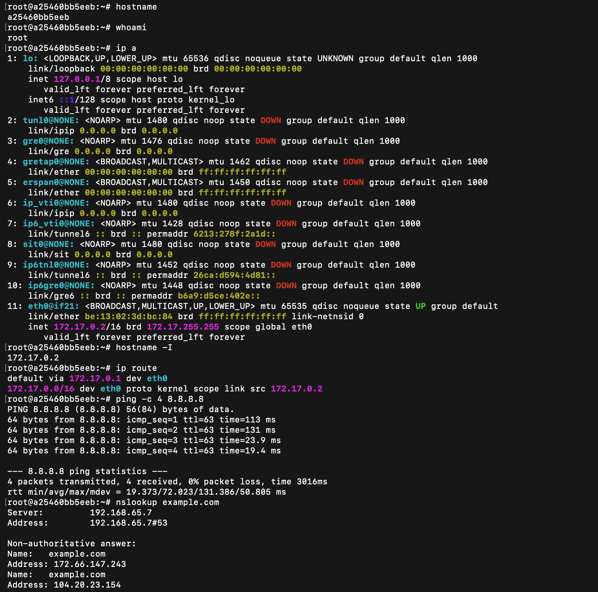
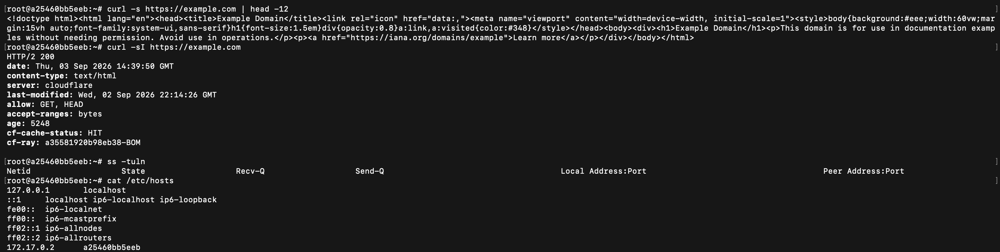
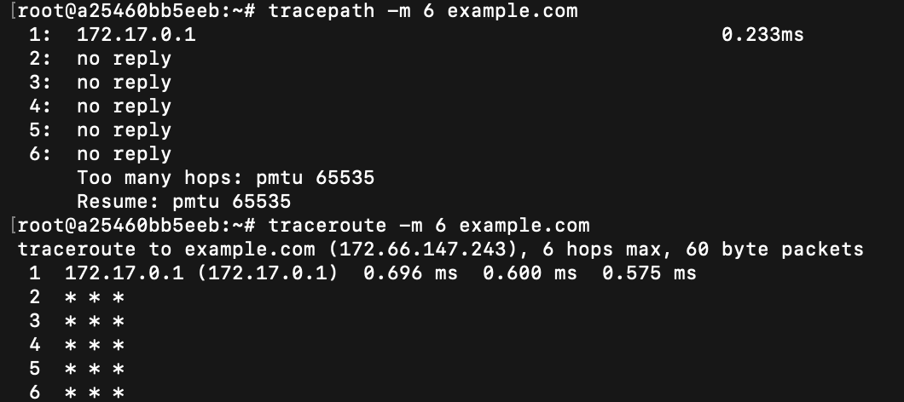
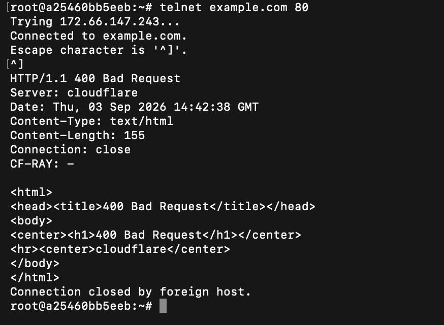

# Session 4 — Networking Fundamentals

**Name:** Rohan Ranjan
**Enrollment Number:** 24BCS10428

## Task

- Practise the networking commands from the course repository.
- Create a Markdown file, run each command and record the output.
- Add a short explanation of what each command does.

Every command below was run inside an Ubuntu container (`a25460bb5eeb`) and every code block is
the real output. The four screenshots at the ends of the sections cover all 14 commands in
order.

---

## 1. hostname

```bash
hostname
```

```text
a25460bb5eeb
```

Prints the machine's name on the network. Every host has one, and it is what shows up in log
lines, shell prompts and DNS lookups. Here the name is the container ID, since the hostname was
assigned automatically rather than set by hand.

---

## 2. whoami

```bash
whoami
```

```text
root
```

Prints the effective username of whoever is running the shell. Worth checking before running
anything destructive — `root` means no permission checks will stop you. It reports the
*effective* user, so inside `sudo` it prints `root` even though the login user is someone else.

---

## 3. ip a

```bash
ip a
```

```text
1: lo: <LOOPBACK,UP,LOWER_UP> mtu 65536 qdisc noqueue state UNKNOWN group default qlen 1000
    link/loopback 00:00:00:00:00:00 brd 00:00:00:00:00:00
    inet 127.0.0.1/8 scope host lo
       valid_lft forever preferred_lft forever
    inet6 ::1/128 scope host proto kernel_lo
       valid_lft forever preferred_lft forever
2: tunl0@NONE: <NOARP> mtu 1480 qdisc noop state DOWN group default qlen 1000
    link/ipip 0.0.0.0 brd 0.0.0.0
...  (gre0, gretap0, erspan0, ip_vti0, ip6_vti0, sit0, ip6tnl0, ip6gre0 — all state DOWN)
11: eth0@if21: <BROADCAST,MULTICAST,UP,LOWER_UP> mtu 65535 qdisc noqueue state UP group default
    link/ether be:13:02:3d:bc:84 brd ff:ff:ff:ff:ff:ff link-netnsid 0
    inet 172.17.0.2/16 brd 172.17.255.255 scope global eth0
       valid_lft forever preferred_lft forever
```

Lists every network interface with its IP addresses, MAC address, MTU and state. `lo` is the
loopback interface that carries `127.0.0.1`, and `eth0` is the real interface — here holding
`172.17.0.2/16`. The `/16` is the prefix length: the first 16 bits are the network portion, so
this host sits on `172.17.0.0/16`.

The flags in angle brackets matter when troubleshooting — `UP,LOWER_UP` on `eth0` means the
interface is both administratively enabled and has a live carrier, while `DOWN` on all the
tunnel interfaces means they exist but are unused.

---

## 4. hostname -I

```bash
hostname -I
```

```text
172.17.0.2
```

Prints just the IP addresses, with no interface names or extra formatting. `ip a` is what you
read; `hostname -I` is what you use in a script, because the output is a single clean line that
is trivial to capture into a variable.

---

## 5. ip route

```bash
ip route
```

```text
default via 172.17.0.1 dev eth0
172.17.0.0/16 dev eth0 proto kernel scope link src 172.17.0.2
```

Shows the kernel's routing table — how the machine decides where to send a packet.

The second line is the local network: anything in `172.17.0.0/16` is on the same link and is
sent directly out of `eth0`. The `default` line is the fallback for everything else — packets
for any other address go to the gateway `172.17.0.1`. If the default route is missing, the
machine can reach its own subnet but nothing on the internet, which is one of the first things
to check when connectivity breaks.

---

## 6. ping

```bash
ping -c 4 8.8.8.8
```

```text
PING 8.8.8.8 (8.8.8.8) 56(84) bytes of data.
64 bytes from 8.8.8.8: icmp_seq=1 ttl=63 time=113 ms
64 bytes from 8.8.8.8: icmp_seq=2 ttl=63 time=131 ms
64 bytes from 8.8.8.8: icmp_seq=3 ttl=63 time=23.9 ms
64 bytes from 8.8.8.8: icmp_seq=4 ttl=63 time=19.4 ms

--- 8.8.8.8 ping statistics ---
4 packets transmitted, 4 received, 0% packet loss, time 3016ms
rtt min/avg/max/mdev = 19.373/72.023/131.386/50.805 ms
```

Sends ICMP echo requests and waits for replies, which tests reachability and measures
round-trip latency. `-c 4` stops after four packets instead of running until interrupted.

`0% packet loss` is the headline: the host is reachable and nothing was dropped. `time=` is the
round trip in milliseconds, and `ttl=63` is the remaining time-to-live — it started at 64 and
was decremented once per router, so the reply crossed one hop. Testing an IP rather than a
hostname deliberately takes DNS out of the picture.

---

## 7. nslookup

```bash
nslookup example.com
```

```text
Server:		192.168.65.7
Address:	192.168.65.7#53

Non-authoritative answer:
Name:	example.com
Address: 172.66.147.243
Name:	example.com
Address: 104.20.23.154
...
```

Resolves a name to its IP addresses. `Server:` is the DNS resolver that answered — useful when
you need to know *which* resolver gave a stale answer.

"Non-authoritative" means the answer came from a cache rather than from the domain's own
nameservers, which is normal. This domain returns several addresses, so clients can pick
whichever they support.



---

## 8. curl

```bash
curl -s https://example.com | head -12
```

```text
<!doctype html><html lang="en"><head><title>Example Domain</title><link rel="icon" href="data:,"><meta name="viewport" content="width=device-width, initial-scale=1"><style>body{background:#eee;width:60vw;margin:15vh auto;font-family:system-ui,sans-serif}h1{font-size:1.5em}div{opacity:0.8}a:link,a:visited{color:#348}</style></head><body><div><h1>Example Domain</h1><p>This domain is for use in documentation examples without needing permission. Avoid use in operations.</p><p><a href="https://iana.org/domains/example">Learn more</a></p></div></body></html>
```

Fetches a URL and writes the response body to stdout. Unlike `ping`, this exercises the whole
stack — DNS, TCP, TLS and HTTP — so a successful `curl` proves far more than a successful ping.
`-s` suppresses the progress meter, which matters when piping the output somewhere.

---

## 9. curl -I

```bash
curl -sI https://example.com
```

```text
HTTP/2 200
date: Thu, 03 Sep 2026 14:39:50 GMT
content-type: text/html
server: cloudflare
last-modified: Wed, 02 Sep 2026 22:14:26 GMT
allow: GET, HEAD
accept-ranges: bytes
age: 5248
cf-cache-status: HIT
cf-ray: a35581920b98eb38-BOM
```

`-I` sends a `HEAD` request, so only the response headers come back and the body is skipped.
This is the quickest way to check whether a URL is alive and what it would return.

`HTTP/2 200` is the status — `200 OK` means success, where `404` would mean not found and `500`
a server error. `server: cloudflare` shows the request was answered by a CDN, `cf-cache-status:
HIT` shows it was served from that CDN's cache rather than the origin, and `cf-ray: ...-BOM`
identifies the Cloudflare edge (Mumbai) that handled it.

---

## 10. ss

```bash
ss -tuln
```

```text
Netid  State   Recv-Q  Send-Q   Local Address:Port   Peer Address:Port
```

Shows sockets, and is the modern replacement for `netstat`. The flags combine as:

- `-t` TCP sockets
- `-u` UDP sockets
- `-l` only sockets in the listening state
- `-n` numeric — show port `22` rather than resolving it to `ssh`

Only the header row comes back here: this container runs no network services, so nothing is
listening on any port. On a server you would expect to see rows like `0.0.0.0:22` for sshd. This
is the command to reach for when answering "is anything actually listening on that port?".

---

## 11. /etc/hosts

```bash
cat /etc/hosts
```

```text
127.0.0.1	localhost
::1	localhost ip6-localhost ip6-loopback
fe00::	ip6-localnet
ff00::	ip6-mcastprefix
ff02::1	ip6-allnodes
ff02::2	ip6-allrouters
172.17.0.2	a25460bb5eeb
```

A static, local name-to-IP mapping file. It is consulted **before** DNS, so an entry here wins
over whatever the DNS server would have returned — handy for pointing a hostname at a test
server, and equally a good thing to check when a name resolves to something unexpected.

The last line is why the machine can resolve its own hostname without any DNS record existing
for it.



---

## 12. tracepath

```bash
tracepath -m 6 example.com
```

```text
 1:  172.17.0.1                                            0.233ms
 2:  no reply
 3:  no reply
 4:  no reply
 5:  no reply
 6:  no reply
     Too many hops: pmtu 65535
     Resume: pmtu 65535
```

Traces the path to a destination hop by hop and discovers the path MTU along the way. Unlike
`traceroute` it needs no root privileges, which is its main advantage.

Only the first hop replied — the container's gateway at `172.17.0.1`. `no reply` afterwards does
not mean the route is broken; `curl` and `ping` both succeed. Intermediate routers simply are
not obliged to send back the ICMP messages that make traceroute work, and most cloud and ISP
routers are configured not to.

---

## 13. traceroute

```bash
traceroute -m 6 example.com
```

```text
traceroute to example.com (172.66.147.243), 6 hops max, 60 byte packets
 1  172.17.0.1 (172.17.0.1)  0.696 ms  0.600 ms  0.575 ms
 2  * * *
 3  * * *
 4  * * *
 5  * * *
 6  * * *
```

Does the same job as `tracepath` — mapping the routers between here and the destination — by
sending packets with increasing TTL values and noting which router reports each expiry. Three
probes are sent per hop, which is why each line shows three timings.

`* * *` means no reply within the timeout for any of the three probes, matching what `tracepath`
found. It is the expected result when routers are configured to drop or rate-limit ICMP, and it
is not by itself evidence of a fault. `-m 6` caps the search at 6 hops instead of the default 30.



---

## 14. telnet

```bash
telnet example.com 80
```

```text
Trying 172.66.147.243...
Connected to example.com.
Escape character is '^]'.
^]

HTTP/1.1 400 Bad Request
Server: cloudflare
Date: Thu, 03 Sep 2026 14:42:38 GMT
Content-Type: text/html
Content-Length: 155
Connection: close
CF-RAY: -

<html>
<head><title>400 Bad Request</title></head>
<body>
<center><h1>400 Bad Request</h1></center>
<hr><center>cloudflare</center>
</body>
</html>
Connection closed by foreign host.
```

Opens a raw TCP connection to a host and port. Nobody uses it as a remote login tool any more —
it is unencrypted — but it remains a quick way to answer "is this port open and accepting
connections?".

`Connected to example.com` is the answer: the TCP handshake completed, so port 80 is reachable
and something is listening. Pressing the escape character and then sending an empty line made
the server receive a malformed request, so it replied `400 Bad Request` and closed the
connection — which still proves the port is open and serving HTTP. A firewalled or closed port
would instead hang, or fail with `Connection refused`.

`nc -vz example.com 80` does the same check more safely and is usually preferred in scripts.


