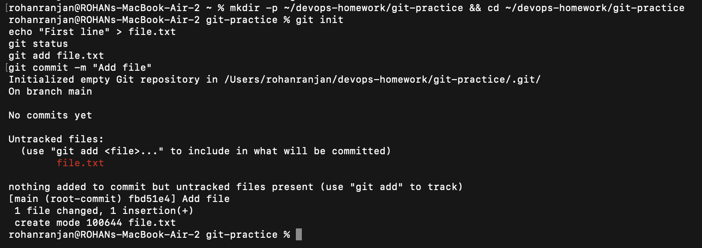
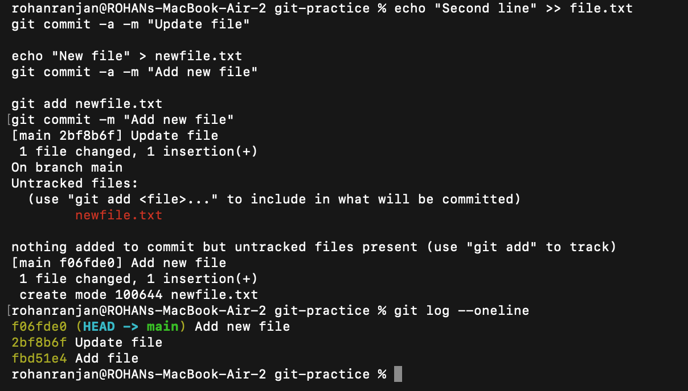
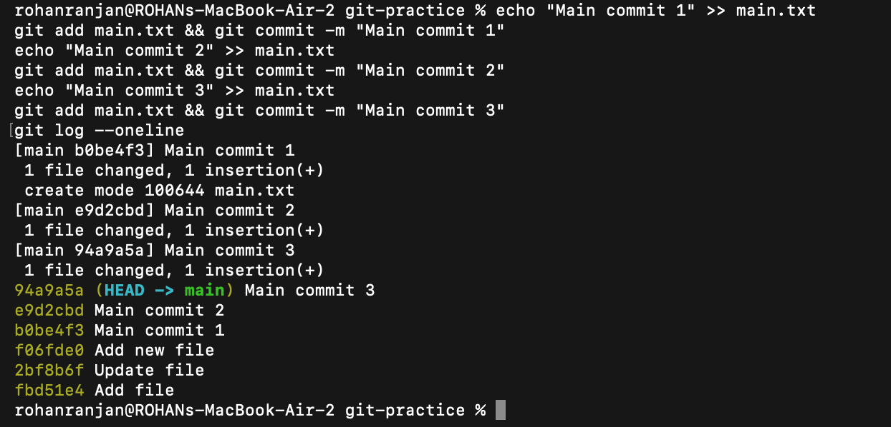
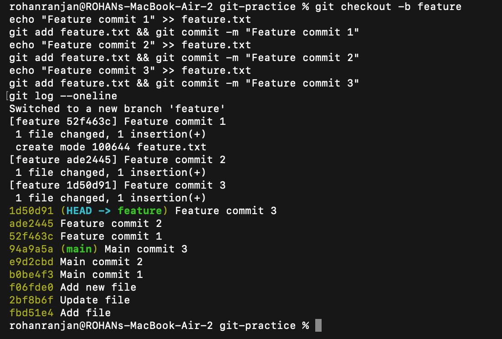
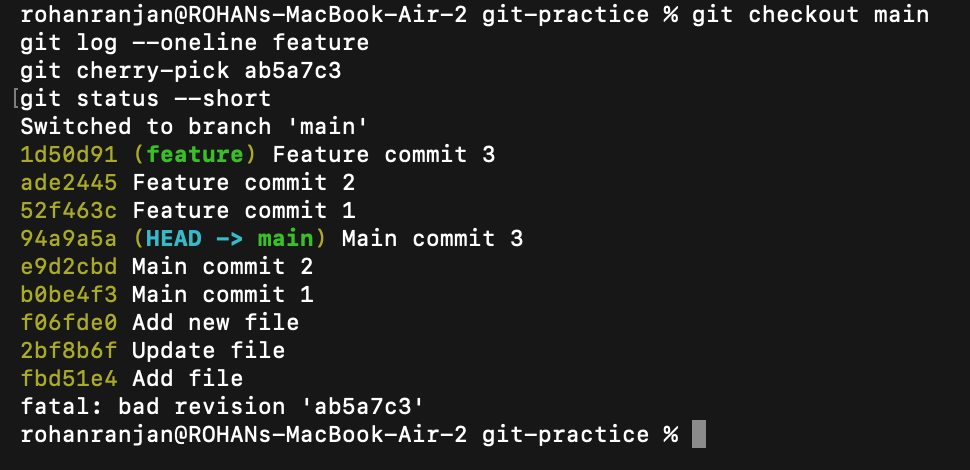
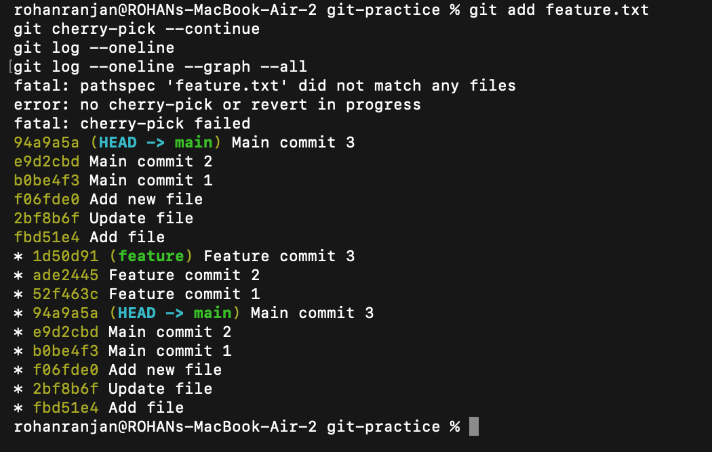

# Session 5 — Git & GitHub

**Name:** Rohan Ranjan
**Enrollment Number:** 24BCS10428

All commands below were run in a scratch repository at `~/devops-homework/git-practice`. The
output shown in the code blocks and the screenshots is the real output from that run.

---

## Task 1: `git commit -a -m` vs `git commit -m`

- Practise `git commit -a -m "message"`.
- Understand how it differs from `git commit -m "message"`.
- Run both and observe where they behave differently.

### Commands

Set up the repository and make the first commit the normal way — stage with `git add`, then commit:

```bash
mkdir -p ~/devops-homework/git-practice && cd ~/devops-homework/git-practice
git init
echo "First line" > file.txt
git status
git add file.txt
git commit -m "Add file"
```

### Output

```text
$ git init
Initialized empty Git repository in /Users/rohanranjan/devops-homework/git-practice/.git/

$ git status
On branch main

No commits yet

Untracked files:
  (use "git add <file>..." to include in what will be committed)
	file.txt

nothing added to commit but untracked files present (use "git add" to track)

$ git commit -m "Add file"
[main (root-commit) fbd51e4] Add file
 1 file changed, 1 insertion(+)
 create mode 100644 file.txt
```



### Commands

Now modify the tracked file and commit with `-a`, then try the same thing on a brand new file:

```bash
echo "Second line" >> file.txt
git commit -a -m "Update file"

echo "New file" > newfile.txt
git commit -a -m "Add new file"

git add newfile.txt
git commit -m "Add new file"

git log --oneline
```

### Output

```text
$ git commit -a -m "Update file"
[main 2bf8b6f] Update file
 1 file changed, 1 insertion(+)

$ git commit -a -m "Add new file"
On branch main
Untracked files:
  (use "git add <file>..." to include in what will be committed)
	newfile.txt

nothing added to commit but untracked files present (use "git add" to track)

$ git add newfile.txt
$ git commit -m "Add new file"
[main f06fde0] Add new file
 1 file changed, 1 insertion(+)
 create mode 100644 newfile.txt

$ git log --oneline
f06fde0 (HEAD -> main) Add new file
2bf8b6f Update file
fbd51e4 Add file
```



### Explanation

`git commit -m` only commits what is already in the staging area. Anything not staged with
`git add` is left out of the commit.

`git commit -a -m` adds one extra step before committing: it automatically stages every file
git is **already tracking** that has been modified or deleted. That is why `Update file`
worked without an explicit `git add` — `file.txt` was already tracked.

The important limit is visible in the second half of the output. `newfile.txt` had never been
committed, so git was not tracking it, and `-a` skipped it completely — git reported
`nothing added to commit but untracked files present`. A new file always needs an explicit
`git add` first, no matter which commit flag is used.

---

## Task 2: Git Cherry-Pick

- Create 2–4 commits on the `main` branch.
- Use `git log` to view them.
- Create a new branch and make 2–3 commits there.
- Use `git log` to identify one specific commit.
- Cherry-pick just that commit onto `main`.
- Verify the change is now present on `main`.

### Commands

Three commits on `main`:

```bash
echo "Main commit 1" >> main.txt
git add main.txt && git commit -m "Main commit 1"
echo "Main commit 2" >> main.txt
git add main.txt && git commit -m "Main commit 2"
echo "Main commit 3" >> main.txt
git add main.txt && git commit -m "Main commit 3"
git log --oneline
```

### Output

```text
$ git log --oneline
94a9a5a (HEAD -> main) Main commit 3
e9d2cbd Main commit 2
b0be4f3 Main commit 1
f06fde0 Add new file
2bf8b6f Update file
fbd51e4 Add file
```



### Commands

Then a `feature` branch with three commits of its own:

```bash
git checkout -b feature
echo "Feature commit 1" >> feature.txt
git add feature.txt && git commit -m "Feature commit 1"
echo "Feature commit 2" >> feature.txt
git add feature.txt && git commit -m "Feature commit 2"
echo "Feature commit 3" >> feature.txt
git add feature.txt && git commit -m "Feature commit 3"
git log --oneline
```

### Output

```text
$ git log --oneline
1d50d91 (HEAD -> feature) Feature commit 3
ade2445 Feature commit 2
52f463c Feature commit 1
94a9a5a (main) Main commit 3
e9d2cbd Main commit 2
b0be4f3 Main commit 1
f06fde0 Add new file
2bf8b6f Update file
fbd51e4 Add file
```



### Commands

Back on `main`, pick out only `Feature commit 2` (`ade2445`) and cherry-pick it:

```bash
git checkout main
git log --oneline feature
git cherry-pick ade2445
git status --short
```

### Output

```text
$ git checkout main
Switched to branch 'main'

$ git cherry-pick ade2445
CONFLICT (modify/delete): feature.txt deleted in HEAD and modified in ade2445 (Feature commit 2).
Version ade2445 (Feature commit 2) of feature.txt left in tree.
error: could not apply ade2445... Feature commit 2
hint: After resolving the conflicts, mark them with
hint: "git add/rm <pathspec>", then run
hint: "git cherry-pick --continue".

$ git status --short
DU feature.txt
```



The cherry-pick stopped on a conflict, which is expected here. `Feature commit 2` is a change
*to* `feature.txt`, but on `main` that file does not exist at all — it was created by
`Feature commit 1`, which was not picked. Git cannot apply a modification to a missing file,
so it reports `modify/delete` and marks the path `DU` (deleted by us, modified by them).

### Commands

Keep the incoming version and finish the cherry-pick:

```bash
git add feature.txt
git cherry-pick --continue
cat feature.txt
git log --oneline --graph --all
```

### Output

```text
$ git cherry-pick --continue
[main c1d90f4] Feature commit 2
 1 file changed, 2 insertions(+)
 create mode 100644 feature.txt

$ cat feature.txt
Feature commit 1
Feature commit 2

$ git log --oneline --graph --all
* 1d50d91 (feature) Feature commit 3
* ade2445 Feature commit 2
* 52f463c Feature commit 1
| * c1d90f4 (HEAD -> main) Feature commit 2
|/
* 94a9a5a Main commit 3
* e9d2cbd Main commit 2
* b0be4f3 Main commit 1
* f06fde0 Add new file
* 2bf8b6f Update file
* fbd51e4 Add file
```



### Explanation

Cherry-picking takes the *change* introduced by one commit and replays it on the current
branch. It does not move the commit and it does not bring across anything else from that
branch.

The graph makes the key point clear. `Feature commit 2` now appears twice — as `ade2445` on
`feature` and as `c1d90f4` on `main`. The content of the change is identical, but the commit
hash is different, because a commit hash is derived from its parent and metadata as well as
its contents. Replaying the change onto a different parent necessarily produces a new hash.

Note also that `feature.txt` on `main` ended up with both lines in it. That is a consequence
of resolving the conflict by keeping the incoming version of the file wholesale, rather than
the cherry-pick quietly bringing `Feature commit 1` along with it — `main` still has no
commit `52f463c`.
