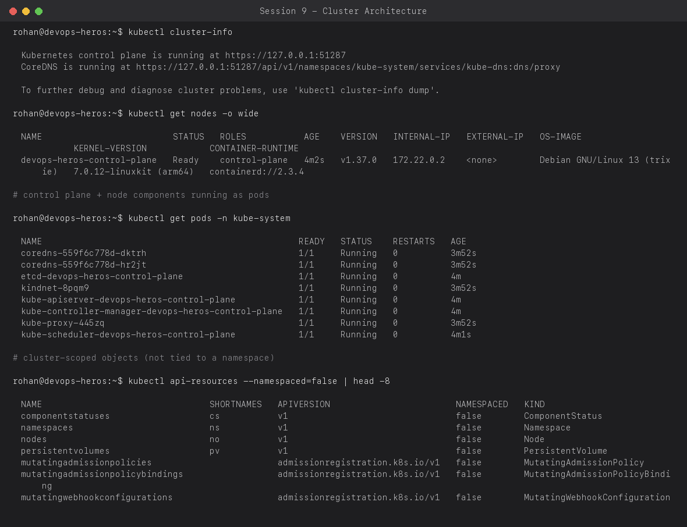
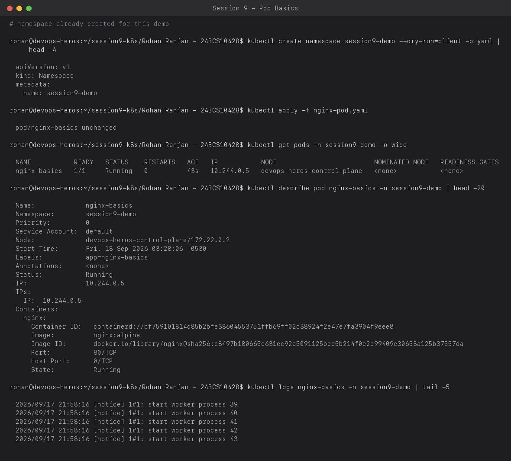
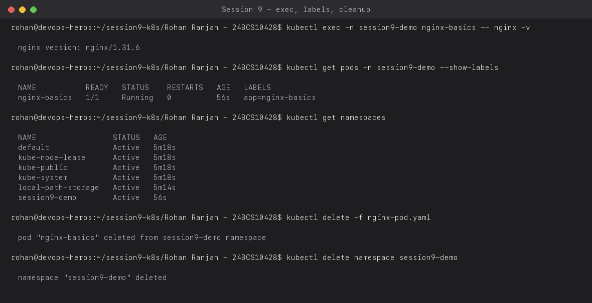

# Session 9 — Kubernetes Fundamentals

**Name:** Rohan Ranjan
**Enrollment Number:** 24BCS10428

All commands below were run against a real local Kubernetes cluster created with `kind`
(Kubernetes-in-Docker) on my machine — `kind create cluster --name devops-heros`. Every
screenshot is the actual output of the command shown above it.

---

## Task 1: Kubernetes Cluster Architecture

A Kubernetes cluster has two kinds of machines:

- **Control plane** — the brain of the cluster. Runs `kube-apiserver` (the front door for all
  requests), `etcd` (the cluster's key-value store, the single source of truth for state),
  `kube-scheduler` (decides which node a new pod runs on), and `kube-controller-manager` (runs
  the control loops that keep actual state matching desired state).
- **Worker nodes** — run the actual application pods. Each node runs a `kubelet` (talks to the
  control plane and manages containers on that node), `kube-proxy` (programs network rules so
  Services work), and a container runtime (here, `containerd`).

In a `kind` cluster all of this runs as containers/pods on my laptop, but the same components
exist in any real cluster (EKS, GKE, on-prem, etc.) — only who manages the control plane differs.

```bash
kubectl cluster-info
kubectl get nodes -o wide
kubectl get pods -n kube-system
kubectl api-resources --namespaced=false | head -8
```



Notice every control-plane component (`etcd`, `kube-apiserver`, `kube-controller-manager`,
`kube-scheduler`) is itself just a pod in `kube-system` — Kubernetes runs its own brain on
top of itself (a "static pod"). `kindnet` is the CNI plugin giving pods their networking, and
`local-path-provisioner` is what backs PersistentVolumeClaims in `kind`.

---

## Task 2: Pods — creating, inspecting, and reading logs

A **Pod** is the smallest deployable unit in Kubernetes — one or more containers that share
network and storage, always scheduled together on the same node.

`nginx-pod.yaml`:

```yaml
apiVersion: v1
kind: Pod
metadata:
  name: nginx-basics
  namespace: session9-demo
  labels:
    app: nginx-basics
spec:
  containers:
    - name: nginx
      image: nginx:alpine
      ports:
        - containerPort: 80
```

```bash
kubectl apply -f nginx-pod.yaml
kubectl get pods -n session9-demo -o wide
kubectl describe pod nginx-basics -n session9-demo
kubectl logs nginx-basics -n session9-demo
```



`describe` shows the pod's full lifecycle detail: which node it landed on, its assigned pod IP,
the container image actually pulled (resolved to a digest), and its current state. `logs`
streams stdout/stderr from the container — here, nginx's worker-process startup messages.

---

## Task 3: exec into a pod, labels, and namespaces

```bash
kubectl exec -n session9-demo nginx-basics -- nginx -v
kubectl get pods -n session9-demo --show-labels
kubectl get namespaces
```



- `kubectl exec` runs a command *inside* a running container, the same way `docker exec` does —
  useful for quick debugging without needing SSH access to the node.
- **Labels** (`app=nginx-basics`) are key-value tags on objects. They're how Services,
  Deployments, and ReplicaSets find *which* pods belong to them (via label selectors) — nothing
  in Kubernetes is wired together by name, it's all label selectors.
- **Namespaces** partition a single cluster into isolated virtual clusters — separate objects,
  separate RBAC, separate resource quotas — so multiple teams/environments can share one
  physical cluster safely. `kube-system`, `kube-public`, `kube-node-lease`, and `default` are
  created automatically; `session9-demo` is the one I created for this lab.

Cleanup at the end of the same screenshot: `kubectl delete -f nginx-pod.yaml` removes the pod,
`kubectl delete namespace session9-demo` removes everything in it.

---

## Interview-style summary

- **What's the difference between a Pod and a container?** A Pod wraps one or more containers
  that need to share a network namespace and storage — Kubernetes never schedules a bare
  container, only Pods.
- **What is etcd and why does it matter?** It's the cluster's single source of truth. If etcd
  is lost with no backup, the cluster's state is gone even if every node is still running.
- **What does kube-scheduler actually decide?** Which node a newly-created pod should run on,
  based on resource requests, node affinity/taints, and current node capacity — it does not
  create the pod itself, it just binds it to a node.

## Resources

- https://kubernetes.io/docs/tutorials/kubernetes-basics/
- https://minikube.sigs.k8s.io/docs/start/?arch=%2Fmacos%2Farm64%2Fstable%2Fbinary+download
- https://kubernetes.io/docs/concepts/architecture/
- https://github.com/Nency-Ravaliya/Kubernetes
